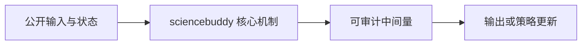
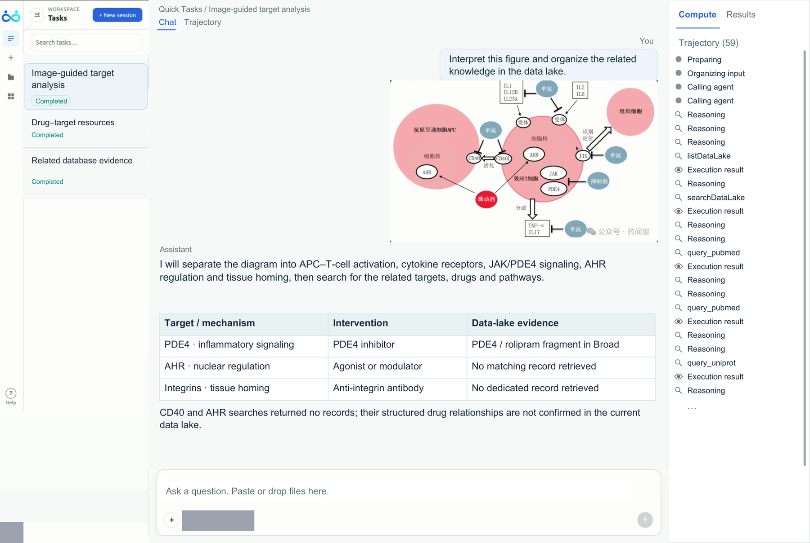

# ScienceBuddy: Recursive-in-Recursive Self-Improvement for Interactive Scientific Agents

> **复现级别：L1 核心机制诊断。** 本地执行双层状态更新；没有连接真实实验室环境。

## 论文信息

| 字段 | 内容 |
|---|---|
| 论文链接 | [ScienceBuddy: Recursive-in-Recursive Self-Improvement for Interactive Scientific Agents](https://arxiv.org/abs/2609.17523) |
| 公司/机构 | Gen-Verse research collaboration（按第一作者署名单位） |
| 首次公开日期 | 2026-09-15（arXiv v1） |
| 原文开源代码 | 是：[https://github.com/Gen-Verse/ScienceBuddy](https://github.com/Gen-Verse/ScienceBuddy) |
| Adapter / 方法 | `sciencebuddy` |
| 本地复现代码 | [`src/auto_research/agent_research/latest_20260916.py`](https://github.com/daiwk/auto-research/blob/main/src/auto_research/agent_research/latest_20260916.py) |

## 原始论文总结

### 背景与主要改动

内层递归演化交互 harness，外层用成功轨迹更新科学 Agent 策略。

本地 reference kernel 保留决定性门控、权重或状态转换，并输出可审计中间量，以便与相邻方法在统一预算下比较。

<!-- paper-figure:start -->
### 原论文关键图

> **原论文 Figure 4（关键图）**：展示原论文提出的核心架构、主要模块及其连接关系。图片来自[原论文](https://arxiv.org/abs/2609.17523)，版权归原作者所有；点击图片可查看来源。
<!-- paper-figure:end -->

### 核心公式

实现保留论文的决定性状态转换，并输出权重、门控、深度、阶段或缓存统计；固定预算和三种子只用于检查机制不变量，不等同于论文规模训练。

### 论文离线与线上效果

论文报告的能力、速度或成本结论只作为原文事实记录；本地指标不与其直接横比，也不外推线上收益。

## 本地复现

三种子结果见 [`metrics/mechanism-seeds42-44.json`](metrics/mechanism-seeds42-44.json)。统一 receipt 标记 `diagnostic_only=true`，不会被公开看板当成完整能力提升。

### 复现边界

本地执行双层状态更新；没有连接真实实验室环境。
