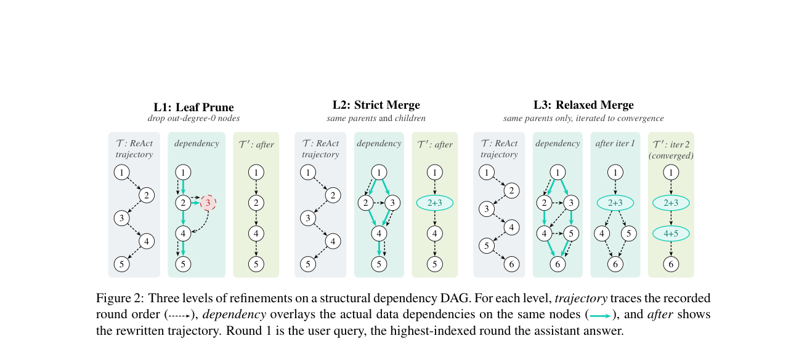

# Dependency-Aware Trajectory Refinement for Efficient Multi-Turn Agent Fine-Tuning

> **复现级别：L1 核心机制诊断。** 本地执行依赖裁剪与合并；DAG 来自可审计 fixture，不冒充 LLM 标注器。

## 论文信息

| 字段 | 内容 |
|---|---|
| 论文链接 | [Dependency-Aware Trajectory Refinement for Efficient Multi-Turn Agent Fine-Tuning](https://arxiv.org/abs/2609.18417) |
| 公司/机构 | ShanghaiTech University（按第一作者署名单位） |
| 首次公开日期 | 2026-09-16（arXiv v1） |
| 原文开源代码 | 是：[https://github.com/Alibaba-NLP/VLLM-KB](https://github.com/Alibaba-NLP/VLLM-KB) |
| Adapter / 方法 | `dependency-refinement` |
| 本地复现代码 | [`src/auto_research/agent_research/latest_20260919.py`](https://github.com/daiwk/auto-research/blob/main/src/auto_research/agent_research/latest_20260919.py) |

## 原始论文总结

### 背景与主要改动

把多轮轨迹表示为轮级依赖 DAG，依次执行叶节点裁剪、严格合并和宽松合并，减少冗余消息同时保留最终答案依赖。

<!-- paper-figure:start -->
### 原论文关键图

> **原论文 Figure 2（关键图）**：展示原论文方法的总体设计和关键组成。图片来自[原论文](https://arxiv.org/abs/2609.18417)，版权归原作者所有；点击图片可查看来源。
<!-- paper-figure:end -->

### 核心公式

本地 reference kernel 保留论文决定性的门控、权重、状态转换或调度规则，并把中间量写入指标产物；具体公式与变量对应见实现函数及测试中的不变量断言。

### 论文离线与线上效果

论文报告的线上、benchmark、训练效率或推理速度只作为原文结果。本地三种子 artifact 只验证核心机制、形状和状态不变量，不与论文数字直接横比。指标见 [`metrics/mechanism-seeds42-44.json`](metrics/mechanism-seeds42-44.json)。

## 复现边界

本地执行依赖裁剪与合并；DAG 来自可审计 fixture，不冒充 LLM 标注器。
