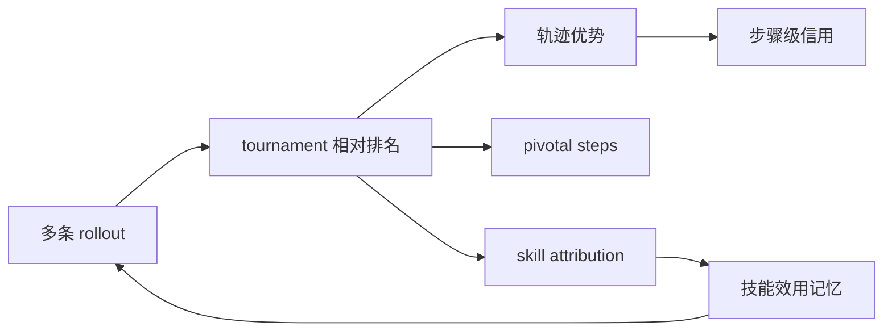
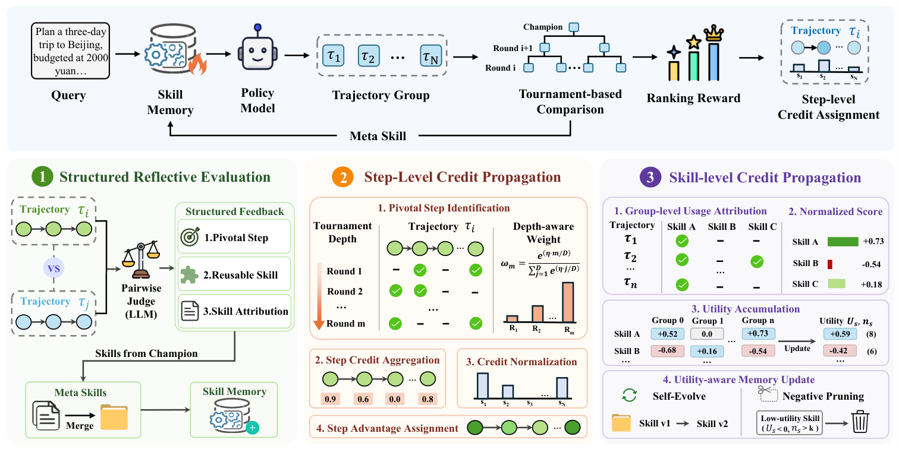

# ArenaFlow：从轨迹排名到层级信用传播

> **复现级别：L1 核心机制诊断。** 本地保留 tournament、pivotal-step 与 skill-utility 三层账本；没有执行真实在线 RL。

## 论文信息

| 字段 | 内容 |
|---|---|
| 论文链接 | [ArenaFlow](https://arxiv.org/abs/2609.21378) |
| 公司/机构 | Alibaba Group（按第一作者署名单位） |
| 首次公开日期 | 2026-09-18（arXiv v1） |
| 原文开源代码 | 是：[Alibaba-NLP/qqr](https://github.com/Alibaba-NLP/qqr)（论文所列链接；当前仓库内容需按论文版本继续核验） |
| Adapter / 方法 | `arenaflow` |
| 本地复现代码 | [`src/auto_research/agent_research/latest_20260921.py`](https://github.com/daiwk/auto-research/blob/main/src/auto_research/agent_research/latest_20260921.py) |

## 原始论文总结

ArenaFlow 用 tournament 相对排名替代容易饱和的点式奖励，再从结构化比较中提取 pivotal success steps、可复用技能和技能使用归因。轨迹优势沿 survival depth 传播到关键步骤，技能效用则更新全局技能记忆，形成下一轮探索先验。

<!-- paper-figure:start -->
### 原论文关键图

> **原论文 Figure 2（关键图）**：展示原论文提出的核心架构、主要模块及其连接关系。图片来自[原论文](https://arxiv.org/abs/2609.21378)，版权归原作者所有；点击图片可查看来源。
<!-- paper-figure:end -->

### 核心公式

轨迹相对优势使用 `A_i = (rank_mean - rank_i) / max(n-1,1)`；本地再把 `A_i` 沿 survival depth 分配给 pivotal steps，并把成功贡献累积到对应技能效用账本。

## 本地复现与边界

本地仅验证三层信用路径和不读取 gold plan 的约束，不进行梯度更新。指标见 [`metrics/mechanism-seeds42-44.json`](metrics/mechanism-seeds42-44.json)。
