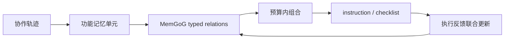
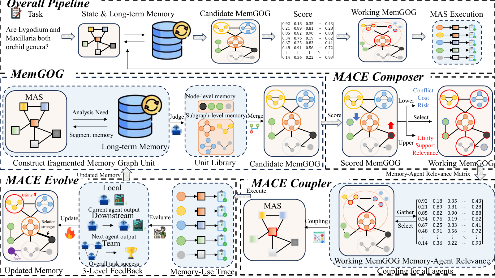

# MACE：自适应记忆图上的 Memory-Agent 协同进化

> **复现级别：L1 核心机制诊断。** 本地保留功能单元、typed relation 与 outcome-conditioned 更新；未复现论文八个完整 benchmark 或多 Agent LLM 调用。

## 论文信息

| 字段 | 内容 |
|---|---|
| 论文链接 | [MACE](https://arxiv.org/abs/2609.21533) |
| 公司/机构 | arXiv HTML 未清晰列出第一作者机构（不作推断） |
| 首次公开日期 | 2026-09-18（arXiv v1） |
| 原文开源代码 | 未发现作者公开代码（核验于 2026-09-21） |
| Adapter / 方法 | `mace` |
| 本地复现代码 | [`src/auto_research/agent_research/latest_20260921.py`](https://github.com/daiwk/auto-research/blob/main/src/auto_research/agent_research/latest_20260921.py) |

## 原始论文总结

MemGoG 把 condition、action 和 output 组成保留局部依赖的功能单元，并用 support、conflict、repair 关系连接跨经验单元。MACE Loop 在预算内选择工作图，以 instruction 或 checklist 交给不同 Agent，再把单元组合、呈现方式和任务结果联合回写。

<!-- paper-figure:start -->
### 原论文关键图

> **原论文 Figure 2（关键图）**：展示原论文方法的总体设计和关键组成。图片来自[原论文](https://arxiv.org/abs/2609.21533)，版权归原作者所有；点击图片可查看来源。
<!-- paper-figure:end -->

### 核心公式

本地将记忆图更新写成 `w'_(i,j) = w_(i,j) + η · outcome · relation(i,j)`，分别记录 support、conflict 与 repair 边；它保留结果条件化更新方向，但不声称复现论文完整优化器。

## 本地复现与边界

本地只在确定性公开 observation mini-suite 上记录功能单元、关系和呈现反馈，不把计数器声称为多 Agent 能力提升。指标见 [`metrics/mechanism-seeds42-44.json`](metrics/mechanism-seeds42-44.json)。
