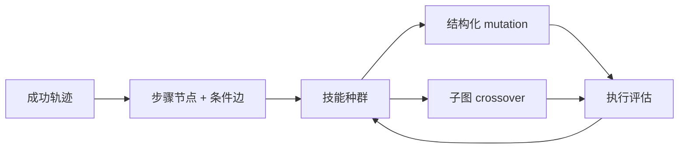
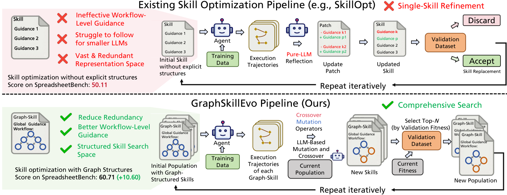

# GraphSkillEvo：图结构 Agent 技能的进化优化

> **复现级别：L1 核心机制诊断。** 本地实现显式技能图、去冗余、结构化 mutation/crossover；未调用 GPT-5.4 系列或论文五个完整 benchmark。

## 论文信息

| 字段 | 内容 |
|---|---|
| 论文链接 | [GraphSkillEvo](https://arxiv.org/abs/2609.21749) |
| 公司/机构 | City University of Hong Kong（按第一作者署名单位） |
| 首次公开日期 | 2026-09-18（arXiv v1） |
| 原文开源代码 | 是：[ruisun7/GraphSkillEvo](https://github.com/ruisun7/GraphSkillEvo) |
| Adapter / 方法 | `graphskillevo` |
| 本地复现代码 | [`src/auto_research/agent_research/latest_20260921.py`](https://github.com/daiwk/auto-research/blob/main/src/auto_research/agent_research/latest_20260921.py) |

## 原始论文总结

论文把自然语言技能表示成执行步骤节点和上下文条件边，减少自由文本冗余并显式表达工作流。在此结构上使用 population-based evolution，通过结构感知 mutation 和 crossover 扩大技能搜索范围。

<!-- paper-figure:start -->
### 原论文关键图

> **原论文 Figure 1（关键图）**：展示原论文的整体流程、关键阶段及其数据流向。图片来自[原论文](https://arxiv.org/abs/2609.21749)，版权归原作者所有；点击图片可查看来源。
<!-- paper-figure:end -->

### 核心公式

本地以 `fitness(G) = success(G) - λ · duplicate_nodes(G)` 约束技能图演化，并只在拓扑合法、无重复边的父图之间执行子图 crossover；这验证结构不变量，不代表论文规模的能力结果。

## 本地复现与边界

本地 kernel 从公开 observation 构造技能图，做去重和确定性 crossover，只验证状态不变量；没有把 mini-suite 分数解释为论文能力。指标见 [`metrics/mechanism-seeds42-44.json`](metrics/mechanism-seeds42-44.json)。
