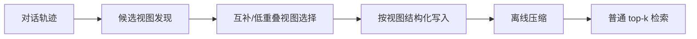
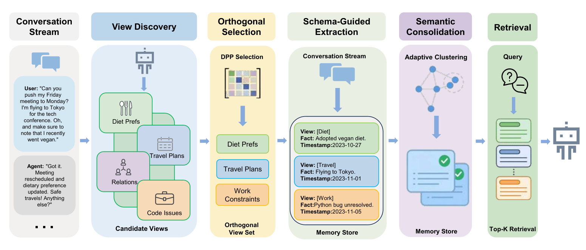

# AutoViewMem：面向对话长期记忆的自配置正交视图

> **复现级别：L1 核心机制诊断。** 本地保留写入前视图发现、低重叠存储和离线压缩流程；未运行 Qwen3-8B/14B、LoCoMo 或 PersonaMem。

## 论文信息

| 字段 | 内容 |
|---|---|
| 论文链接 | [AutoViewMem](https://arxiv.org/abs/2609.21940) |
| 公司/机构 | National University of Defense Technology（按第一作者署名单位） |
| 首次公开日期 | 2026-09-18（arXiv v1） |
| 原文开源代码 | 未发现作者公开代码（核验于 2026-09-21） |
| Adapter / 方法 | `autoviewmem` |
| 本地复现代码 | [`src/auto_research/agent_research/latest_20260921.py`](https://github.com/daiwk/auto-research/blob/main/src/auto_research/agent_research/latest_20260921.py) |

## 原始论文总结

论文先从交互轨迹发现候选语义视图，再用低重叠约束选出互补视图，并在写入时按视图提取带 provenance 的记忆。语义解耦发生在索引之前，因此查询时仍可使用普通 top-k，而无需复杂路由；离线图压缩进一步合并重复或冲突记忆。

<!-- paper-figure:start -->
### 原论文关键图

> **原论文 Figure 1（关键图）**：展示原论文提出的核心架构、主要模块及其连接关系。图片来自[原论文](https://arxiv.org/abs/2609.21940)，版权归原作者所有；点击图片可查看来源。
<!-- paper-figure:end -->

### 核心公式

本地以 `overlap(v_i,v_j) = |T_i ∩ T_j| / |T_i ∪ T_j|` 约束候选视图之间的语义重叠；只有低于阈值的互补视图进入写入阶段。该式是公开 mini-suite 的可审计代理，不替代论文中的 LLM 视图发现器。

## 本地复现与边界

本地 kernel 只从公开 observation 构造有限容量视图桶，记录 view discovery、正交写入和 consolidation 计数；标准答案不进入策略输入。指标见 [`metrics/mechanism-seeds42-44.json`](metrics/mechanism-seeds42-44.json)。
