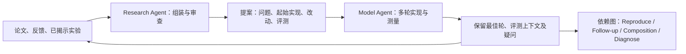
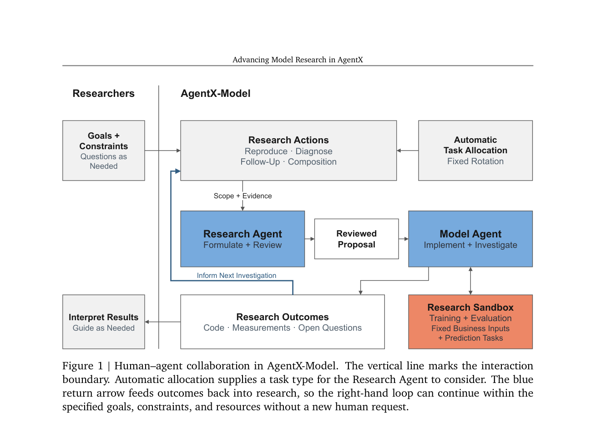

# AgentX-Model：以实验结果持续推进模型研究

> **本地保真度：公开数据机制验证（concept demo）**。执行了双角色提案/审查/调查接口、四类动作和带依赖的结果盲回放；角色由确定性规则驱动，实验图由 MovieLens-1M 上实际训练的六个轻量模型节点组成。它不是论文的私有 473 节点历史图、LLM Agent 系统或线上 A/B 复现。

## 论文信息

| 字段 | 内容 |
|---|---|
| 论文链接 | [arXiv 2609.30001](https://arxiv.org/abs/2609.30001) |
| 公司 / 机构 | Kuaishou（原论文 PDF 版权署名；一作 Shuang Yang） |
| 首次公开日期 | 2026-09-24（arXiv v1） |
| 原作者代码 | 未发现 AgentX-Model 的公开实现；论文生产代码、实验图与日志未随文发布（核查于 2026-09-28） |
| 本地 adapter / 方法 | `agentx-model-replay`，独立公开评测脚本；**不**注册为通用 `agent-eval` 方法或 Evolve 算子 |
| 本地复现代码 | [`agentx_model.py`](https://github.com/daiwk/auto-research/blob/main/src/auto_research/agent_research/agentx_model.py)、[`agentx_model_public.py`](https://github.com/daiwk/auto-research/blob/main/src/auto_research/agent_research/agentx_model_public.py) |

## 原始论文总结

### 背景与主要改动

早期 AgentX 关注从研究构想到实现、评估的单次闭环；AgentX-Model 追问**一次实验之后如何决定下一次做什么**。Research Agent 负责跨论文和实验路径提出、独立审查研究问题；Model Agent 接收获批提案，在固定业务输入与预测任务下多轮改代码、训练、测量，并返回中间最佳实现、负结果和未解问题。两者通过提案而非共享完整工作日志衔接。



<!-- paper-figure:start -->
### 原论文关键图

[](https://arxiv.org/pdf/2609.30001#page=5)

> **原论文 Figure 1（关键图）**：展示原论文方法的总体设计和关键组成。图片来自[原论文](https://arxiv.org/abs/2609.30001)，版权归原作者所有；点击图片可查看来源。
<!-- paper-figure:end -->

### 核心形式

论文将提案写为 $P_t=(q_t,s_t,\delta_t,v_t)$，分别对应研究问题、起始实现、待验证改动与评测设计；共享研究状态 $S_t=(\mathcal I_t,\mathcal E_t,\mathcal Q_t)$ 保留实现、附条件的测量证据和未解问题。单个实验的最佳有效轮次是 $b_i=\max_{r\in\mathcal V_i}\operatorname{AUC}_{i,r}$；对父节点与整条可比祖先路径分别算增量，避免把“从退化父节点恢复”误写成“刷新路径最佳”。

四类动作各有不同目标：Reproduce 引入论文机制；Follow-up 围绕已有结果继续；Composition 检验两条路径互补且先解冲突；Diagnose 通过观测与干预降低不确定性，不应仅按即时 AUC 排序。历史回放只有在父实验已选中时才能选子实验；候选结果必须选中后才揭示。

### 论文离线与线上效果

论文报告约 25 天内完成 636 个模型改动实验，其中 560 个记录了高于对应业务基线的 AUC。五个最新线上 A/B 包括获客效率、目标客群广告花费和观看时长改善；这都是作者的生产结果，不是本仓库本地结果。论文还用 6 个环境、473 个私有实验节点比较任务分配策略，结论不是某一种复杂调度始终胜出。

## 本地复现

### 可执行路径与防泄漏边界

1. 对 MovieLens-1M 每位用户按时间保留最后两条交互作 validation/test；训练最多抽取 18,000 条，其余统计量只由训练集合生成，训练特征的用户/物品评分率做 leave-one-out。
2. 固定 `rating ≥ 4` 预测任务及同一逻辑回归训练预算；两种 Reproduce 分别加入用户×物品评分率交叉项和历史类型匹配项，Follow-up 增加二阶交叉，Composition 联合不同来源特征。另有 Diagnose 使用**训练集**估计校准因子，并在验证集观测 PCOC。
3. Research 角色只看动作、依赖、候选改动及**已揭示**的父结果，构造起始代码、比较参考和评测上下文；审查拒绝改动基线版本、split 或起始参考。Model 角色只在候选合法且被选中后取得记录中的 40/80 步逐轮结果。最佳轮和最后轮分别保留。
4. 固定轮转、均匀随机和已揭示父结果贪心三种分配方式各有 **2 次选择预算**，只够探索五个 AUC 候选的一部分；AUC 路由按原论文原则排除 Diagnose，诊断分支单独执行。候选选择是**公开规则**，不冒充论文的 LLM candidate selector。
5. 只依 validation 选各策略的 champion；该 champion 的 test AUC 在选择完成后计算。不存在读取未来节点指标的 oracle 或线上流量。

```bash
python scripts/run_agentx_model_public.py \
  --dataset-dir data --seeds 42,43,44 --budget 2 \
  --output runs/agentx-model/public-replay.json
```

稳定收据：[MovieLens-1M 三种子结果](metrics/movielens-1m-replay-seeds42-44.json)。

| Seed | 基线验证 AUC | 固定 / 随机 / 父节点贪心最佳验证 AUC | 对应所选模型测试 AUC | 诊断 PCOC（前→后） |
|---:|---:|---:|---:|---:|
| 42 | 0.71415 | 0.71415 / 0.71458 / 0.71458 | 0.70729 / 0.70524 / 0.70524 | 1.0173 → 0.9941 |
| 43 | 0.71648 | 0.71648 / 0.71648 / 0.71648 | 0.66524 / 0.66524 / 0.66524 | 1.0500 → 1.0242 |
| 44 | 0.72085 | 0.72290 / 0.72219 / 0.72219 | 0.72188 / 0.72229 / 0.72229 | 1.0435 → 1.0220 |

两次预算确实造成不同选择路径和验证结果，但只有三个数据种子、一个预设小图，**不能据此断言某策略优于另一种**。Seed 44 的三种策略均达到“基线 AUC 严格 +0.001”阈值；固定策略在第 1 次、另外两种在第 2 次达到。测试列只是验证集选定模型的隔离检查，不参与策略选择。校准干预在三种子验证集上让 PCOC 更接近 1，但没有由此推出线上校准收益。

## 复现边界

本地两个“Agent”是有隔离接口的确定性执行角色，而非论文使用的 Pi/Claude Code/GLM、独立 LLM 审查或自动编程；模型变种也是预设可执行候选，非系统自主发明。六节点依赖图来自本仓库真实公开数据实验，不是作者 473 节点生产日志；rating 任务不代表工业曝光、点击、转化或线上 A/B。该工作验证**编排与回放机制**，不验证论文的人效或收益结论，也没有声称接入 Evolve 多轮控制器。
