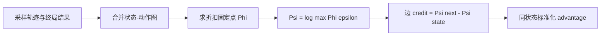
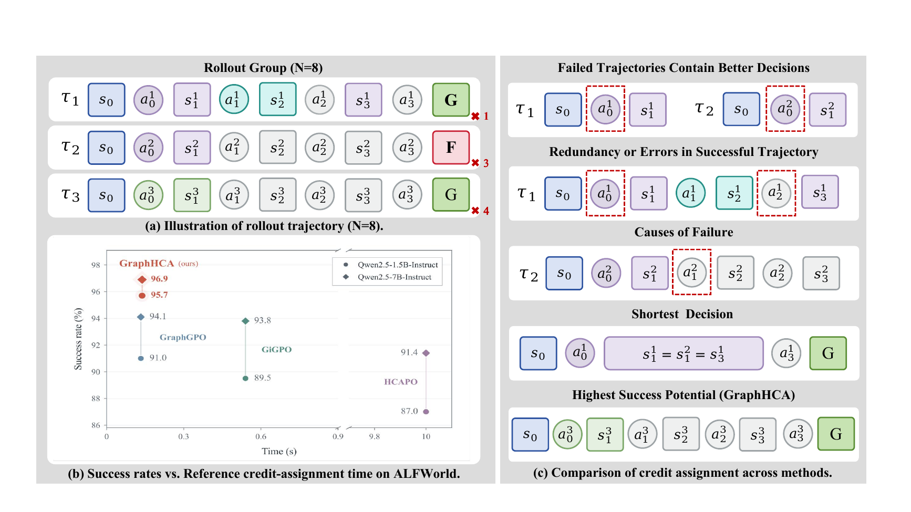

# GraphHCA：长轨迹 Agent 的闭式事后信用分配

> **复现级别：L1 无 gold 核心机制。** 本地从采样轨迹图、动作和终局结果计算固定点势能与逐步优势；不读取参考答案或计划。

## 论文信息

| 字段 | 内容 |
|---|---|
| 论文链接 | [GraphHCA: Closed-Form Hindsight Credit Assignment for Long-Horizon LLM Agents](https://arxiv.org/abs/2609.35084) |
| 公司 / 机构 | Beihang University / Zhongguancun Academy（第一作者署名单位） |
| 首次公开日期 | 2026-09-28（arXiv v1） |
| 原作者代码 | 截至 2026-09-30 未发现/未发布原作者代码 |
| 本地 adapter / 方法 | `graphhca` |
| 本地复现代码 | [`src/auto_research/agent_research/latest_20260930.py`](https://github.com/daiwk/auto-research/blob/main/src/auto_research/agent_research/latest_20260930.py) |

## 原始论文总结

### 背景与主要改动

稀疏终局奖励难以定位长轨迹中的关键动作。GraphHCA 把 rollout 合并为状态转移图，以成功/失败终态为边界解折扣固定点，再把相邻状态的对数势能差分配给每一步，并在同状态动作间标准化。

<!-- paper-figure:start -->
### 原论文关键图

> **原论文方法图**：展示轨迹图构建与 hindsight credit 回传。图片来自[原论文](https://arxiv.org/abs/2609.35084)，版权归原作者所有。
<!-- paper-figure:end -->

### 核心公式

非终态满足 $\Phi(s)=\gamma\,\mathbb E_{a\sim\hat q}[\Phi(s')]$，成功终态为 1、失败终态为 0。势能 $\Psi(s)=\log\max(\Phi(s),\epsilon)$，单步信用为 $\Psi(s')-\Psi(s)$，再在共享起点的动作间标准化。

### 论文离线与线上效果

论文报告的长时程 Agent 成绩仅作为原文结果。本地验证固定点收敛、成功边信用排序和 gold 字段不可达，见 [`metrics/mechanism-seeds42-44.json`](metrics/mechanism-seeds42-44.json)。

## 本地复现

`graphhca_credit` 只接受 `Transition` 和 success 布尔值；汇总实验见 [`../../experiments/sep30-p0-p1-mechanisms-seeds42-44.json`](../../experiments/sep30-p0-p1-mechanisms-seeds42-44.json)。

## 复现边界

当前未训练语言模型，也未把 GraphHCA 注册为 Evolve 算子。只有统一控制器能采样真实轨迹、执行该 estimator 并隔离验证策略更新后才算正式接入。
