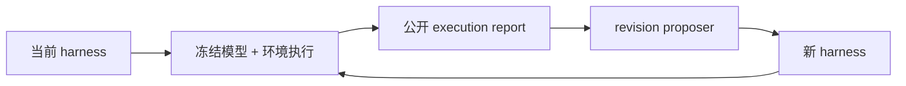
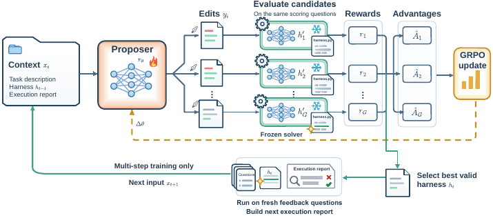

# Harness Learning：学习可执行脚手架完成测试时适配

> **复现级别：L1 无 gold 机制诊断。** 实现由执行反馈驱动的 harness revision policy 与多轮适配；冻结任务策略，不读取答案或计划。

## 论文信息

| 字段 | 内容 |
|---|---|
| 论文链接 | [Harness Learning Enables Generalizable Test-Time Adaptation](https://arxiv.org/abs/2609.35738) |
| 公司 / 机构 | Johns Hopkins University / Carnegie Mellon University |
| 首次公开日期 | 2026-09-28（arXiv v1） |
| 原作者代码 | 截至 2026-09-30 未发现/未发布原作者代码 |
| 本地 adapter / 方法 | `harness-learning` |
| 本地复现代码 | [`src/auto_research/agent_research/latest_20260930.py`](https://github.com/daiwk/auto-research/blob/main/src/auto_research/agent_research/latest_20260930.py) |

## 原始论文总结

### 背景与主要改动

论文把测试时适配的对象从模型参数转为可执行 harness：proposer 根据真实执行反馈修改验证、解释器、检索或重试组件；底层任务模型保持冻结，多轮执行后保留更有效的脚手架。

<!-- paper-figure:start -->
### 原论文关键图

> **原论文总体流程图**：展示 proposer、执行器和多轮 harness 修订。图片来自[原论文](https://arxiv.org/abs/2609.35738)，版权归原作者所有。
<!-- paper-figure:end -->

### 核心公式

本地 proposer 使用组内相对执行奖励更新分类策略：$A_i=r_i-\bar r$，并对 revision logit 做 REINFORCE 更新。适配接口只接收执行报告中的 score 与 failure 类型，没有 gold answer、gold plan 或隐藏 verifier 字段。

### 论文离线与线上效果

原文跨任务泛化结论不等同于本地结果。本地三种子仅验证多轮修订、执行反馈闭环和 gold 隔离不变量，见 [`metrics/mechanism-seeds42-44.json`](metrics/mechanism-seeds42-44.json)。

## 本地复现

`HarnessProposer` 与 `adapt_harness` 可接入外部真实执行 callback；汇总诊断见 [`../../experiments/sep30-p0-p1-mechanisms-seeds42-44.json`](../../experiments/sep30-p0-p1-mechanisms-seeds42-44.json)。

## 复现边界

当前没有接入通用 Agent runner 或 Evolve，因为二者尚不能安全执行任意 harness 并完成隔离验证；本页不把规则化 mini-suite 的成功率宣称为 Agent 能力提升。
