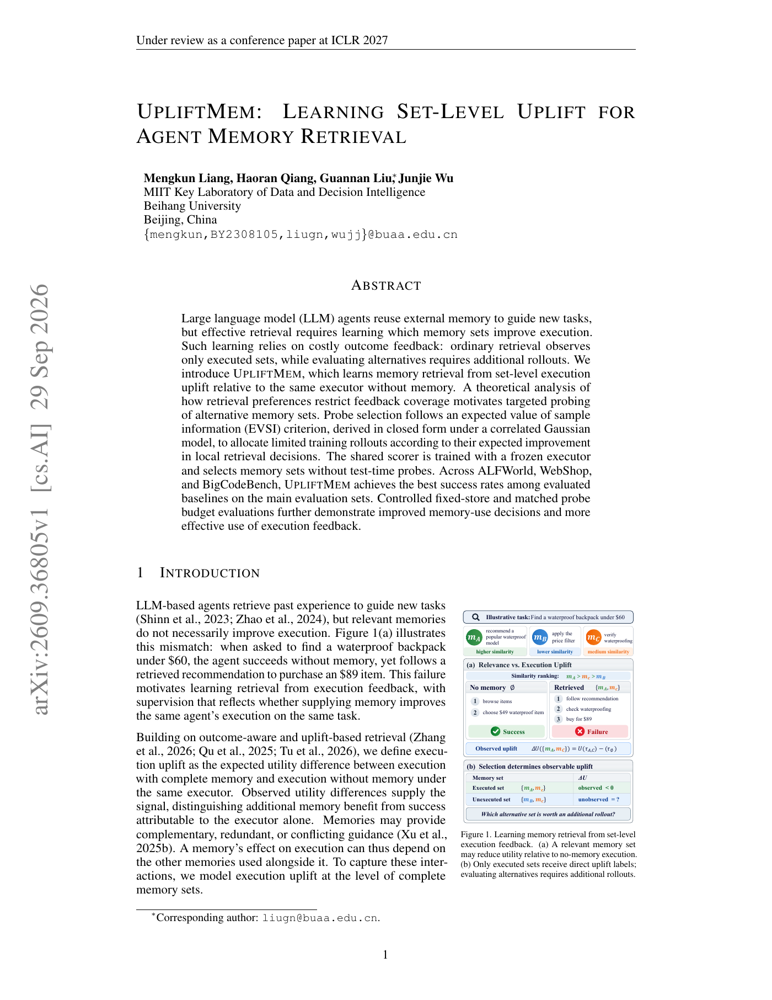

# UpliftMem：用集合级执行增益学习 Agent 记忆检索

> **复现级别：L1 uplift 与 probe 机制。** 实现同 executor 的 paired uplift 和相关 Gaussian EVSI 选择。

## 论文信息

| 字段 | 内容 |
|---|---|
| 论文链接 | [arXiv v1](https://arxiv.org/abs/2609.36805) |
| 公司/机构 | Beihang University |
| 首次公开日期 | 2026-09-29（arXiv v1） |
| 原文开源代码 | 否：截至 2026-09-30 未找到原作者仓库 |
| Adapter | `upliftmem` |
| 本地复现代码 | `src/auto_research/agent_research/latest_20260930_followup.py` |

### 背景与主要改动

相关记忆不一定提升执行。UpliftMem 以同一冻结 executor 在“使用完整 memory set”和“不使用 memory”时的结果差作为 supervision，并在集合级建模互补、冗余和冲突。候选集合太多无法全跑时，用相关 Gaussian 后验下的 EVSI 把额外 rollout 分配给最可能改变局部检索决策的集合。

<!-- paper-figure:start -->
### 原论文关键图

> 原论文 Figure 1，展示相关 memory 仍可能产生负 uplift，以及未执行集合的反馈缺口。图片来自[原论文](https://arxiv.org/abs/2609.36805)，版权归原作者所有。
<!-- paper-figure:end -->

## 本地复现

本地 `set_level_uplift` 强制 paired treatment/control；`gaussian_evsi` 在固定 posterior 上选 probe；三种子机制结果见 [`metrics/mechanism-seeds42-44.json`](metrics/mechanism-seeds42-44.json)。未实现完整 set constructor、共享 scorer、ALFWorld/WebShop/BigCodeBench 执行器，因此只作为机制与评测基础设施。
