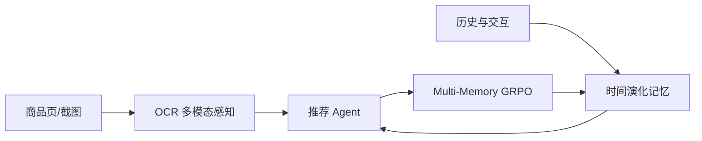
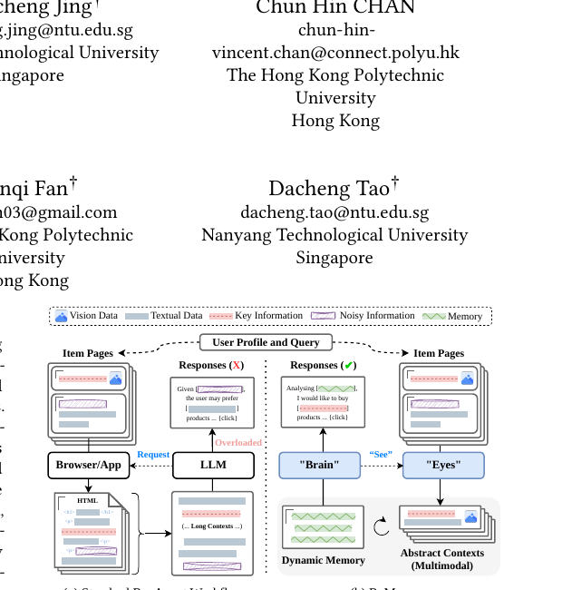

# ReMem：推荐 Agent 的多模态感知与时间演化记忆

> **复现级别：L1 记忆机制。** 实现固定预算的 time-evolving memory 和 multi-memory GRPO 目标；未接入真实购物网页与 OCR 模型。

## 论文信息

| 字段 | 内容 |
|---|---|
| 论文链接 | [ReMem](https://arxiv.org/abs/2609.37311) |
| 公司 / 机构 | 香港理工大学（第一作者署名单位） |
| 首次公开日期 | 2026-09-29（arXiv v1） |
| 原作者代码 | 是：[Quhaoh233/ReMem](https://github.com/Quhaoh233/ReMem) |
| 本地 adapter / 方法 | `remem` |
| 本地复现代码 | [`src/auto_research/agent_research/latest_20260930.py`](https://github.com/daiwk/auto-research/blob/main/src/auto_research/agent_research/latest_20260930.py) |

## 原始论文总结

### 背景与主要改动

推荐 Agent 一方面要从异构商品页稳定提取信息，另一方面不能把完整用户历史无限塞进上下文。ReMem 用 OCR 驱动的多模态 item perception 生成紧凑语义表示，再以固定预算、随时间更新的 dynamic memory 保存偏好；Multi-Memory GRPO 让多个记忆视图共享策略更新。

<!-- paper-figure:start -->
### 原论文关键图

> 原论文 Figure 1：多模态“眼睛”和动态记忆“脑”的分工。图片来自[原论文](https://arxiv.org/abs/2609.37311)，版权归原作者所有。
<!-- paper-figure:end -->

### 核心公式

本地记忆更新保留最近观测，同时按衰减后的 relevance/recency 分数选择历史块，使 $|M_t|\le B$；多记忆目标对同一 query 的不同 memory view 分别计算 group-normalized advantage，再做共享 clipped policy objective。

### 论文离线与线上效果

论文报告长上下文推荐 Agent 的准确率和 token 效率改进。本站只验证记忆预算、时间更新、目标函数及 gold isolation，指标见 [`metrics/mechanism-seeds42-44.json`](metrics/mechanism-seeds42-44.json)。

## 本地复现与边界

这里不是完整网页 Agent：未运行 OCR、浏览器、作者数据或真实 episode；固定小样本只用于验证信息流，不能宣传为推荐能力提升。
