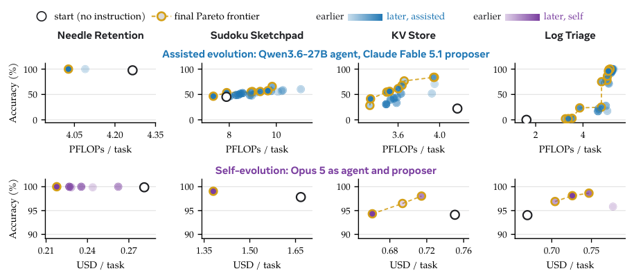

# Context Language Models

> **复现级别：L1 核心机制诊断。** 执行 context-file 编辑和 suffix cache 边界；未训练 Qwen3.5-9B，也未运行 24 小时 Agent swarm。

## 论文信息

| 字段 | 内容 |
|---|---|
| 论文链接 | [arXiv 2609.37725](https://arxiv.org/abs/2609.37725) |
| 公司/机构 | University of Washington / Meta Superintelligence Labs（按第一作者署名单位） |
| 首次公开日期 | 2026-09-29（arXiv v1） |
| 原文开源代码 | 是：[https://github.com/facebookresearch/context-language-models](https://github.com/facebookresearch/context-language-models) |
| Adapter | `context-lm` |
| 本地复现代码 | [`src/auto_research/agent_research/latest_20261001.py`](https://github.com/daiwk/auto-research/blob/main/src/auto_research/agent_research/latest_20261001.py) |

## 原始论文总结

### 背景与主要改动

把上下文视为模型可直接编辑的文件，使保留、删除和重组信息成为模型行为，而不是外部 harness 的固定策略；多 Agent 各自维护 context file，服务端从第一个不匹配 token 起重新 prefill。

<!-- paper-figure:start -->
### 原论文关键图

> **原论文 Figure 28（关键图）**：展示原论文的训练流程与关键优化环节。图片来自[原论文](https://arxiv.org/abs/2609.37725)，版权归原作者所有；点击图片可查看来源。
<!-- paper-figure:end -->

### 核心公式

$c_{t+1}=f_\theta^{CLM}(c_t)$。本地实现 replace/append 文件变换、显式容量边界和从首个 prefix mismatch 起算的 suffix cache reuse。

### 论文离线与线上效果

BrowseComp-Plus 准确率提高 11.4%、FLOPs 减少 21.5%；EdgeBench 分数提高 5%、FLOPs 减少 59%；在线 RL 使 Qwen3.5-9B 提高 47.6% 且 FLOPs 减少 12%。

## 本地复现

> **本地对照口径**：基线为论文机制关闭或默认状态，实验组为开启对应核心算子；本批只验证不变量和状态转换，跨模型相对变化不适用。

三种子诊断见 [`metrics/mechanism-seeds42-44.json`](metrics/mechanism-seeds42-44.json)。`diagnostic_only=true`，只证明核心状态转换、梯度或调度不变量可执行，不能进入正式能力排名。

## 复现边界

执行 context-file 编辑和 suffix cache 边界；未训练 Qwen3.5-9B，也未运行 24 小时 Agent swarm。
