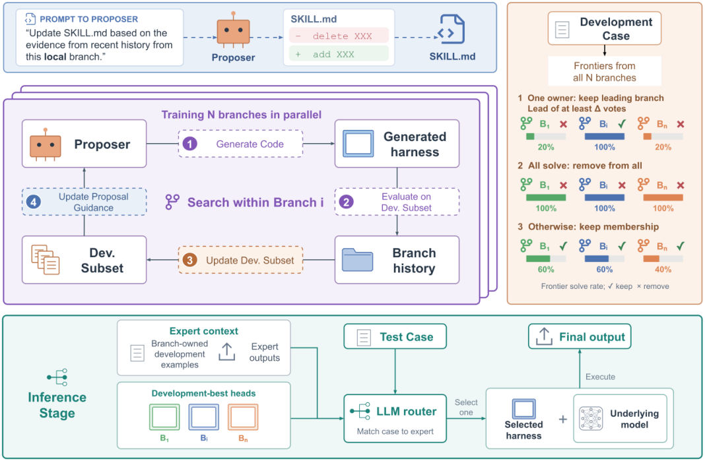

# Mixture of Self-Improving Branches for Agent Harness Optimization

> **复现级别：L1 核心机制诊断。** 执行分支子集分化和输入路由；没有 LLM 生成 harness，也不运行 SWE-bench。

## 论文信息

| 字段 | 内容 |
|---|---|
| 论文链接 | [arXiv 2609.37834](https://arxiv.org/abs/2609.37834) |
| 公司/机构 | 原文首页未列机构（按第一作者署名单位） |
| 首次公开日期 | 2026-09-29（arXiv v1） |
| 原文开源代码 | 否：截至 2026-10-01 未找到原作者公开仓库 |
| Adapter | `branch-mixture` |
| 本地复现代码 | [`src/auto_research/agent_research/latest_20261001.py`](https://github.com/daiwk/auto-research/blob/main/src/auto_research/agent_research/latest_20261001.py) |

## 原始论文总结

### 背景与主要改动

将 harness 搜索拆成多条分支，每条分支维护不同的开发子集和 proposal policy；全分支都解决的样本被移除，具有分支区分度的样本被保留，部署时由只看输入特征的 router 选择开发集冠军。

<!-- paper-figure:start -->
### 原论文关键图

> **原论文 Figure 1（关键图）**：展示原论文的整体流程、关键阶段及其数据流向。图片来自[原论文](https://arxiv.org/abs/2609.37834)，版权归原作者所有；点击图片可查看来源。
<!-- paper-figure:end -->

### 核心公式

$J_b^t(H)=|X_b^t|^{-1}\sum_x\mathbb E[r(f_M(H,x),x)]$。本地实现有区分度开发子集更新和不读取测试标签的线性 router。

### 论文离线与线上效果

相对 Meta-Harness，在奥数推理、Terminal-Bench 2.0、SWE-bench Lite 上分别相对提高 34.8%、11.6%、3.8%。

## 本地复现

> **本地对照口径**：基线为论文机制关闭或默认状态，实验组为开启对应核心算子；本批只验证不变量和状态转换，跨模型相对变化不适用。

三种子诊断见 [`metrics/mechanism-seeds42-44.json`](metrics/mechanism-seeds42-44.json)。`diagnostic_only=true`，只证明核心状态转换、梯度或调度不变量可执行，不能进入正式能力排名。

## 复现边界

执行分支子集分化和输入路由；没有 LLM 生成 harness，也不运行 SWE-bench。
