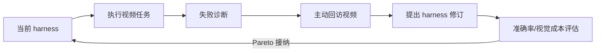
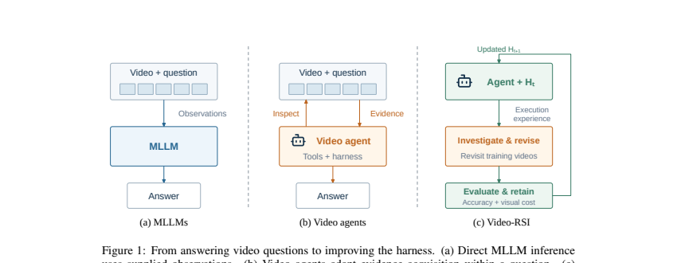

# Video-RSI：通过 harness 演化递归改进视频 Agent

> **复现级别：L1 接纳规则。** 实现准确率—视觉成本双目标的 Pareto 接纳；未在视频 benchmark 上自动改写并执行完整 harness。

## 论文信息

| 字段 | 内容 |
|---|---|
| 论文链接 | [Video-RSI](https://arxiv.org/abs/2609.37950) |
| 公司 / 机构 | 清华大学（第一作者署名单位） |
| 首次公开日期 | 2026-09-29（arXiv v1） |
| 原作者代码 | 是：[bingjunluo/Video-RSI](https://github.com/bingjunluo/Video-RSI) |
| 本地 adapter / 方法 | `video-rsi` |
| 本地复现代码 | [`src/auto_research/agent_research/latest_20260930.py`](https://github.com/daiwk/auto-research/blob/main/src/auto_research/agent_research/latest_20260930.py) |

## 原始论文总结

### 背景与主要改动

视频 Agent 的执行 trace 只包含当前 harness 选择观察的证据，因此失败解释可能无法区分。Video-RSI 让模型回访原训练视频、主动收集额外观察，形成可检验诊断并改写 harness；候选只有在准确率提高且成本不恶化，或成本下降且准确率不恶化时才保留。

<!-- paper-figure:start -->
### 原论文关键图

> 原论文 Figure 1：直接回答、固定视频 Agent 与递归 harness 改进的区别。图片来自[原论文](https://arxiv.org/abs/2609.37950)，版权归原作者所有。
<!-- paper-figure:end -->

### 核心公式

本地接纳规则为 $a'\ge a-\epsilon_a$ 且 $c'\le c+\epsilon_c$，并要求至少一项严格改善；这保留论文 accuracy/cost 双门槛，拒绝用单一加权分数掩盖明显退化。

### 论文离线与线上效果

论文报告在视频理解 benchmark 上同时提高准确率、减少处理帧数。本站只报告接纳逻辑三种子诊断 [`metrics/mechanism-seeds42-44.json`](metrics/mechanism-seeds42-44.json)，不声称完成端到端视频复现。

## 本地复现与边界

未把训练视频私有答案或 example-level score 暴露给候选 harness；当前不含真实视频解码、代码改写 sandbox 和跨代停止条件，因而暂不登记为 Evolve 可执行 operator。
