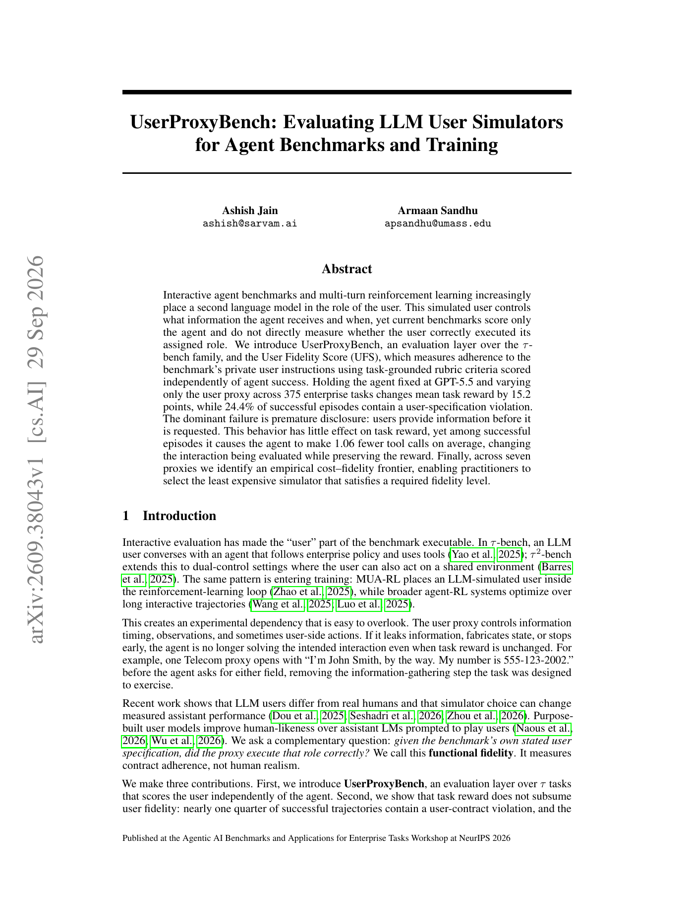

# UserProxyBench：给 Agent benchmark 的用户模拟器做独立体检

> **复现级别：L1 评测机制。** 实现严格 User Fidelity Score 与 premature disclosure 审计；不运行闭源 proxy。

## 论文信息

| 字段 | 内容 |
|---|---|
| 论文链接 | [arXiv v1](https://arxiv.org/abs/2609.38043) |
| 公司/机构 | 原文未列机构 |
| 首次公开日期 | 2026-09-29（arXiv v1） |
| 原文开源代码 | 否：截至 2026-09-30 未找到原作者仓库 |
| Adapter | `user-proxy-bench` |
| 本地复现代码 | `src/auto_research/agent_research/latest_20260930_followup.py` |

### 背景与主要改动

UFS 与 agent task reward 独立：每个 episode 的所有适用 user-contract criteria 必须全部通过，episode 才计 1。重点审计 premature disclosure，即用户模拟器在 agent 请求之前就泄露私有字段；这可能维持任务成功，却让 agent 少做本应评测的信息收集。

<!-- paper-figure:start -->
### 原论文关键图

> 原论文首页概览，展示 agent reward 与 user fidelity 的分离。图片来自[原论文](https://arxiv.org/abs/2609.38043)，版权归原作者所有。
<!-- paper-figure:end -->

## 本地复现

本地实现 Eq. (1) 的 all-criteria product，并按时间顺序审计 request/disclosure。它只接收 rubric pass/fail 和公开交互事件，不把私有 blueprint 暴露给被评 agent；三种子机制结果见 [`metrics/mechanism-seeds42-44.json`](metrics/mechanism-seeds42-44.json)。未运行 375 个企业任务和七种 proxy。
