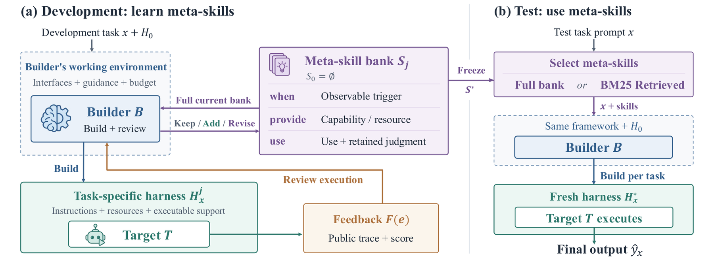

# Learning Meta-Skills for Agent Harness Design in Test-Time AI4AI

> **复现级别：L1 核心机制诊断。** 执行开发反馈 refine 与冻结后检索；fixture reward 不是 AI4AI benchmark。

## 论文信息

| 字段 | 内容 |
|---|---|
| 论文链接 | [arXiv 2609.38143](https://arxiv.org/abs/2609.38143) |
| 公司/机构 | Apodex / University of Illinois Urbana-Champaign（按第一作者署名单位） |
| 首次公开日期 | 2026-09-29（arXiv v1） |
| 原文开源代码 | 是：[https://github.com/qiancheng-apodex/MetaSkill-AI4AI](https://github.com/qiancheng-apodex/MetaSkill-AI4AI) |
| Adapter | `meta-skills` |
| 本地复现代码 | [`src/auto_research/agent_research/latest_20261001.py`](https://github.com/daiwk/auto-research/blob/main/src/auto_research/agent_research/latest_20261001.py) |

## 原始论文总结

### 背景与主要改动

从开发任务的 harness 执行反馈中提炼包含 when、provide、use 的 meta-skill，再冻结技能库；测试任务只检索相关 meta-skill 来构建新 harness，不用测试结果反向修改技能库。

<!-- paper-figure:start -->
### 原论文关键图

> **原论文 Figure 1（关键图）**：展示原论文提出的核心架构、主要模块及其连接关系。图片来自[原论文](https://arxiv.org/abs/2609.38143)，版权归原作者所有；点击图片可查看来源。
<!-- paper-figure:end -->

### 核心公式

$s=(when,provide,use)$，开发期循环为 $S_{j+1}=Revise(S_j,\{(H_x^j,F(e_x^j))\})$。本地技能库只接受开发反馈，测试选择不写回。

### 论文离线与线上效果

相对 no-skill 基线提高 8.95 个百分点，相对直接复用固定 skill bank 提高 12.02 个百分点；详情页不把该结果外推到本地 fixture。

## 本地复现

> **本地对照口径**：基线为论文机制关闭或默认状态，实验组为开启对应核心算子；本批只验证不变量和状态转换，跨模型相对变化不适用。

三种子诊断见 [`metrics/mechanism-seeds42-44.json`](metrics/mechanism-seeds42-44.json)。`diagnostic_only=true`，只证明核心状态转换、梯度或调度不变量可执行，不能进入正式能力排名。

## 复现边界

执行开发反馈 refine 与冻结后检索；fixture reward 不是 AI4AI benchmark。
