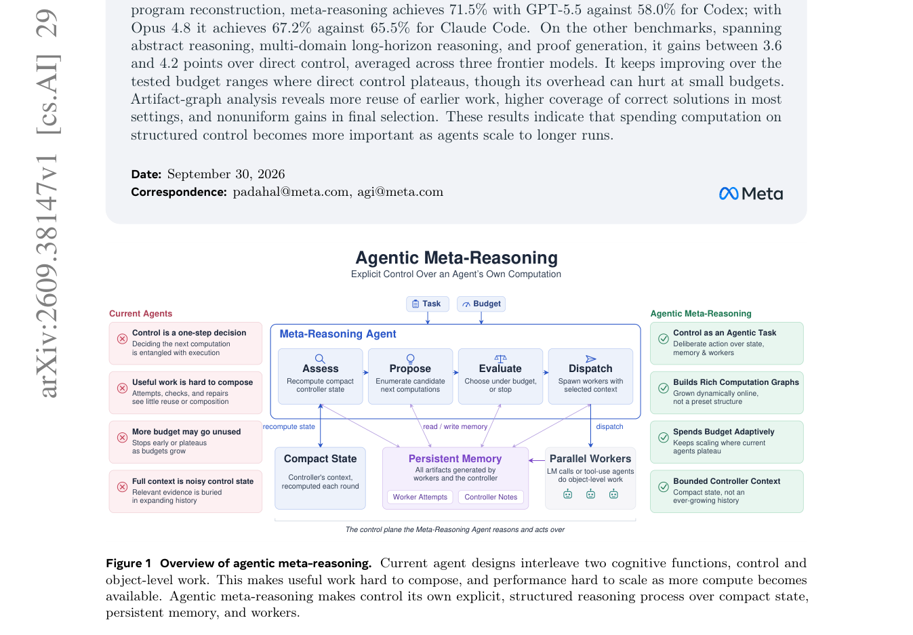

# Thinking Before Thinking: Scaling Agentic Inference Through Meta-Reasoning

> **复现级别：L1 核心机制诊断。** 执行预算可行性、Evaluate/Dispatch 选择和持久 artifact/紧凑 state 分离；不调用前沿 worker，不复述 ProgramBench 为本地成绩。

## 论文信息

| 字段 | 内容 |
|---|---|
| 论文链接 | [arXiv 2609.38147](https://arxiv.org/abs/2609.38147) |
| 公司/机构 | Meta Superintelligence Labs（按第一作者署名单位） |
| 首次公开日期 | 2026-09-29（arXiv v1） |
| 原文开源代码 | 否：截至 2026-10-01 未找到原作者公开仓库 |
| Adapter | `meta-reasoning` |
| 本地复现代码 | [`src/auto_research/agent_research/latest_20261001.py`](https://github.com/daiwk/auto-research/blob/main/src/auto_research/agent_research/latest_20261001.py) |

## 原始论文总结

### 背景与主要改动

把对象级工作交给 worker，把控制本身拆成 Assess、Propose、Evaluate 和 Dispatch；控制器只携带紧凑状态，通过持久 artifact memory 复用既有工作，并在统一调用预算内决定继续、分叉或停止。

<!-- paper-figure:start -->
### 原论文关键图

> **原论文 Figure 1（关键图）**：展示原论文提出的核心架构、主要模块及其连接关系。图片来自[原论文](https://arxiv.org/abs/2609.38147)，版权归原作者所有；点击图片可查看来源。
<!-- paper-figure:end -->

### 核心公式

$s_t=Assess(x,s_{t-1},\Delta M_t;M_t)$，$\tilde a_t=Evaluate(x,s_t,b_t,\mathcal A_t;M_t)$，随后 $a_t=Dispatch(\cdot)$。本地实现对可行 action 按预期价值/调用成本选择，并把完整 artifact 留在持久 memory。

### 论文离线与线上效果

ProgramBench 上 GPT-5.5 达 71.5%，Codex 为 58.0%；Opus 4.8 达 67.2%，Claude Code 为 65.5%。其他长程任务相对 direct control 平均提高 3.6–4.2 分。

## 本地复现

> **本地对照口径**：基线为论文机制关闭或默认状态，实验组为开启对应核心算子；本批只验证不变量和状态转换，跨模型相对变化不适用。

三种子诊断见 [`metrics/mechanism-seeds42-44.json`](metrics/mechanism-seeds42-44.json)。`diagnostic_only=true`，只证明核心状态转换、梯度或调度不变量可执行，不能进入正式能力排名。

## 复现边界

执行预算可行性、Evaluate/Dispatch 选择和持久 artifact/紧凑 state 分离；不调用前沿 worker，不复述 ProgramBench 为本地成绩。
