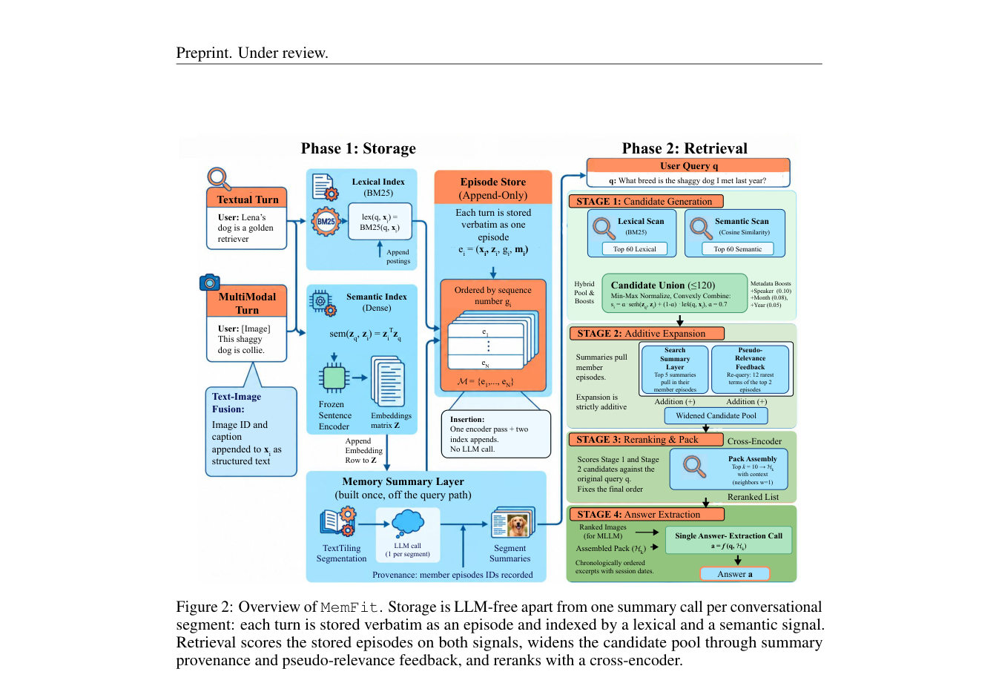

# MemFit: Efficient Long-Term Agentic Memory

> **复现级别：L1 核心机制诊断。** 执行无损追加和混合检索 hook；不调用 embedding/cross-encoder。

## 论文信息

| 字段 | 内容 |
|---|---|
| 论文链接 | [arXiv v1](https://arxiv.org/abs/2610.00872) |
| 公司/机构 | 原文首页未列第一作者机构（按第一作者署名单位） |
| 首次公开日期 | 2026-09-30（arXiv v1） |
| 原文开源代码 | 否：截至 2026-10-03 未找到原作者公开实现 |
| Adapter | `memfit` |
| 本地复现代码 | [`src/auto_research/agent_research/latest_20261003.py`](https://github.com/daiwk/auto-research/tree/main/src/auto_research/agent_research/latest_20261003.py) |

## 原始论文总结

### 背景与主要改动

原始 turn 追加写入不改写，只用 segment summary 建索引；读取融合 lexical、semantic 与 rerank 信号，避免昂贵 LLM 写入。

<!-- paper-figure:start -->
### 原论文关键图

> **原论文 Figure 2（关键图）**：展示原论文方法的总体设计和关键组成。图片来自[原论文](https://arxiv.org/abs/2610.00872)，版权归原作者所有；点击图片可查看来源。
<!-- paper-figure:end -->

### 核心公式

$score=lexical+semantic$，write 为 append-only。

### 论文离线与线上效果

论文报告相对 LLM memory 管线更低写入延迟和成本，并保持长期问答质量。

## 本地复现

> **本地对照口径**：基线为机制关闭或默认状态，实验组执行定义性算子；L1 不报告正式相对提升，百分比不适用。

- 三种子诊断：[`metrics/mechanism-seeds42-44.json`](metrics/mechanism-seeds42-44.json)
- `diagnostic_only=true`，不进入正式能力排名。

## 复现边界

执行无损追加和混合检索 hook；不调用 embedding/cross-encoder。
