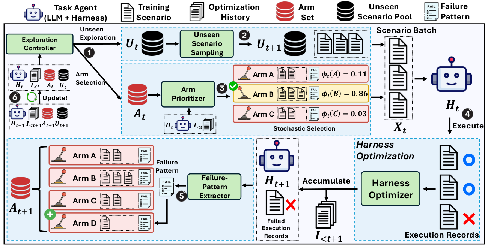

# ActiveSaddler: Automated Curriculum Learning for Agent Harness Optimization

> **复现级别：L1 核心机制诊断。** 执行动态 failure arm 与探索/利用调度；不调用 AutoSaddler 或真实 GAIA2/Terminal-Bench 环境。

## 论文信息

| 字段 | 内容 |
|---|---|
| 论文链接 | [arXiv 2610.00906](https://arxiv.org/abs/2610.00906) |
| 公司/机构 | POSTECH（按第一作者署名单位） |
| 首次公开日期 | 2026-10-01（arXiv v1） |
| 原文开源代码 | 是：[https://github.com/microsoft/AutoSaddler/tree/feat/activesaddler](https://github.com/microsoft/AutoSaddler/tree/feat/activesaddler) |
| Adapter | `active-saddler` |
| 本地复现代码 | [`src/auto_research/agent_research/latest_20261002.py`](https://github.com/daiwk/auto-research/blob/main/src/auto_research/agent_research/latest_20261002.py) |

## 原始论文总结

### 背景与主要改动

把反复出现的失败模式动态实例化为非平稳 bandit arm；课程控制器在发现新场景和重访已知弱点之间选择，并随 harness 修复结果更新优先级。

<!-- paper-figure:start -->
### 原论文关键图

> **原论文关键图**：展示论文核心架构、训练流程或系统协议。图片来自[原论文](https://arxiv.org/abs/2610.00906)，版权归原作者所有；点击图片可查看来源。
<!-- paper-figure:end -->

### 核心公式

$a_t=argmax_a[\hat v_a+c\sqrt{\log(t)/(n_a+1)}]$，并周期性 Draw 未见场景。

### 论文离线与线上效果

相同 harness optimizer 与 rollout 预算下，GAIA2 Pass@1 +4.4 点，Terminal-Bench 2.0 +7.5 点。

## 本地复现

> **本地对照口径**：基线为机制关闭或默认状态，实验组为开启对应核心算子。本批指标只验证不变量、梯度或状态转换，不表示论文规模效果。

- 三种子诊断：[`metrics/mechanism-seeds42-44.json`](metrics/mechanism-seeds42-44.json)
- `diagnostic_only=true`，不进入正式能力排名。

## 复现边界

执行动态 failure arm 与探索/利用调度；不调用 AutoSaddler 或真实 GAIA2/Terminal-Bench 环境。
