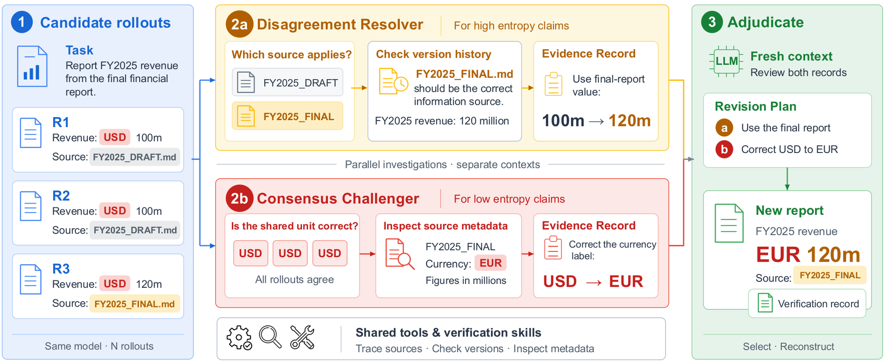

# VeriHarness: Scaling Agentic Verification for Long-Horizon Tasks

> **复现级别：L1 核心机制诊断。** 执行证据支持、冲突和共识挑战选择；fixture checker 不等同论文的真实工具环境。

## 论文信息

| 字段 | 内容 |
|---|---|
| 论文链接 | [arXiv 2610.00972](https://arxiv.org/abs/2610.00972) |
| 公司/机构 | Google Cloud AI Research（按第一作者署名单位） |
| 首次公开日期 | 2026-10-01（arXiv v1） |
| 原文开源代码 | 否：截至 2026-10-02 未找到原作者公开实现 |
| Adapter | `veriharness` |
| 本地复现代码 | [`src/auto_research/agent_research/latest_20261002.py`](https://github.com/daiwk/auto-research/blob/main/src/auto_research/agent_research/latest_20261002.py) |

## 原始论文总结

### 背景与主要改动

同一基础模型得到 workspace、证据工具和可复用验证技能；disagreement resolver 查证冲突 claim，consensus challenger 主动质疑共同 claim 和遗漏要求。

<!-- paper-figure:start -->
### 原论文关键图

> **原论文关键图**：展示论文核心架构、训练流程或系统协议。图片来自[原论文](https://arxiv.org/abs/2610.00972)，版权归原作者所有；点击图片可查看来源。
<!-- paper-figure:end -->

### 核心公式

$score(y)=supported(y)-contradicted(consensus)-\epsilon|claims(y)|$。

### 论文离线与线上效果

五个长程 workspace benchmark 上，相对单 rollout 平均提高 6.2（Gemini 3.5 Flash）和 6.4 点（Claude Opus 4.8），并发布约 26k rollouts。

## 本地复现

> **本地对照口径**：基线为机制关闭或默认状态，实验组为开启对应核心算子。本批指标只验证不变量、梯度或状态转换，不表示论文规模效果。

- 三种子诊断：[`metrics/mechanism-seeds42-44.json`](metrics/mechanism-seeds42-44.json)
- `diagnostic_only=true`，不进入正式能力排名。

## 复现边界

执行证据支持、冲突和共识挑战选择；fixture checker 不等同论文的真实工具环境。
