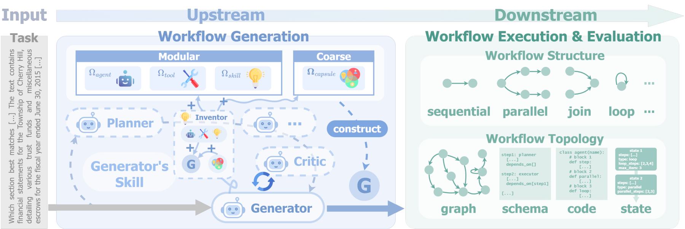

# It Takes Workflows to Evolve Better Workflows

> **复现级别：L1 核心机制诊断。** 执行结构 credit 守恒分配；不生成 workflow、不训练 Qwen3.5，也不运行 DataWright。

## 论文信息

| 字段 | 内容 |
|---|---|
| 论文链接 | [arXiv 2610.01026](https://arxiv.org/abs/2610.01026) |
| 公司/机构 | William & Mary（按第一作者署名单位） |
| 首次公开日期 | 2026-10-01（arXiv v1） |
| 原文开源代码 | 否：截至 2026-10-02 未找到原作者公开实现 |
| Adapter | `flowright` |
| 本地复现代码 | [`src/auto_research/agent_research/latest_20261002.py`](https://github.com/daiwk/auto-research/blob/main/src/auto_research/agent_research/latest_20261002.py) |

## 原始论文总结

### 背景与主要改动

利用 workflow 拓扑把稀疏结果拆为层级、结构感知的 role credit，使单角色自进化、上下游协同或多 Agent co-evolution 可共用一个 harness。

<!-- paper-figure:start -->
### 原论文关键图

> **原论文关键图**：展示论文核心架构、训练流程或系统协议。图片来自[原论文](https://arxiv.org/abs/2610.01026)，版权归原作者所有；点击图片可查看来源。
<!-- paper-figure:end -->

### 核心公式

$r_i=R\,w_i/\sum_jw_j$，$w_i=valid_i(1+children_i)$。

### 论文离线与线上效果

跨文档、幻灯片、图表、代码、数学和金融任务最高 +7.41%；多角色共同进化整体 +5.03%，单角色 +2.83%。

## 本地复现

> **本地对照口径**：基线为机制关闭或默认状态，实验组为开启对应核心算子。本批指标只验证不变量、梯度或状态转换，不表示论文规模效果。

- 三种子诊断：[`metrics/mechanism-seeds42-44.json`](metrics/mechanism-seeds42-44.json)
- `diagnostic_only=true`，不进入正式能力排名。

## 复现边界

执行结构 credit 守恒分配；不生成 workflow、不训练 Qwen3.5，也不运行 DataWright。
