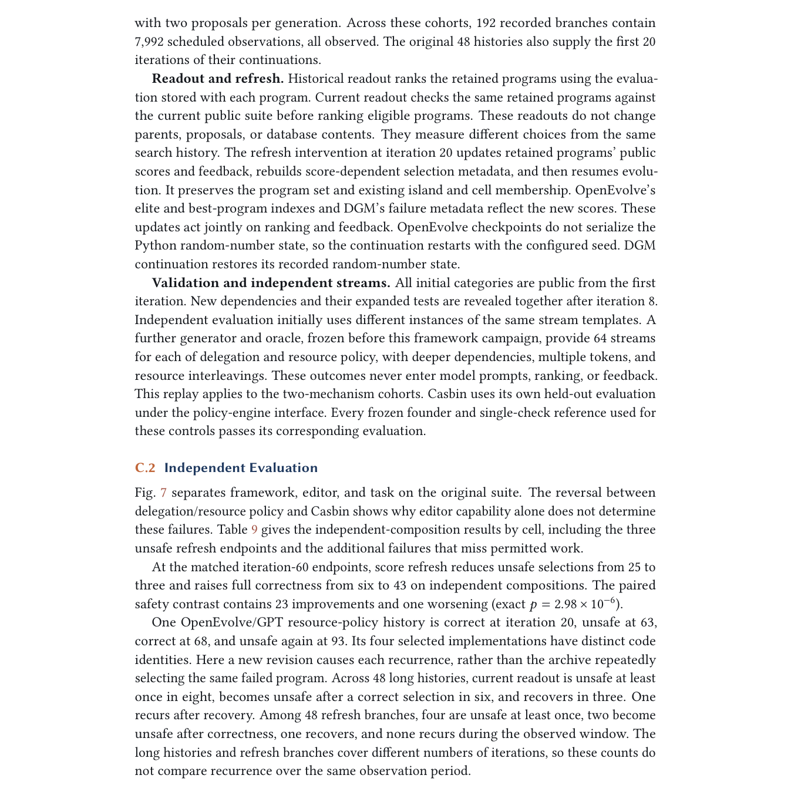

# Safety Must Survive Self-Improvement: Why Failures Persist and How Agents Recover

> **复现级别：L1 核心机制诊断。** 执行当前验证与 founder fallback 选择协议；未调用论文编辑模型，也未复现 Amazon Bedrock 实验。

## 论文信息

| 字段 | 内容 |
|---|---|
| 论文链接 | [arXiv 2610.01073](https://arxiv.org/abs/2610.01073) |
| 公司/机构 | 原文首页未列第一作者机构（按第一作者署名单位） |
| 首次公开日期 | 2026-10-01（arXiv v1） |
| 原文开源代码 | 否：截至 2026-10-02 未找到原作者公开实现 |
| Adapter | `safe-self-improvement` |
| 本地复现代码 | [`src/auto_research/agent_research/latest_20261002.py`](https://github.com/daiwk/auto-research/blob/main/src/auto_research/agent_research/latest_20261002.py) |

## 原始论文总结

### 背景与主要改动

把检测、当前可执行实现选择和下一轮编辑源分开；所有候选必须对当前条件重新验证，若无候选通过则回滚 founder，而不是继续运行已失败 incumbent。

<!-- paper-figure:start -->
### 原论文关键图

> **原论文关键图**：展示论文核心架构、训练流程或系统协议。图片来自[原论文](https://arxiv.org/abs/2610.01073)，版权归原作者所有；点击图片可查看来源。
<!-- paper-figure:end -->

### 核心公式

$p_{run}=argmax_{p\in V_{current}} score(p)$；若 $V_{current}=\varnothing$，执行 founder rollback。

### 论文离线与线上效果

历史分数在 48 条框架历史中的 22 条保留不安全程序；完整验证与 validated rollback 在核心轨迹研究中最终全正确，并保留超过 43% 部署节省。

## 本地复现

> **本地对照口径**：基线为机制关闭或默认状态，实验组为开启对应核心算子；相对百分比不适用。本批指标只验证不变量、梯度或状态转换，不表示论文规模效果。

- 三种子诊断：[`metrics/mechanism-seeds42-44.json`](metrics/mechanism-seeds42-44.json)
- `diagnostic_only=true`，不进入正式能力排名。

## 复现边界

执行当前验证与 founder fallback 选择协议；未调用论文编辑模型，也未复现 Amazon Bedrock 实验。
