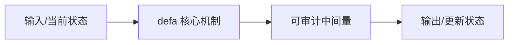
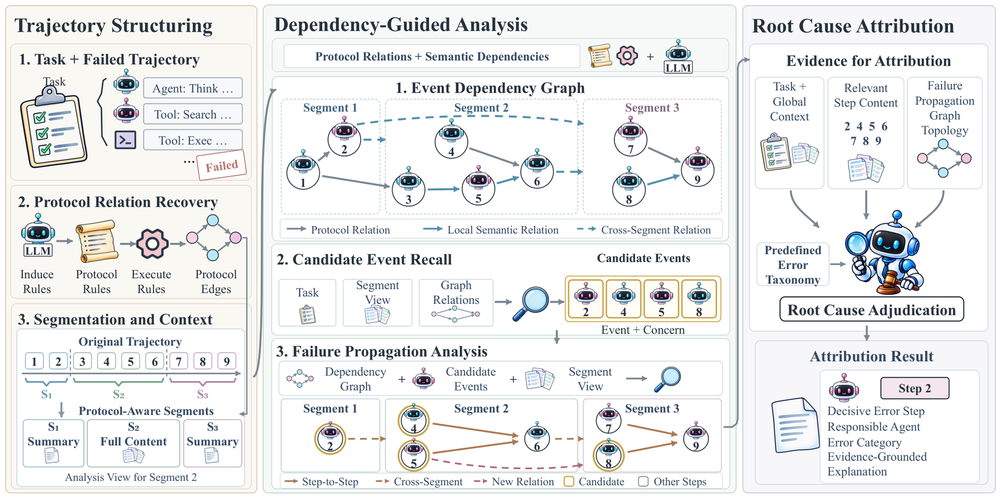

# DeFA: Dependency-Guided Failure Attribution for LLM Agents

> **复现级别：L1 核心机制诊断。** 执行依赖反向传播与 decisive-error 选择；不使用 gold plan/answer，不运行多模态 judge。

## 论文信息

| 字段 | 内容 |
|---|---|
| 论文链接 | [arXiv 2610.01256](https://arxiv.org/abs/2610.01256) |
| 公司/机构 | Qwen DianJin Team, Alibaba Cloud Computing（按第一作者署名单位） |
| 首次公开日期 | 2026-10-01（arXiv v1） |
| 原文开源代码 | 否：截至 2026-10-02 未找到原作者公开实现 |
| Adapter | `defa` |
| 本地复现代码 | [`src/auto_research/agent_research/latest_20261002.py`](https://github.com/daiwk/auto-research/blob/main/src/auto_research/agent_research/latest_20261002.py) |

## 原始论文总结

### 背景与主要改动

融合 protocol relation 和语义依赖构造 event dependency graph，再从违规事件逆向追踪 source 与下游影响，形成 failure propagation graph 并定位 decisive error。

<!-- paper-figure:start -->
### 原论文关键图

> **原论文关键图**：展示论文核心架构、训练流程或系统协议。图片来自[原论文](https://arxiv.org/abs/2610.01256)，版权归原作者所有；点击图片可查看来源。
<!-- paper-figure:end -->

### 核心公式

$e^*=argmax_{e\in Ancestor(V)} error(e)$，同时保留 responsible agent 与传播子图。

### 论文离线与线上效果

在 Who and When 系列达到最佳 responsible-agent 与 exact-step 准确率；用于 Trace2Skill 后下游准确率再提高 6–15 点。

## 本地复现

> **本地对照口径**：基线为机制关闭或默认状态，实验组为开启对应核心算子。本批指标只验证不变量、梯度或状态转换，不表示论文规模效果。

- 三种子诊断：[`metrics/mechanism-seeds42-44.json`](metrics/mechanism-seeds42-44.json)
- `diagnostic_only=true`，不进入正式能力排名。

## 复现边界

执行依赖反向传播与 decisive-error 选择；不使用 gold plan/answer，不运行多模态 judge。
