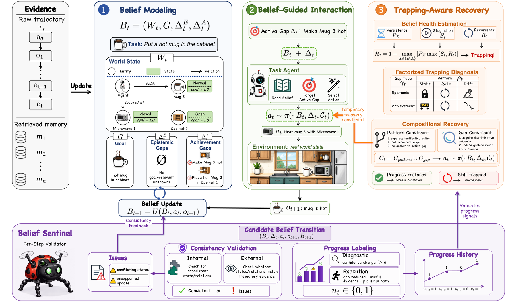

# Beyond Memory: Harnessing Long-Horizon Agents with Explicit Belief States

> **复现级别：L1 核心机制诊断。** 执行 belief 更新与停滞检测；未调用外部工具环境。

## 论文信息

| 字段 | 内容 |
|---|---|
| 论文链接 | [arXiv v1](https://arxiv.org/abs/2610.01415) |
| 公司/机构 | 原文首页未列第一作者机构（按第一作者署名单位） |
| 首次公开日期 | 2026-10-01（arXiv v1） |
| 原文开源代码 | 否：截至 2026-10-03 未找到原作者公开实现 |
| Adapter | `belief-state-pos` |
| 本地复现代码 | [`src/auto_research/agent_research/latest_20261003.py`](https://github.com/daiwk/auto-research/tree/main/src/auto_research/agent_research/latest_20261003.py) |

## 原始论文总结

### 背景与主要改动

把当前世界事实与尚未解决的任务要求显式维护为 belief；若连续动作没有减少 unresolved requirements，则识别 Belief Trapping 并触发针对性恢复。

<!-- paper-figure:start -->
### 原论文关键图

> **原论文 Figure 2（关键图）**：展示原论文方法的总体设计和关键组成。图片来自[原论文](https://arxiv.org/abs/2610.01415)，版权归原作者所有；点击图片可查看来源。
<!-- paper-figure:end -->

### 核心公式

$b_t=(facts_t, unresolved_t)$，$\Delta|unresolved|\ge0$ 标记停滞。

### 论文离线与线上效果

四个执行/诊断 benchmark 上改善长程 Agent 成功率。

## 本地复现

> **本地对照口径**：基线为机制关闭或默认状态，实验组执行定义性算子；L1 不报告正式相对提升，百分比不适用。

- 三种子诊断：[`metrics/mechanism-seeds42-44.json`](metrics/mechanism-seeds42-44.json)
- `diagnostic_only=true`，不进入正式能力排名。

## 复现边界

执行 belief 更新与停滞检测；未调用外部工具环境。
