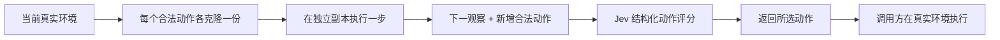
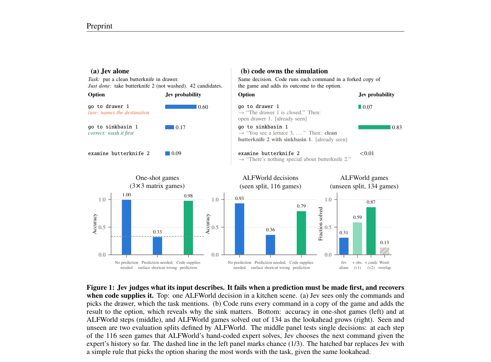

# Code Owns the Simulation, Jev Owns the Evaluation

> **L1 核心机制诊断**：真实克隆环境、执行分支和调用既有 provider 协议；本地实验使用显式词法诊断 provider，没有调用真实 Jev，也不是 ALFWorld 成功率复现。

## 论文信息

| 字段 | 内容 |
|---|---|
| 论文链接 | [arXiv 2610.01834](https://arxiv.org/abs/2610.01834) |
| 公司/机构 | The Chinese University of Hong Kong（一作 Yaodong Yang） |
| 首次公开日期 | 2026-10-01（arXiv v1） |
| 原文开源代码 | 未找到作者公开代码仓库（2026-10-04 全文核查） |
| Adapter | `jev-lookahead`（Python 机制 API，不是 reproduce CLI adapter） |
| 本地复现代码 | [`src/auto_research/system_one/lookahead.py`](https://github.com/daiwk/auto-research/blob/main/src/auto_research/system_one/lookahead.py) |

## 原始论文总结

### 背景与主要改动

让可执行代码负责模拟每个动作的后继状态，让 Jev 只负责比较动作带来的进展。除了当前动作和下一观察，还显式提供“执行后新出现的可用动作”，降低纯语义动作评分难以预判长期可达性的缺陷。

<!-- paper-figure:start -->
### 原论文关键图

> **原论文 Figure 1（关键图）**：展示原论文方法的总体设计和关键组成。图片来自[原论文](https://arxiv.org/abs/2610.01834)，版权归原作者所有；点击图片可查看来源。
<!-- paper-figure:end -->

### 核心公式

对动作 $a$，$s'_a=\operatorname{step}(\operatorname{clone}(s),a)$；令 $\Delta A_a=A(s'_a)\setminus A(s)$。
决策器输入仅包含 $a,o(s'_a),\Delta A_a$ 以及公开任务历史，而不是 simulator 的 reward、gold plan 或成功标签。

### 论文离线与线上效果

ALFWorld unseen 的 134 个任务中，论文报告 raw 42 个、加入下一观察 79 个、再加入新可用动作 116 个成功（约 87%）。机器人技能选择为 22/40，手写选择器为 3/40；直接 raw-torque 路线为 0/20。不同任务结果不可混比。未报告生产线上 A/B。

## 本地复现

运行 `PYTHONPATH=src python scripts/run_oct04_seven_papers.py`。

- `simulate_options(environment)`：每个动作独立克隆；拒绝 `fork()` 返回原对象，真实状态不改变。
- `choose_with_lookahead(environment, provider, task=..., observation=...)`：复用 System One `ChoiceQuestion`/`SystemOneRequest`，校验结果属于合法候选；不擅自执行真实动作。
- 环境须提供 `fork/admissible_commands/step`，`step` 仅返回可观察字符串。调用方必须保证深层状态、RNG 和外部资源隔离；仅对象不同不等于完整隔离。

[三种子产物](metrics/mechanism-seeds42-44.json)记录每次模拟两个分支、真实状态不变及所选动作。词法 provider 是明确标记的测试替身，不用它生成能力成功率。

## 复现边界

尚未运行真实 Jev checkpoint/托管 API、ALFWorld 或机器人环境；本次不新增 CUDA 路径，不宣称 GPU 验证或 Evolve 能力提升。[System One 方法索引](../../system-one/catalog.md)保留交叉入口。
