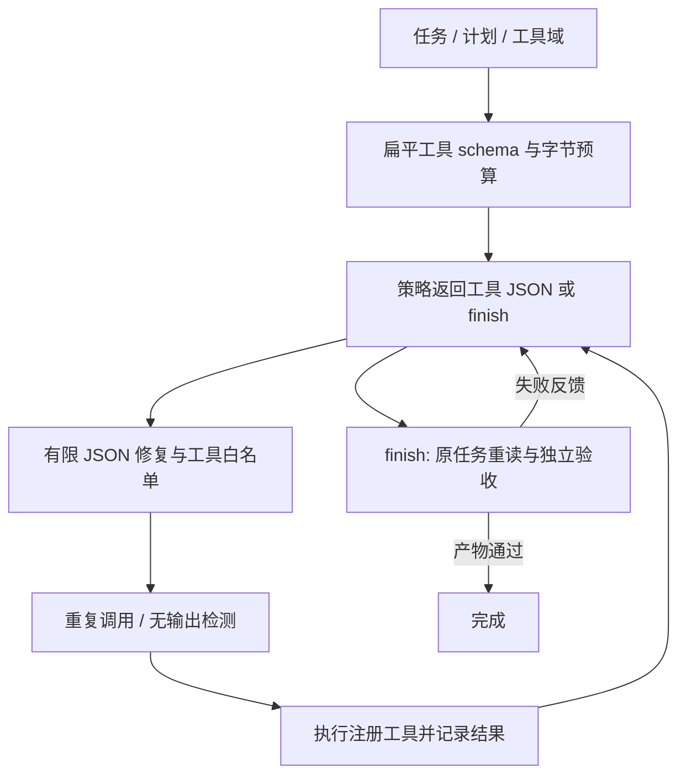
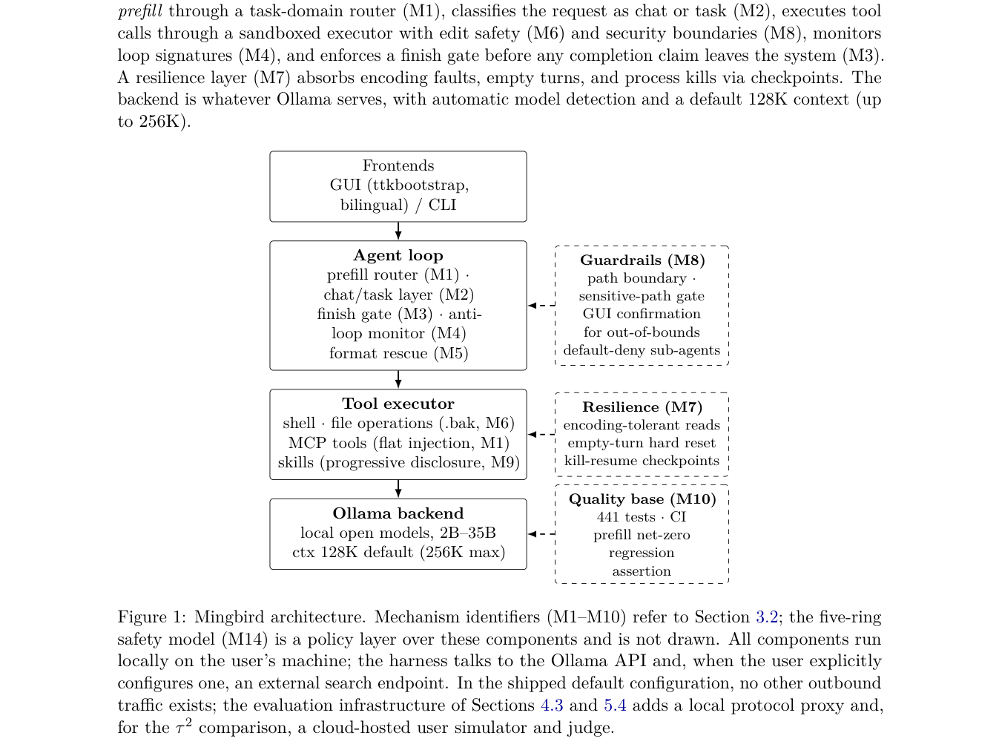

# Mingbird：面向本地小模型的 Agent Harness

> **L1 可移植运行框架诊断**：实际执行工具、检查产物和阻止假完成；使用显式脚本策略，不冒充真实小模型任务成功率。

## 论文信息

| 字段 | 内容 |
|---|---|
| 论文链接 | [arXiv 2610.02001](https://arxiv.org/abs/2610.02001) |
| 公司/机构 | University of Science and Technology Beijing（一作 Hao Wang） |
| 首次公开日期 | 2026-10-01（arXiv v1） |
| 原文开源代码 | 是：[Mingbird/Mingbird-agent](https://github.com/Mingbird/Mingbird-agent)，Apache-2.0 |
| Adapter | `mingbird`（Python 机制 API） |
| 本地复现代码 | [`src/auto_research/agent_research/mingbird.py`](https://github.com/daiwk/auto-research/blob/main/src/auto_research/agent_research/mingbird.py) |

## 原始论文总结

### 背景与主要改动

通过 domain 路由和扁平 schema 降低小模型工具调用负担；当模型宣称完成时重新注入原任务与计划并检查产物，发现重复调用或无输出循环时提醒修正，同时为常见 JSON 格式错误提供有限救援。改进的是推理运行框架，不需要把它解释为新的基础模型结构。

<!-- paper-figure:start -->
### 原论文关键图

> **原论文 Figure 1（关键图）**：展示原论文提出的核心架构、主要模块及其连接关系。图片来自[原论文](https://arxiv.org/abs/2610.02001)，版权归原作者所有；点击图片可查看来源。
<!-- paper-figure:end -->

### 核心公式

上下文约束为 $|\operatorname{UTF8}(prefill)|\le B$，不能按字符数估计中文字节。
工具超过 8 个参数时仅保留 required；调用签名由工具名和规范化 JSON 参数构成。
相同签名累计至少 6 次或连续至少 15 次无输出触发纠偏。

### 论文离线与线上效果

论文 LRAB 288 个模型任务单元报告 0.886，对照 0.631/0.479/0.405；τ² 相关比较报告 0.856/0.791/0.737。论文也说明自建基准、单机单次试验等局限。未报告生产线上 A/B；安全防护不是已证明可靠的沙箱。

## 本地复现

`PYTHONPATH=src python scripts/run_oct04_seven_papers.py` 在临时目录中真实写入文件：第一次 finish 因文件不存在被拒绝，随后执行写入，最后重新检查通过。全部三 seed 的[产物](metrics/mechanism-seeds42-44.json)保留拒绝假完成、实际产物及调用次数，不展示虚假的模型准确率。

- `flat_prefill`：路由、required 校验、UTF-8 硬预算。
- `rescue_tool_call`：支持 JSON、JSON 代码围栏和二次编码 JSON；只允许注册工具，绝不 `eval`。
- `run_task`：策略只接收任务/计划/执行轨迹，真实验收由外部 callback 执行；失败被反馈继续修正。
- `LoopMonitor`：规范化参数顺序；重复第六次在执行前被拦截。

## 复现边界

未实现整个 Windows GUI/语音产品、未跑 LRAB/τ²、未接入真实本地 LLM。注册工具仍继承调用方权限，此模块不是隔离沙箱，不应直接注册任意 shell。外部验收不能读取策略未获授权的私密信息并反馈给策略。
