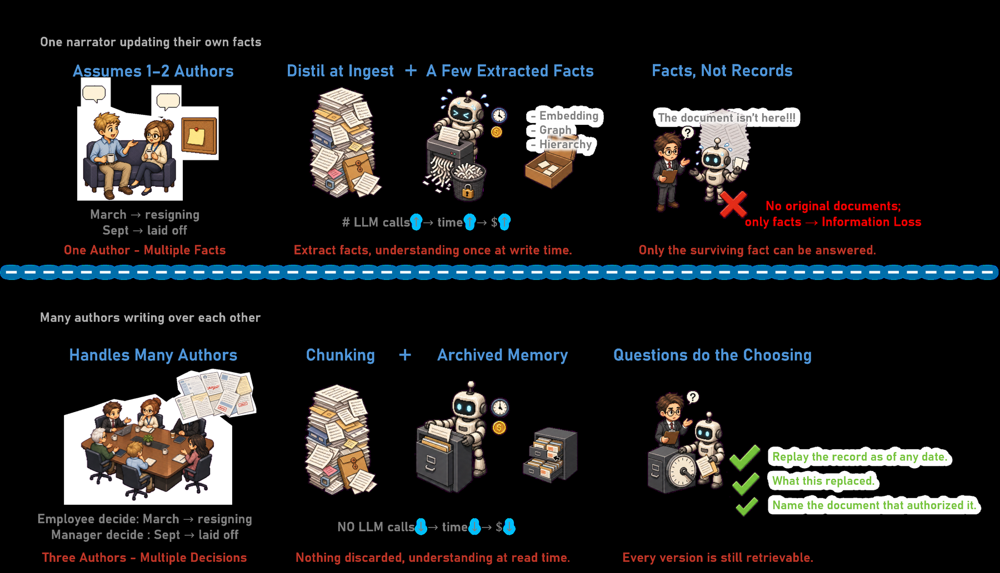

# Mem++: Non-Destructive Memory for Long-Term Organizational LLM Agents

> **复现级别：L1 核心机制诊断。** 执行全量写入、as-of 过滤与混合检索；不运行 OrgMemBench 或外部 embedding 服务。

## 论文信息

| 字段 | 内容 |
|---|---|
| 论文链接 | [arXiv 2610.02002](https://arxiv.org/abs/2610.02002) |
| 公司/机构 | The University of Texas at Austin（按第一作者署名单位） |
| 首次公开日期 | 2026-10-01（arXiv v1） |
| 原文开源代码 | 是：[https://github.com/AIDAChip-Inc/mem-plus-plus](https://github.com/AIDAChip-Inc/mem-plus-plus) |
| Adapter | `mem-plus-plus` |
| 本地复现代码 | [`src/auto_research/agent_research/latest_20261002.py`](https://github.com/daiwk/auto-research/blob/main/src/auto_research/agent_research/latest_20261002.py) |

## 原始论文总结

### 背景与主要改动

写入时完整保留文档、日期和作者，不调用生成模型做不可逆摘要；读取时先按问题时间过滤，再融合 lexical 与 semantic ranking。

<!-- paper-figure:start -->
### 原论文关键图

> **原论文关键图**：展示论文核心架构、训练流程或系统协议。图片来自[原论文](https://arxiv.org/abs/2610.02002)，版权归原作者所有；点击图片可查看来源。
<!-- paper-figure:end -->

### 核心公式

$score(d,q)=BM25(d,q)+sim(e_d,e_q)$，且仅检索 $time(d)\le time(q)$。

### 论文离线与线上效果

OrgMemBench 相对最强 memory baseline 提升 8.0–13.1 点；gpt-4.1-mini 比 RAG 高 2.6 点。

## 本地复现

> **本地对照口径**：基线为机制关闭或默认状态，实验组为开启对应核心算子；相对百分比不适用。本批指标只验证不变量、梯度或状态转换，不表示论文规模效果。

- 三种子诊断：[`metrics/mechanism-seeds42-44.json`](metrics/mechanism-seeds42-44.json)
- `diagnostic_only=true`，不进入正式能力排名。

## 复现边界

执行全量写入、as-of 过滤与混合检索；不运行 OrgMemBench 或外部 embedding 服务。
