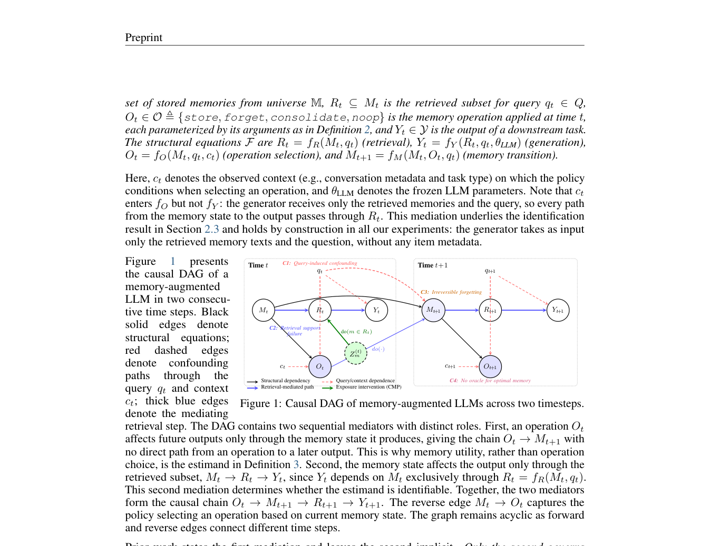

# Causal Memory Policy：检索干预下的记忆效用

> **L1 因果测量协议**：实现均衡随机曝光、Hájek 估计及不确定性感知单 query 决策。不把它夸大为已验证的长期记忆清理策略。

## 论文信息

| 字段 | 内容 |
|---|---|
| 论文链接 | [arXiv 2610.02070](https://arxiv.org/abs/2610.02070) |
| 公司/机构 | Illinois Institute of Technology（一作 Arman Behnam） |
| 首次公开日期 | 2026-10-01（arXiv v1） |
| 原文开源代码 | 论文给出[匿名发布仓库](https://anonymous.4open.science/r/cmp-release-D0C3/)；本轮访问未成功，未执行上游代码 |
| Adapter | `causal-memory-policy`（Python 机制 API） |
| 本地复现代码 | [`src/auto_research/agent_research/causal_memory_policy.py`](https://github.com/daiwk/auto-research/blob/main/src/auto_research/agent_research/causal_memory_policy.py) |

## 原始论文总结

### 背景与主要改动

被检索到的记忆与任务难度天然相关，直接按任务成败删除记忆存在选择偏差。CMP 在固定候选池中预留均衡随机曝光槽位，使每条记忆都有可估计的处理/对照样本，再用带标准误的效用判断保护不确定的记忆。

<!-- paper-figure:start -->
### 原论文关键图

> **原论文 Figure 1（关键图）**：展示原论文方法的总体设计和关键组成。图片来自[原论文](https://arxiv.org/abs/2610.02070)，版权归原作者所有；点击图片可查看来源。
<!-- paper-figure:end -->

### 核心公式

均衡设计保证每行 $k$ 个曝光，每列曝光次数为 $\lfloor Tk/P\rfloor$ 或 $\lceil Tk/P\rceil$。
$\hat\tau=\bar Y_{Z=1}-\bar Y_{Z=0}$，$SE=\sqrt{s_1^2/n_1+s_0^2/n_0}$。

$$
g_\lambda(z)=\lambda z\Phi(z)+z\Phi(-z)+(\lambda-1)\phi(z),\qquad z=\hat\tau/SE.
$$

仅 $g_\lambda(z)<0$ 时 forget；支持不足应拒绝估计，无限不确定性返回 noop。**固定槽位意味着处理某条记忆时也改变其他记忆分布**；估计的是该曝光设计下的净效应，不能直接解释为独立加性系数。

### 论文离线与线上效果

论文强调可识别的 per-query 记忆效用及错误删除代价，不声称已经解决跨 query 记忆保留、候选池选择和长期动态策略。未报告生产线上 A/B。

## 本地复现

`PYTHONPATH=src python scripts/run_oct04_seven_papers.py`：12 条记忆、600 次检索、每次 2 槽，三 seed 合成外部结果。每条记忆曝光恰好 100 次；[产物](metrics/mechanism-seeds42-44.json)保留正负效用、标准误及 forget 判断。

`balanced_exposure` 先构造满足度数的设计，再随机置换和边交换；`estimate_utility` 最少需要每臂两个观测。设计适用于固定候选池/已知曝光随机化，不能拿生产观察日志直接替代随机实验。

## 复现边界

尚未运行真实 LLM 检索任务或跨 query 记忆删除实验；合成效用恢复不是 Agent 答题准确率，不进入能力排行榜或 Evolve 晋级证据。
