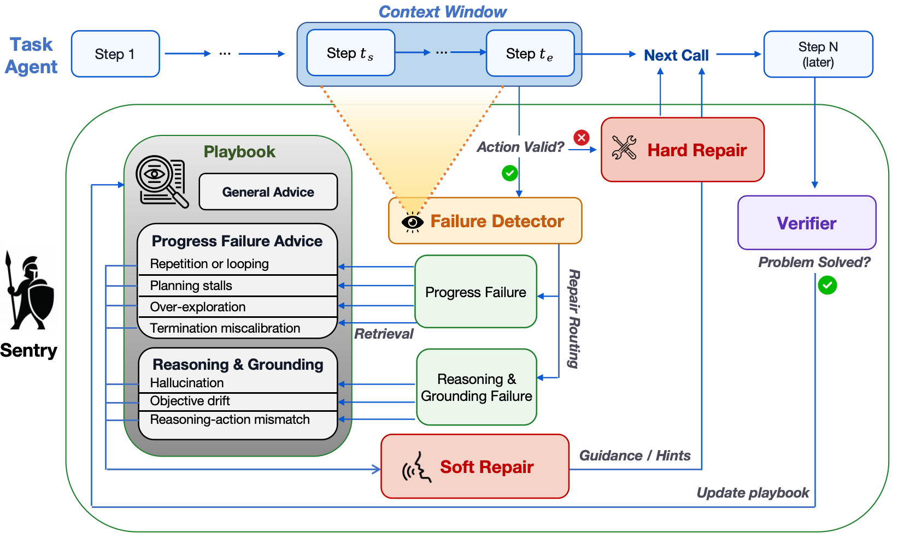

# Sentry：只在失败时调取经验，恢复确认后才写入记忆

> 独立控制器与真实 checkpoint 的小预算工具任务验证；未复现原文四套环境，不宣称 WebShop、AppWorld、SWE-bench 或 Mind2Web 成绩。

## 论文信息

| 字段 | 内容 |
|---|---|
| 论文链接 | [arXiv 2610.02994 v1](https://arxiv.org/abs/2610.02994) |
| 公司/机构 | Stanford University（一作 Changxiu Ji，与 Amy Lu 共同一作） |
| 首次公开日期 | 2026-10-02 |
| 原文开源代码 | [作者仓库](https://github.com/nuglifeleoji/Sentry)的 `83064d18a99f47a0a8032049eaa2e1e4085351ad` 仅有说明、论文和图片；可运行源码**尚未发布**，不能把 README 中命令当作已开源实现 |
| Adapter | `sentry`（独立失败恢复 API，尚非统一 Evolve 算子） |
| 本地复现代码 | [`sentry.py`](https://github.com/daiwk/auto-research/blob/main/src/auto_research/agent_research/sentry.py)、[`sentry_public.py`](https://github.com/daiwk/auto-research/blob/main/src/auto_research/agent_research/sentry_public.py)、[`运行脚本`](https://github.com/daiwk/auto-research/blob/main/scripts/run_sentry_checkpoint.py) |

## 原始论文总结

### 背景与主要改动

Sentry 不把所有失败经验长期塞进 Agent 上下文，而是先识别当前行为失败，再按类别和标签检索相关恢复建议。外部验证器只看后续可观察进展、不看任务奖励，确认恢复后才把经验写入 playbook；动作格式错误走单独的硬修复路径。

<!-- paper-figure:start -->
### 原论文关键图

[](https://github.com/nuglifeleoji/Sentry/blob/83064d18a99f47a0a8032049eaa2e1e4085351ad/assets/sentry-framework.png)

> 图片来自[原论文](https://arxiv.org/abs/2610.02994)作者仓库提供的框架图，版权归原作者所有；检测、条件检索、恢复验证和经验写入分别对应本地控制器状态，最终答案评测器在该闭环之外。
<!-- paper-figure:end -->

### 核心规则与原文结果

检索先匹配失败大类，再按标签重合数和新近性排序，尽量避免同一主标签占满返回结果。默认最近窗口 $W=5$、验证跨度 $H=10$、最多检索 $k=5$ 条；未确认恢复或测试阶段冻结时均不新增经验。论文在四种 Agent 环境比较运行时干预与上下文演化，详见[原文实验](https://arxiv.org/html/2610.02994v1#S5)；不是本地成绩。

## 本地复现

```bash
python -m pip install -e '.[post-training-gpu]' pyarrow
hf download Qwen/Qwen3-4B-Instruct-2507 --revision cdbee75f17c01a7cc42f958dc650907174af0554
mkdir -p data
curl -Lf 'https://huggingface.co/datasets/hotpotqa/hotpot_qa/resolve/1908d6afbbead072334abe2965f91bd2709910ab/distractor/validation-00000-of-00001.parquet' \
  -o data/hotpotqa-validation.parquet
PYTHONPATH=src python scripts/run_sentry_checkpoint.py \
  --dataset data/hotpotqa-validation.parquet \
  --output runs/sentry/results.json \
  --memory-cases 4 --held-out-offset 16 --held-out-cases 8 \
  --seeds 42,43,44
```

数据使用 [HotpotQA 官方 Hugging Face 镜像](https://huggingface.co/datasets/hotpotqa/hotpot_qa/tree/1908d6afbbead072334abe2965f91bd2709910ab/distractor)的 validation parquet。脚本校验固定 SHA-256，并按题目 ID 哈希排序；前 4 题建立记忆，之后 16 题保留给接口开发，再后 8 题作隔离对照。它们均来自官方 dev，**不是官方 test**。数据遵循原始 CC BY-SA 4.0 许可，仓库不复制原始语料。

真实 Qwen3-4B-Instruct-2507 选择 `search`、`read`、`finish`。环境只保存公开文档，不保存答案或 supporting facts；至少读一页才可提交答案。仅在整条轨迹结束后，外部评分器读取参考答案计算 EM。Sentry 与基线使用相同题目、生成种子、工具和 14 步上限；Sentry 额外检测/验证调用单独计量，不声称等 token 预算。

### A100 实测结果（2026-10-07）

固定 Qwen3-4B checkpoint；每个 seed 在 4 个任务上建立记忆，再冻结并对照相同的 8 个隔离任务。以下是同一组 8 个任务的三个生成种子，**不是 24 个不同任务**。

| Seed | 基线 EM | Sentry EM | 冻结经验数 |
|---|---:|---:|---:|
| 42 | 3/8 | 2/8 | 2 |
| 43 | 3/8 | 4/8 | 2 |
| 44 | 4/8 | 1/8 | 2 |
| 均值 | 41.67% | 29.17% | 2 |

本地结果为负，不能宣传为能力提升。基线/Sentry 的每题平均动作数为 2.58/3.13，Agent 输入输出 token 为 1,534.96/3,308.67；Sentry 另有每 seed 平均 27,956 个管理器 token（包含记忆阶段，不能混作单题推理成本）。三个 seed 均实际产生了条件经验检索，而不是只记录“开启记忆”标签。

[逐题脱敏指标与轨迹哈希](metrics/checkpoint-seeds42-44.json)保留 ID、动作数、EM、调用成本、事件计数和源提交。原始正文、完整模型回复不发布到站点。模型恢复判断出现误判可能是负结果的原因之一，但本轮不根据隔离集重调 detector、prompt 或记忆再重报成绩。

## 复现边界与失败记录

- 本地环境是 HotpotQA 文档上的只读检索工具，不是原论文浏览器、软件工程环境；样本很小，只作集成验证。
- 经验由模型局部恢复判断产生，判断仍可能错误；不把“模型说恢复了”当最终答对。
- 两轮接口开发分别发现动作枚举被照抄、工具可用性说明不足；这些题目已从最终隔离集排除。没有修改答案判定或塞入 gold 来提高得分。
- 没有软失败、没有验证成功或没有新经验时，都如实保留 0；不能用硬修复或手工经验冒充真实学习。
- CPU 单元测试覆盖延迟验证、检索规则、非法模型输出和冻结写入；真实 GPU 结果单独登记。尚未进入统一 Evolve 的能力晋级链。
