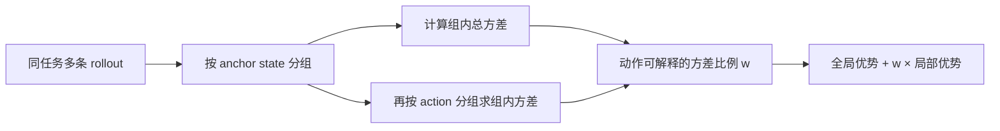
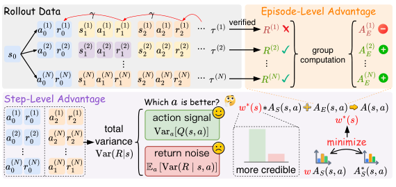

# AdaStep：按局部信用的可靠性调整 Agent RL 优势

> **L1 统计机制诊断**。实现论文 Eq. (17)–(18) 的同锚状态、按动作分组的方差分解、稀疏组回退和最终优势组合；没有宣称完成 Agent 策略训练或原文任务评测。

## 论文信息

| 字段 | 内容 |
|---|---|
| 论文链接 | [arXiv 2610.03223 v1](https://arxiv.org/abs/2610.03223) |
| 公司/机构 | Tsinghua University（一作 Xin Wang；论文其他署名机构含 Nanjing University、Xiaomi Inc.） |
| 首次公开日期 | 2026-10-02（arXiv v1；10 月 5 日公告） |
| 原文开源代码 | 未找到作者公开代码（2026-10-05 核查原文 HTML） |
| Adapter | `adastep`（独立 L1 机制 API，**未注册**完整 reproduce adapter） |
| 本地复现代码 | [`src/auto_research/agent_research/adastep.py`](https://github.com/daiwk/auto-research/blob/main/src/auto_research/agent_research/adastep.py)；[`scripts/run_adastep_20261005.py`](https://github.com/daiwk/auto-research/blob/main/scripts/run_adastep_20261005.py) |

## 原始论文总结

### 背景与主要改动

Agent 长轨迹的终局奖励给每一步同样的全局优势，无法指出哪一步有用；GiGPO 等方法用相同锚状态的局部回报补充信用，但同一动作之后的随机路径也会改变回报。AdaStep 不另训 critic，而是看同组中**不同动作解释了多少回报方差**。动作间差异主导时信任局部信用；同动作内部差异主导时将局部修正压低，保留全局优势。



<!-- paper-figure:start -->
### 原论文关键图

[](https://arxiv.org/html/2610.03223)

> **原论文 Figure 2**：同一锚状态下的动作解释方差与后续路径噪声共同决定局部信用权重。图片来自[原论文](https://arxiv.org/abs/2610.03223)，版权归原作者所有；点击图片可查看来源。
<!-- paper-figure:end -->

### 核心公式

对同一锚状态 $s$ 的训练轨迹，把实际观测到的折扣回报 $R$ 再按动作 $a$ 分组。论文使用分母为 $N_s$、$n_{s,a}$ 的总体经验方差，计算

$$
\hat w(s)=1-\frac{\sum_a \hat p(a\mid s)\,\widehat{\mathrm{Var}}(R\mid s,a)}{\widehat{\mathrm{Var}}(R\mid s)},
\qquad A_{i,t}=A_E(\tau_i)+\hat w(s_{i,t})A_S(s_{i,t},a_{i,t}).
$$

只有至少两个动作、每个动作至少两条样本且总方差大于零时估计比值；其他情况按论文默认 $w=1$。全组回报相同则局部优势为零，不凭空产生修正。本地 API 可选择局部优势是否按组总标准差归一化，但**权重始终从未归一化回报统计估计**。

### 论文离线与线上效果

原文使用 Qwen3-1.7B/4B、Qwen2.5-7B-Instruct，在 ALFWorld、WebShop、ScienceWorld 与 GiGPO/HGPO 等比较；报告多个设置上的提升。方法的信用计算额外时间约 1%，是论文报告值，不是本地测速。论文未报告生产线上 A/B。

## 本地复现

```bash
PYTHONPATH=src python scripts/run_adastep_20261005.py
python -m pytest tests/test_adastep_20261005.py
```

[三 seed 机制回执](metrics/variance-seeds42-44.json)使用合成动作回报组：动作差异显著的组平均权重约 0.974；只有后续噪声的组约 0.026。此结果仅检查权重的方向，**不是** Agent 任务成功率。测试还覆盖组内总体方差、少样本回退、全回报并列与优势归一化。

## 复现边界

输入只包含策略 rollout 的任务 ID、状态键、动作、折扣回报和全局优势；分组键为任务 ID 与 anchor state，避免不同任务的同名状态互相污染。不读取金标答案或计划。这里未运行环境交互、Qwen 策略更新、ALFWorld/WebShop/ScienceWorld，也没有同预算的 GiGPO 对照。标记 `diagnostic_only=true`、`formal_comparison=false`，不进入能力看板或 Evolve 晋级。升级需要真实同任务多条 rollout、可信的 anchor-state 对齐、隔离的 validation/test、完整策略优化和多 seed 基线；如启用 CUDA 路径，先在 A100/A30 运行并提交脱敏回执。
