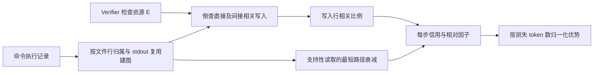
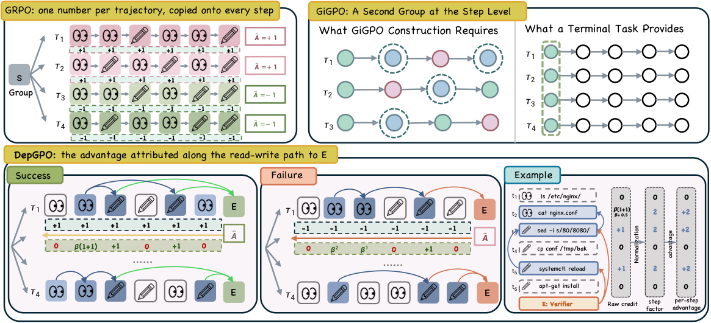

# DepGPO：用终端命令依赖分配 Agent RL 信用

> **L1 机制诊断**。这里实现了论文的记录级读写依赖、相关写入与支持性读取信用，以及步级/令牌级优势归一化；尚未接入真实终端 tracer、verifier 执行或 Qwen 策略训练，不能把机制指标当成任务成功率。

## 论文信息

| 字段 | 内容 |
|---|---|
| 论文链接 | [arXiv 2610.03634 v1](https://arxiv.org/abs/2610.03634) |
| 公司/机构 | Southeast University（一作 Yu Li；合著机构包括 Huawei Noah’s Ark Lab） |
| 首次公开日期 | 2026-10-02（arXiv v1，10 月 5 日公告） |
| 原文开源代码 | 未找到作者公开实现（2026-10-06 核查论文全文及公开仓库检索） |
| Adapter | `depgpo`（独立 L1 机制 API，**未注册**完整 reproduce adapter） |
| 本地复现代码 | [`src/auto_research/agent_research/depgpo.py`](https://github.com/daiwk/auto-research/blob/main/src/auto_research/agent_research/depgpo.py)；[`scripts/run_depgpo_20261006.py`](https://github.com/daiwk/auto-research/blob/main/scripts/run_depgpo_20261006.py) |

## 原始论文总结

### 背景与主要改动

终端 Agent 通常只拿到任务结束后的 verifier 奖励。GRPO 把同一条轨迹的优势分给所有生成 token，无法区分真正生成答案的命令、为其提供数据的读取，以及后来被覆盖或无关的操作。DepGPO 从执行记录构造命令依赖图：文件读取连向该文件尚未覆盖的写入者，可信的 stdout 复用也形成边；再从 verifier 实际检查的文件、端口和进程向后追溯。



<!-- paper-figure:start -->
### 原论文关键图

[](https://arxiv.org/html/2610.03634v1/fig1.png)

> **原论文 Figure 2**：上方对比 GRPO 的整轨迹同权和 GiGPO 的状态分组；下方展示 DepGPO 沿读写路径给成功/失败轨迹分配不同命令信用，再归一为每步优势。图片来自[原论文](https://arxiv.org/abs/2610.03634)，版权归原作者所有；点击图片可查看来源。
<!-- paper-figure:end -->

### 公式与关键区别

写命令的信用是相关写入记录占其所有写入记录的比例；相关写入包括仍存在于 verifier 检查文件中的直接写入，以及被后续相关写命令读取、且未在原位置覆盖的间接写入。无写入的读取命令，把能到达的每个相关写命令的信用按最短依赖距离乘 $\beta^d$ 后求和（论文默认 $\beta=0.5$）。同一步多个命令的信用相加，不取均值。每条轨迹减去本轨迹最小步信用，再归一到步均值 1；未记录命令、全信用并列等情况保持 GRPO 单位权重。最后按进入损失的 token 数再次归一，保持 token 加权平均优势不变，且不翻转原始优势符号。

论文在 Qwen3.5-9B / Qwen3.6-27B、SETA / TMAX 设置下报告 Terminal-Bench 的 pass@1 改善和更稳定的训练；这些是**论文结果**，不是本地结果。详细实验与训练预算见[原文](https://arxiv.org/html/2610.03634)。

## 本地复现（机制验证）

```bash
PYTHONPATH=src python scripts/run_depgpo_20261006.py
PYTHONPATH=src python -m pytest tests/test_depgpo_20261006.py
```

[机制回执](metrics/trace-mechanism.json)只包含四条手工结构化命令：支持读取、间接写入、最终写入、无关写入。测试还覆盖覆盖写不自动建立依赖、写入记录分母、最短路径、回退、负优势与 token 数不等时的均值守恒。这不是 Terminal-Bench、真实 Qwen 训练或多 seed 能力比较。

## 复现边界与下一步

输入是**可信 tracer 已记录**的文件读写、每命令 diff 行号或全文件标记、stdout 来源、verifier 检查资源及策略损失 token 长度。代码不解析 shell 文本，也不自行判断 stdout 匹配；传入的 stdout 来源必须排除原任务提示中已经出现的值。verifier 文件集合须先剔除 verifier 自己写入的文件，过滤系统噪声并规范化路径；否则信用结果不可信。代码不读取金标答案或计划。当前 `diagnostic_only=true`、`formal_comparison=false`，不进入能力看板或 Evolve 晋级。

若要升级为完整复现，还需真实受控 terminal tracer、verifier 资源记录、同任务多条策略 rollout、GRPO/DAPO actor 更新、验证集选 checkpoint 与隔离测试集的多 seed 同预算对照。若声明 CUDA 训练路径，按仓库门槛先在 A100/A30 运行，并提交脱敏 GPU 回执。
