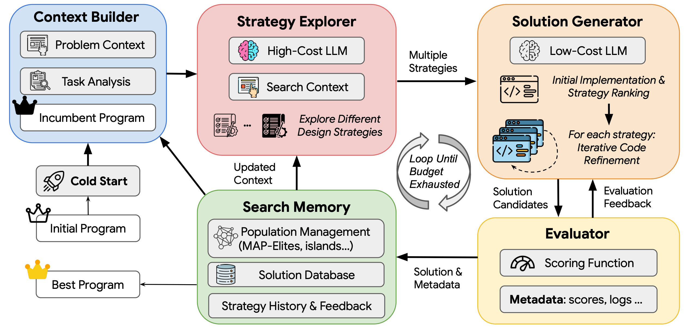

# FrugalEvo：固定成本下的强弱模型程序进化

> 本地独立实现与公开任务小预算验证。不是原论文 API 模型、美元成本或完整 20 任务结果的复现；尚未接入统一 Evolve 控制器。

## 论文信息

| 字段 | 内容 |
|---|---|
| 论文链接 | [arXiv 2610.03675 v1](https://arxiv.org/abs/2610.03675) |
| 公司/机构 | National University of Singapore（一作 Hui Chen）；合著包括 University of Washington、Princeton、Stanford |
| 首次公开日期 | 2026-10-02 |
| 原文开源代码 | [作者实现](https://github.com/chchenhui/frugalevo)，Apache-2.0；核对版本 `82f7b739110944bf3e8737db303a302a568e7327` |
| Adapter | `frugalevo`（独立程序搜索 API，不是通用 `reproduce` adapter） |
| 本地复现代码 | [`frugalevo.py`](https://github.com/daiwk/auto-research/blob/main/src/auto_research/agent_research/frugalevo.py)、[`program_sandbox.py`](https://github.com/daiwk/auto-research/blob/main/src/auto_research/agent_research/program_sandbox.py)、[`运行脚本`](https://github.com/daiwk/auto-research/blob/main/scripts/run_frugalevo_checkpoint.py) |

## 原始论文总结

### 背景与主要改动

FrugalEvo 把程序优化拆成高成本模型提出策略、低成本模型执行和改进代码，按预算内整条最佳成绩曲线评价搜索效率。先试跑多种策略再排序，失败时保留父程序追加反馈，取得改进后重新锚定，并用岛屿档案保存不同程序。

<!-- paper-figure:start -->
### 原论文关键图

[](https://github.com/chchenhui/frugalevo/blob/82f7b739110944bf3e8737db303a302a568e7327/assets/frugalevo_overview.png)

> 图片来自[原论文](https://arxiv.org/abs/2610.03675)作者仓库提供的框架图，版权归原作者所有；图中强/弱模型分工、评估和程序档案对应本地三个独立接口。
<!-- paper-figure:end -->

### 公式与原文结果

设累计调用成本为 $c$，截至该成本的最佳有效得分为 $s^*(c)$，预算 $B$ 下的 BA-AUC 为 $\int_0^B s^*(c)\,dc$。它奖励较早找到好程序，不等于最后一次评估的分数。原文用数学、系统和算法优化任务比较多种进化方法；原文 API 定价与成绩请见[论文实验](https://arxiv.org/html/2610.03675v1#S3)，不能与本地 token 预算直接换算。

## 本地复现

需要 Linux、可用的 bubblewrap/prlimit、CUDA 和预先下载的公开 checkpoint。生成程序在无网络、无工作区/凭据/模型缓存挂载的沙箱中运行；沙箱不能启动时拒绝执行，没有裸 `exec` 回退。

提示词要求不使用文件和子进程，但实际安全边界是 namespace、只读系统运行时和资源限制，并非 seccomp 禁止所有子进程；隔离命名空间内仍有临时目录。这些限制经过 `scripts/validate_program_sandbox.py` 的真实 Linux 检查，不等于形式化安全证明。

```bash
python -m pip install -e '.[post-training-gpu]'
hf download Qwen/Qwen2.5-7B-Instruct --revision bb46c15ee4bb56c5b63245ef50fd7637234d6f75
hf download Qwen/Qwen3-4B-Instruct-2507 --revision cdbee75f17c01a7cc42f958dc650907174af0554
PYTHONPATH=src python scripts/run_frugalevo_checkpoint.py \
  --output runs/frugalevo/results.json --budget 40000 \
  --max-calls 30 --max-tokens 768 --seeds 42,43,44
```

模型为固定修订的 Qwen2.5-7B-Instruct 与 Qwen3-4B-Instruct-2507；脚本允许传本地缓存目录，不上传模型。较大模型不保证比较小模型强。模型修订、每次实际 token 数、完整生成代码、反馈、策略与成本曲线写入 JSON；无效程序和格式错误也保留成本。

两个完整权重合计约 22 GB，需预留下载空间和 GPU 显存；没有量化或 CPU 回退。Linux 还须安装系统 `bubblewrap` 和 `util-linux`（提供 `prlimit`），并允许非特权 user namespace。权重下载完后运行脚本仅从本地缓存加载。若用 `--large-checkpoint` / `--small-checkpoint` 覆盖目录，调用者必须确认目录对应上述 revision。

本地公开目标是把 26 个圆放入单位正方形并最大化半径和。代码只输出圆心/半径，可信检查器独立验证有限数值、边界和不重叠；模型自报的分数不被采用。对照是相同初始程序、相同预算上限的弱模型迭代搜索。每个方法还受 30 次调用上限约束，因此不声称两者实际花费完全相同。

### A100 实测结果（2026-10-07）

每个方法的预算上限为 40,000 加权 token、最多 30 次调用；三个 seed 都从同一个有效网格程序（半径和 2.16667）开始。

| Seed | 弱模型最终最佳 | FrugalEvo 最终最佳 | 弱模型 BA-AUC / B | FrugalEvo BA-AUC / B |
|---|---:|---:|---:|---:|
| 42 | 2.40000 | 2.40000 | 2.31671 | 2.19131 |
| 43 | 2.40000 | 2.40000 | 2.32273 | 2.34223 |
| 44 | 2.40000 | 2.16667 | 2.32876 | 2.16667 |
| 均值 | 2.40000 | 2.32222 | 2.32273 | 2.23340 |

**本地结果没有证明强弱模型协作更好。** FrugalEvo 的策略试跑分别执行 4/5/5 次，细化执行 9/7/7 次；不是只调用一次强模型就声称完成进化。其平均花费为 38,820 加权 token，弱模型为 29,253.67；弱模型先触及 30 次调用上限，因此这是相同上限而非相同实际花费的对照。BA-AUC 积分对未用完的预算延续当前最佳分数，不能把早停区间直接丢掉。

开发期间曾因任务的“输出 Python”要求干扰策略 JSON 产生格式失败，已修正输出合同；失败 pilot 不混入上述最终三种子结果。原始运行仍保存每次错误与成本，未从正式运行中删除无效程序。

[逐 seed 指标、成本曲线与程序哈希](metrics/checkpoint-seeds42-44.json)；[真实 GPU 与沙箱回执](../../gpu-validations/oct07-agent-search-a100.json)。

## 复现边界

- 共享前缀字节顺序已实现；当前 Transformers 后端**没有跨请求 KV 前缀缓存**，`cached_input_tokens=0`，不声称复现论文缓存加速。
- 成本是输入/输出 token 的固定加权单位（大模型 2、小模型 1），不是美元或实测能耗。
- 岛屿档案用固定代码长度和词集差异分桶，未照搬作者动态归一化描述符；任务约束为标准库程序，与作者 NumPy 接口不同。
- 这是对公开数学目标的直接优化，没有隐藏测试分布；不外推为泛化能力或正式 Evolve 晋级证据。

GPU 回执验证了冻结模型生成和候选程序执行，**不是权重训练证据**，也没有将小任务结果升级为正式能力提升。
