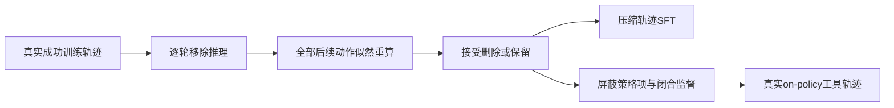
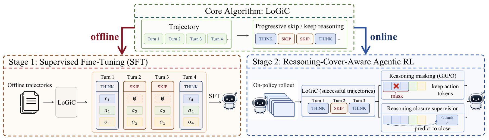

# RACE：跨轮动作似然驱动的推理压缩

> 独立核心机制 API 与真实 checkpoint 接口。短运行是 L1 诊断，非论文 benchmark 复测；尚未接入统一 Evolve 晋级。

## 论文信息

| 字段 | 内容 |
|---|---|
| 论文链接 | [arXiv 2610.12061 v1](https://arxiv.org/abs/2610.12061) |
| 公司/机构 | Renmin University of China（一作 Yiruo Cheng） |
| 首次公开日期 | 2026-10-08 |
| 原文开源代码 | [作者公布的仓库](https://github.com/HututuAI/RACE)，截至 2026-10-10 仓库为空，尚无可下载实现 |
| Adapter | race（独立机制 API，非通用 reproduce adapter） |
| 本地复现代码 | src/auto_research/agent_research/race.py；共享后端 oct10_backend.py；scripts/run_oct10_agents.py |

## 原始论文总结

### 背景与主要改动

LoGiC 从第二轮逐步删除推理，检查本轮及所有后续原动作的平均 token 对数似然变化，已接受删除继续影响后续上下文。成功轨迹压缩后用于 SFT；RL 屏蔽可删推理并监督提前闭合。原文四个 Agent 环境推理 token 分别减少 32.3%、80.2%、46.4%、62.0%，未报告线上 A/B。

### 架构流程



<!-- paper-figure:start -->
### 原论文关键图

[](https://arxiv.org/html/2610.12061v1/RACE2.png)

> **原论文 Figure 3（关键图）**：展示原论文的训练流程与关键优化环节。图片来自[原论文](https://arxiv.org/abs/2610.12061)，版权归原作者所有；点击图片可查看来源。
<!-- paper-figure:end -->

### 核心公式

$d_j=\ell(a_j\mid h_j)-\ell(a_j\mid\tilde h_j)$；所有 $j\ge t$ 的 $d_j\le\epsilon$ 才删除。RL 分母保留原全部策略 token 数；闭合项按全部回合数归一化。

### 论文离线与线上效果

上述数字属于[原论文全文](https://arxiv.org/html/2610.12061v1)，不是本地结果，模型规模和指标协议不同不能直接比较。

## 本地复现

动作似然、成功轨迹 SFT 与 cover-aware actor 梯度接口已实现。真实输入必须提供公开环境、修订与 reason/action/observation 训练轨迹；不能把 QA 解题行伪装成工具轨迹。评估 Agent 不读取参考动作。论文四环境完整 on-policy RL 尚未复测；其端到端能力结果仍缺。

### 操作与数据协议

```bash
python -m pip install -e '.[post-training-gpu]'
PYTHONPATH=src python scripts/run_oct10_agents.py \
  --method race --checkpoint /path/to/public/checkpoint \
  --dataset /path/to/train.jsonl --device cuda \
  --seed 42 --output runs/race/result.json
```

输入必须有 question、environment、source_revision、split=train、successful=true 与 turns；每轮含 reasoning、action、observation，参考轨迹只用于训练。也可加 `--race-bounded` 使用本仓库公开有界 calculator 环境：真实采样 A/B 工具动作并执行，环境私有判成功，随后重新采样 on-policy 轨迹训练；这是 L1 运行合同验证，不是官方 ScienceWorld。

### 验证与边界

2026-10-10，NVIDIA A100，SmolLM2-135M-Instruct，seed=42：公开 bounded-calculator-v1 中，模型真实采样动作、执行计算工具，再以成功轨迹做 SFT，并重新采样 64 条 on-policy 轨迹。11 条成功；cover-aware actor loss=0.02441，实际闭合监督项 6，原策略 token 分母 554，屏蔽推理 token 24。该环境只验证训练机制，不是 ScienceWorld，不作能力排名。

本地指标：[L1 GPU 诊断](metrics/checkpoint-a100-seed42.json)。检查点修订、源码 commit 与执行命令以本批 GPU 回执为准。

对应 tests/test_race.py 检查公式和状态合同。真实运行保存诊断标识、seed、轨迹/似然或评测路径。单 seed、短响应与少量训练步数不能当稳定提升；失败和负结果保留。GPU 回执由本批集成统一登记，原始 runs 及权重不提交。CPU 可用于机制调试，CUDA 路径必须通过真实 NVIDIA 验证。

