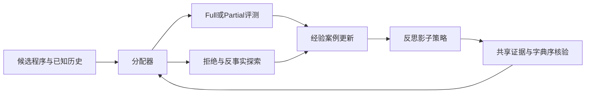
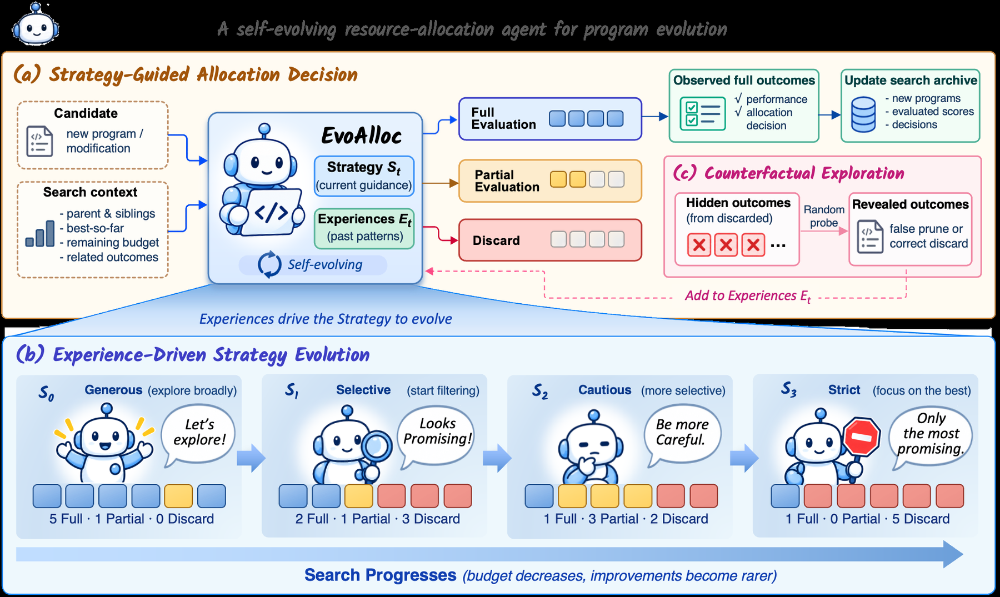

# EvoAlloc：随搜索演化的评测资源分配

> 独立核心机制 API 与真实 checkpoint 接口。短运行是 L1 诊断，非论文 benchmark 复测；尚未接入统一 Evolve 晋级。

## 论文信息

| 字段 | 内容 |
|---|---|
| 论文链接 | [arXiv 2610.12086 v1](https://arxiv.org/abs/2610.12086) |
| 公司/机构 | King Abdullah University of Science and Technology（一作 Yanning Dai） |
| 首次公开日期 | 2026-10-08 |
| 原文开源代码 | 未找到作者公开代码（截至 2026-10-10，检查正文和项目链接） |
| Adapter | evoalloc（独立机制 API，非通用 reproduce adapter） |
| 本地复现代码 | src/auto_research/agent_research/evoalloc.py；共享后端 oct10_backend.py；scripts/run_oct10_agents.py |

## 原始论文总结

### 背景与主要改动

模型选择 Full、Partial 或 Discard，得到 Partial 证据后再选择继续/停止。已观察案例更新固定语句经验并反思策略；影子策略共享同一证据，以漏掉新最佳的次数优先、再比较评测成本。拒绝候选以概率做反事实评测，避免选择性反馈。原文达到基线时 Full 数减少 59–82%，同预算成绩提高 8.7–12.0%，未报告线上 A/B。

### 架构流程



<!-- paper-figure:start -->
### 原论文关键图

[](https://arxiv.org/html/2610.12086v1/figures/fig1.png)

> **原论文 Figure 1（关键图）**：展示原论文方法的总体设计和关键组成。图片来自[原论文](https://arxiv.org/abs/2610.12086)，版权归原作者所有；点击图片可查看来源。
<!-- paper-figure:end -->

### 核心公式

所有实际 Full 均计预算，包括 warmup、影子并集和反事实探索。比较字典序 $(missed\ newbest,\#Full,\#Partial)$；观察两次分歧后才能晋级。

### 论文离线与线上效果

上述数字属于[原论文全文](https://arxiv.org/html/2610.12086v1)，不是本地结果，模型规模和指标协议不同不能直接比较。

## 本地复现

复用真实 Linux bubblewrap/prlimit Circle26 程序环境，可信几何检查器评分而非模型自报，沙箱失败即拒绝运行。Circle26 无 Partial，因此此运行只允许 Full/Discard。经验 ADD/UPDATE/DELETE 不允许 UPDATE 重写语句，未观察案例不可当证据，最多四条活跃/暂定和四条陈旧经验。

### 操作与数据协议

```bash
python -m pip install -e '.[post-training-gpu]'
PYTHONPATH=src python scripts/run_oct10_agents.py \
  --method evoalloc --checkpoint /path/to/public/checkpoint \
  --dataset /path/to/train.jsonl --device cuda \
  --seed 42 --output runs/evoalloc/result.json
```

程序目标由公开 Circle26 几何合同定义，QA 文件不参与评分。

### 验证与边界

2026-10-10，NVIDIA A100，SmolLM2-135M-Instruct，seed=42：真实 Circle26 沙箱执行 4 次 Full 评测，最佳仍为初始程序的 2.16667，没有测出改进。小模型候选不足以完成新最佳/非最佳 warmup，故没有策略晋级；额外真实反思探针明确不晋升。Partial、双分歧影子晋级由合同测试覆盖，本次短 GPU 运行未触发。

本地指标：[L1 GPU 诊断](metrics/checkpoint-a100-seed42.json)。检查点修订、源码 commit 与执行命令以本批 GPU 回执为准。

对应 tests/test_evoalloc.py 检查公式和状态合同。真实运行保存诊断标识、seed、轨迹/似然或评测路径。单 seed、短响应与少量训练步数不能当稳定提升；失败和负结果保留。GPU 回执由本批集成统一登记，原始 runs 及权重不提交。CPU 可用于机制调试，CUDA 路径必须通过真实 NVIDIA 验证。

