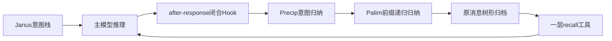
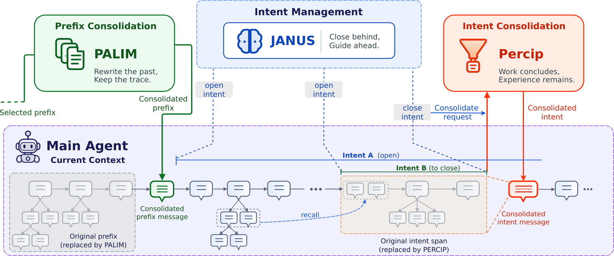

# Hippocam：意图分层的归纳与渐进回忆

> 独立核心机制 API 与真实 checkpoint 接口。短运行是 L1 诊断，非论文 benchmark 复测；尚未接入统一 Evolve 晋级。

## 论文信息

| 字段 | 内容 |
|---|---|
| 论文链接 | [arXiv 2610.12124 v1](https://arxiv.org/abs/2610.12124) |
| 公司/机构 | Institute of Information Engineering, Chinese Academy of Sciences（一作 Xiangyi Zeng） |
| 首次公开日期 | 2026-10-08 |
| 原文开源代码 | 未找到作者公开代码（截至 2026-10-10，检查正文和项目链接） |
| Adapter | hippocam（独立机制 API，非通用 reproduce adapter） |
| 本地复现代码 | src/auto_research/agent_research/hippocam.py；共享后端 oct10_backend.py；scripts/run_oct10_agents.py |

## 原始论文总结

### 背景与主要改动

Janus 在推理前维护嵌套目的，Precip 在主响应后、工具结果前归纳闭合意图。Palim 递归整理早期前缀为叙事和知识，原消息保留为树形子节点；recall 每次返回一层，Agent 自行决定深入。原文 ALFWorld 成功率 97.8%、ScienceWorld 进展 81.9%、StreamBench 平均准确率 81.7%，未报告线上 A/B。

### 架构流程



<!-- paper-figure:start -->
### 原论文关键图

[](https://arxiv.org/html/2610.12124v1/overview.png)

> **原论文 Figure 2（关键图）**：展示原论文方法的总体设计和关键组成。图片来自[原论文](https://arxiv.org/abs/2610.12124)，版权归原作者所有；点击图片可查看来源。
<!-- paper-figure:end -->

### 核心公式

$B=\min(\alpha W,\max(B_{min},K\operatorname{Quantile}_q(R)))$；保护至少 K 个完整交换和 B 个 token。压力预算包括请求开销与预计下一轮；仍超容量则在主推理前失败。

### 论文离线与线上效果

上述数字属于[原论文全文](https://arxiv.org/html/2610.12124v1)，不是本地结果，模型规模和指标协议不同不能直接比较。

## 本地复现

实现意图位置更新、after-response hook、完整工具交换保护、普通/紧急前缀折叠、最小节省/重试、失败保留源文和一层 recall；辅助 checkpoint 真正生成摘要。自主 Janus 未产生闭合时报告 0 次归档；独立受控 Precip/Palim 诊断不能作为自主记忆能力提升。

### 操作与数据协议

```bash
python -m pip install -e '.[post-training-gpu]'
PYTHONPATH=src python scripts/run_oct10_agents.py \
  --method hippocam --checkpoint /path/to/public/checkpoint \
  --dataset /path/to/train.jsonl --device cuda \
  --seed 42 --output runs/hippocam/result.json
```

任务 JSONL 含 question；模型只读问题与产生的工作成果，不读 gold。

### 验证与边界

2026-10-10，NVIDIA A100，SmolLM2-135M-Instruct，seed=42：自主三题运行未触发意图闭合（归档数 0）。另一个明确受控压力探针触发真实摘要：归档节点 3，上下文从 3248 压缩到 24 token，并保留未闭合交换。受控结果不作为自主记忆能力或准确率证据。

本地指标：[L1 GPU 诊断](metrics/checkpoint-a100-seed42.json)。检查点修订、源码 commit 与执行命令以本批 GPU 回执为准。

对应 tests/test_hippocam.py 检查公式和状态合同。真实运行保存诊断标识、seed、轨迹/似然或评测路径。单 seed、短响应与少量训练步数不能当稳定提升；失败和负结果保留。GPU 回执由本批集成统一登记，原始 runs 及权重不提交。CPU 可用于机制调试，CUDA 路径必须通过真实 NVIDIA 验证。

