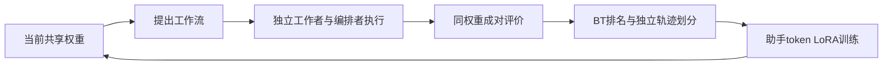
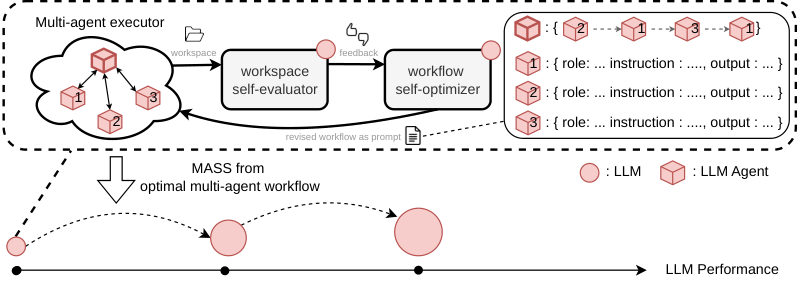

# MASS：多智能体自监督的递归改进

> 独立核心机制 API 与真实 checkpoint 接口。短运行是 L1 诊断，非论文 benchmark 复测；尚未接入统一 Evolve 晋级。

## 论文信息

| 字段 | 内容 |
|---|---|
| 论文链接 | [arXiv 2610.12176 v1](https://arxiv.org/abs/2610.12176) |
| 公司/机构 | UC Berkeley（一作 Hyunin Lee） |
| 首次公开日期 | 2026-10-08 |
| 原文开源代码 | [作者代码](https://github.com/SakanaAI/mass) |
| Adapter | mass（独立机制 API，非通用 reproduce adapter） |
| 本地复现代码 | src/auto_research/agent_research/mass.py；共享后端 oct10_backend.py；scripts/run_oct10_agents.py |

## 原始论文总结

### 背景与主要改动

同一模型执行、提出工作流并成对评价。固定权重下搜索后，独立采集轨迹，以 Bradley–Terry 排名选择前 K−1 条训练、第 K 条验证；仅移除编排者初始工作流提示，保留工作者分工。助手 token 的 SFT 更新权重后再重复。原文 Qwen3.6-27B 两轮在研究任务中提高单位输出 token 表现约 1.2–1.6 倍，未报告线上 A/B。

### 架构流程



<!-- paper-figure:start -->
### 原论文关键图

[](https://arxiv.org/html/2610.12176v1/ICLRpaper_new11.png)

> **原论文 Figure 1（关键图）**：展示原论文的整体流程、关键阶段及其数据流向。图片来自[原论文](https://arxiv.org/abs/2610.12176)，版权归原作者所有；点击图片可查看来源。
<!-- paper-figure:end -->

### 核心公式

$P(i\succ j)=\sigma(s_i-s_j)$；工作者/编排者监督窗口按 2:1 采样。

### 论文离线与线上效果

上述数字属于[原论文全文](https://arxiv.org/html/2610.12176v1)，不是本地结果，模型规模和指标协议不同不能直接比较。

## 本地复现

真实共享 checkpoint 完成两轮搜索、裁判、轨迹采集与 LoRA SFT。本地为固定两工作者和一编排者的有界文本工作流族，可改变角色指令和传递内容；未接入任意工作流图、qwen-code 文件/终端工具，因此不是完整科研 coding-agent 复现。

### 操作与数据协议

```bash
python -m pip install -e '.[post-training-gpu]'
PYTHONPATH=src python scripts/run_oct10_agents.py \
  --method mass --checkpoint /path/to/public/checkpoint \
  --dataset /path/to/train.jsonl --device cuda \
  --seed 42 --output runs/mass/result.json
```

任务 JSONL 含 question；模型只读问题与产生的工作成果，不读 gold。

### 验证与边界

2026-10-10，NVIDIA A100，SmolLM2-135M-Instruct，seed=42：两轮共享权重执行/提案/评价、独立轨迹排名和真实 LoRA SFT 均运行；每轮 3 步，各采样编排者、工作者一、工作者二，rank=8，并重新初始化 LoRA 与优化器。两轮验证损失分别 0.73961、0.33264。该验证损失来自自生成验证轨迹，不能等同独立任务准确率或论文科研能力提升。

本地指标：[L1 GPU 诊断](metrics/checkpoint-a100-seed42.json)。检查点修订、源码 commit 与执行命令以本批 GPU 回执为准。

对应 tests/test_mass.py 检查公式和状态合同。真实运行保存诊断标识、seed、轨迹/似然或评测路径。单 seed、短响应与少量训练步数不能当稳定提升；失败和负结果保留。GPU 回执由本批集成统一登记，原始 runs 及权重不提交。CPU 可用于机制调试，CUDA 路径必须通过真实 NVIDIA 验证。

