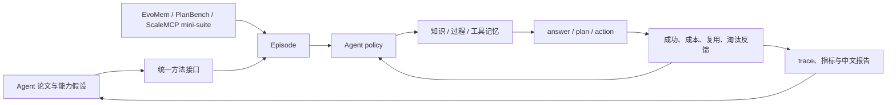

# Agent 论文研究

这里是[论文实现与评测库](../research-library.md)中的 Agent 分支，覆盖记忆、规划、
工具使用、多 Agent 协作和自我进化。首批实现不依赖付费模型 API，用确定性
mini-suite 验证状态更新、跨 episode 复用和受限上下文管理；这些方法与评测器也是
未来 [Agent 自动进化 adapter](../evolution-domains.md)的组件底座。

!!! info "复现保真度"
    当前结果属于**Agent 机制复现**，不是论文在 HotpotQA、OfficeBench 或 ScaleMCP
    上的原始分数。每篇详情页会分开列出论文结果、本地映射与尚未覆盖的能力。

## 快速入口

- [自动进化中的 Agent](../evolution-domains.md)：查看当前支持状态和待接入接口。
- [方法索引](catalog.md)：按记忆、规划、工具管理等方向浏览。
- [统一评测协议](benchmark.md)：mini-suite、成本定义、公平比较与新增方法门槛。
- [U-Mem](2602.22406-u-mem/README.md)：成本感知的主动知识获取与记忆验证。
- [LEGOMem](2510.04851-legomem/README.md)：可组合的编排器与执行过程记忆。
- [MemTool](2507.21428-memtool/README.md)：有限上下文中的动态工具记忆。

## 研究闭环



## 当前实现

| 方向 | 方法 | 核心机制 | 本地评测 | 状态 |
|---|---|---|---|---|
| 公平基线 | Long-context | 保留全部历史，不压缩记忆 | EvoMem mini | 已实现 |
| 主动记忆 | [U-Mem](2602.22406-u-mem/README.md) | 分级获取、语义检索、Thompson sampling | EvoMem mini | 机制复现 |
| 过程记忆 | [LEGOMem](2510.04851-legomem/README.md) | 编排与执行过程单元跨 episode 复用 | PlanBench mini | 机制复现 |
| 工具记忆 | [MemTool](2507.21428-memtool/README.md) | 工作流保护与近期性/成功率淘汰 | ScaleMCP mini | 机制复现 |

## 本地实验快照

固定 120 episodes、seed 42。任务成功率均为 1.0，因此当前对比重点是上下文成本和
可解释复用状态，不应把数字与论文 benchmark 横向比较。

| 方法与 benchmark | joint success | 平均成本 | 额外诊断 |
|---|---:|---:|---|
| Long-context · EvoMem mini | 1.0000 | 64.5000 | 上下文成本随历史线性增长 |
| U-Mem · EvoMem mini | 1.0000 | 3.0500 | 检索失败后升级 tool research |
| LEGOMem · PlanBench mini | 1.0000 | 1.1200 | 108 次过程单元复用 |
| MemTool · ScaleMCP mini | 1.0000 | 1.9812 | 200 次受控工具淘汰 |

完整指标定义见[统一评测协议](benchmark.md)，稳定指标见
[`agent-mini-suites-seed42.json`](../experiments/agent-mini-suites-seed42.json)。

## 一键运行

```bash
auto-research agent-eval --method u-mem --benchmark evomem-mini
auto-research agent-eval --method legomem --benchmark planbench-mini
auto-research agent-eval --method memtool --benchmark scalemcp-mini \
  --episodes 200 --memory-size 8
```

产物写入 `runs/agent-research/<method>-<benchmark>-seed<seed>/`，包含逐步 trace、
`metrics.json` 和中文 `report.md`。

## 后续扩展约定

新增论文时必须同时完成方法实现、独立论文页、方法索引、统一协议实验和稳定指标。
论文页固定包含论文信息、背景与主要改动、架构图、核心公式/算法、论文效果、本地
映射、复现实验和保真边界；入口页只维护全局状态和可比较快照。
