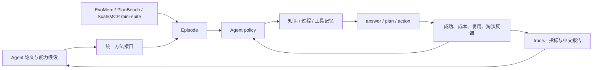

# Agent 论文研究

这里是[论文实现与评测库](../research-library.md)中的 Agent 分支，覆盖记忆、规划、
工具使用、多 Agent 协作和自我进化。确定性 mini-suite 验证状态与跨 episode 复用；
`swebench-local` 则创建真实临时仓库、修改代码并执行回归测试。这些方法与评测器也是
[Agent 自动进化 adapter](../evolution-domains.md)的组件底座。

!!! info "复现保真度"
    mini-suite 属于**Agent 机制复现**；代码 sandbox 属于真实执行的 micro benchmark，
    但不是官方 SWE-bench Lite。每篇详情页分开列出论文结果、本地映射与边界。

## 快速入口

- [自动进化中的 Agent](../evolution-domains.md)：查看当前支持状态和待接入接口。
- [方法索引](catalog.md)：按记忆、规划、工具管理等方向浏览。
- 分类浏览：[按公司 / 机构 / 学校](catalog/by-institution.md) ·
  [按主题](catalog/by-topic.md) · [按年份](catalog/by-year.md)。
- [论文谱系与缺口](lineage.md)：系统审计经典主干、最新覆盖和真实环境前置条件。
- [统一评测协议](benchmark.md)：mini-suite、成本定义、公平比较与新增方法门槛。
- [Toolformer](2302.04761-toolformer/README.md)：按 token loss improvement 自监督过滤工具调用。
- [Self-Refine](2303.17651-self-refine/README.md)：同一模型生成、自反馈并迭代改写。
- [ReWOO](2305.18323-rewoo/README.md)：Planner、Worker、Solver 解耦，减少观察重放。
- [AutoGen](2308.08155-autogen/README.md)：角色化多 Agent 消息编排与显式终止。
- [PEARL](2601.20439-pearl/README.md)：离线工具探索与 planning-centric GRPO。
- [Tree of Thoughts](2305.10601-tree-of-thoughts/README.md)：thought tree、value 与 BFS 回溯。
- [LATS](2310.04406-lats/README.md)：MCTS、环境反馈与自反思搜索。
- [ReAct](2210.03629-react/README.md)：Thought、Action、Observation 的交替执行轨迹。
- [Reflexion](2303.11366-reflexion/README.md)：失败反馈转语言反思并跨 trial 复用。
- [Voyager](2305.16291-voyager/README.md)：自动课程、执行验证和可增长技能库。
- [U-Mem](2602.22406-u-mem/README.md)：成本感知的主动知识获取与记忆验证。
- [LEGOMem](2510.04851-legomem/README.md)：可组合的编排器与执行过程记忆。
- [MemTool](2507.21428-memtool/README.md)：有限上下文中的动态工具记忆。
- [MetaGPT](2308.00352-metagpt/README.md)：产品、架构、工程、测试的 SOP。
- [CRITIC](2305.11738-critic/README.md)：用真实工具反馈迭代修订。
- [Agent Lightning](2508.03680-agent-lightning/README.md)：执行/训练解耦与 credit assignment。
- [SWE-agent](2405.15793-swe-agent/README.md)：软件工程 Agent-Computer Interface。
- [OpenHands](2407.16741-openhands/README.md)：编辑器、终端与 sandbox event stream。
- [MRKL](2205.00445-mrkl/README.md)：router 分发神经与离散符号专家。
- [HuggingGPT](2303.17580-hugginggpt/README.md)：规划、专家模型匹配、依赖执行和汇总。
- [Generative Agents](2304.03442-generative-agents/README.md)：记忆流打分、反思与计划。
- [MemGPT](2310.08560-memgpt/README.md)：core/working/archival 虚拟上下文与 interrupt。
- [WebGPT](2112.09332-webgpt/README.md)：浏览轨迹、引用约束和 reward-model 拒绝采样。
- [SayCan](2204.01691-saycan/README.md)：语言相关性乘以技能 affordance。
- [PAL](2211.10435-pal/README.md)：生成程序并交由确定性解释器执行。
- [ART](2303.09014-art/README.md)：检索任务示例，在工具调用处暂停与恢复。
- [SEED](2607.14777-seed/README.md)：从完成轨迹提炼 hindsight skill 并形成稠密 credit。
- [CAST](2607.25308-cast/README.md)：用 solver value 差分提供 turn 级监督。
- [TurnOPD](2607.05804-turn-opd/README.md)：自适应 rollout 深度与 turn-normalized OPD。
- [Search-R1](2503.09516-search-r1/README.md)：推理/搜索交错、检索 token mask 与结果奖励。
- [RAGEN](2504.20073-ragen/README.md)：StarPO-S 轨迹 RL、Echo Trap 检测与稳定化。
- [LOOP](2502.01600-loop/README.md)：无 value model 的 leave-one-out PPO，
  复用旧 rollout 并做逐 token clip，面向长时程交互。
- [WebAgent-R1](2505.16421-webagent-r1/README.md)：动态压缩网页上下文，以并行完整轨迹和
  M-GRPO 结果奖励训练网页 Agent。
- [MUA-RL](2508.18669-mua-rl/README.md)：把模拟用户纳入 rollout，学习多轮澄清意图、
  调用真实工具并只依赖最终任务奖励。
- [HiSkill](2607.25853-hiskill/README.md)：高层 skill、AtomicOp 与 typed edge 的层次图。
- [UniMem](2607.26017-unimem/README.md)：episodic/parametric memory 自路由与巩固。
- [CAM-DF](2607.27083-cam-df/README.md)：把冻结工具排序转成成本感知的前缀停止决策。
- [SkillRise](2607.26784-skillrise/README.md)：跨相关任务交替求解与维护技能文档。

## 研究闭环



## 当前实现

| 方向 | 方法 | 核心机制 | 本地评测 | 状态 |
|---|---|---|---|---|
| 公平基线 | Long-context | 保留全部历史，不压缩记忆 | EvoMem mini | 已实现 |
| 工具学习 | [Toolformer](2302.04761-toolformer/README.md) | 候选 API call 与自监督 loss 过滤 | ScaleMCP mini | 机制复现 |
| 自我迭代 | [Self-Refine](2303.17651-self-refine/README.md) | generate、feedback、refine 循环 | PlanBench mini | 机制复现 |
| 解耦规划 | [ReWOO](2305.18323-rewoo/README.md) | Planner/Worker/Solver 与证据变量 | PlanBench mini | 机制复现 |
| 多 Agent | [AutoGen](2308.08155-autogen/README.md) | 角色消息、交接、critic 与 termination | PlanBench mini | 机制复现 |
| 规划强化学习 | [PEARL](2601.20439-pearl/README.md) | tool exploration、plan reward、group update | PlanBench mini | 机制复现 |
| 推理搜索 | [Tree of Thoughts](2305.10601-tree-of-thoughts/README.md) | thought expansion、value、BFS/backtrack | PlanBench mini | 机制复现 |
| Agent 搜索 | [LATS](2310.04406-lats/README.md) | UCT、trajectory rollout、环境反馈与反思 | PlanBench mini | 机制复现 |
| 推理与行动 | [ReAct](2210.03629-react/README.md) | Thought → Action → Observation | ScaleMCP mini | 机制复现 |
| 自我改进 | [Reflexion](2303.11366-reflexion/README.md) | verbal feedback 与 episodic reflection | PlanBench mini | 机制复现 |
| 终身学习 | [Voyager](2305.16291-voyager/README.md) | curriculum、skill library、self-verification | PlanBench mini | 机制复现 |
| 主动记忆 | [U-Mem](2602.22406-u-mem/README.md) | 分级获取、语义检索、Thompson sampling | EvoMem mini | 机制复现 |
| 过程记忆 | [LEGOMem](2510.04851-legomem/README.md) | 编排与执行过程单元跨 episode 复用 | PlanBench mini | 机制复现 |
| 工具记忆 | [MemTool](2507.21428-memtool/README.md) | 工作流保护与近期性/成功率淘汰 | ScaleMCP mini | 机制复现 |
| 多 Agent 软件工程 | [MetaGPT](2308.00352-metagpt/README.md) | 四角色 SOP 与结构化交付物 | SWE-style local code | 真实执行 |
| 工具反馈 | [CRITIC](2305.11738-critic/README.md) | 失败 patch、测试反馈、修订 | SWE-style local code | 真实执行 |
| Agent RL | [Agent Lightning](2508.03680-agent-lightning/README.md) | transition、credit update、策略复用 | SWE-style local code | 真实执行 |
| 软件工程 ACI | [SWE-agent](2405.15793-swe-agent/README.md) | 定位、编辑、回归测试 | SWE-style local code | 真实执行 |
| 通用软件 Agent | [OpenHands](2407.16741-openhands/README.md) | 编辑器/终端 event stream | SWE-style local code | 真实执行 |
| 神经符号路由 | [MRKL](2205.00445-mrkl/README.md) | router、神经/符号专家、结果汇总 | ScaleMCP mini | 机制复现 |
| 专家模型编排 | [HuggingGPT](2303.17580-hugginggpt/README.md) | planning、model selection、DAG execution | PlanBench mini | 机制复现 |
| 记忆与反思 | [Generative Agents](2304.03442-generative-agents/README.md) | recency/importance/relevance、reflection、plan | EvoMem mini | 机制复现 |
| 虚拟上下文 | [MemGPT](2310.08560-memgpt/README.md) | tiered memory、page-in/out、interrupt | EvoMem mini | 机制复现 |
| 浏览问答 | [WebGPT](2112.09332-webgpt/README.md) | browser trajectory、citation、rejection sampling | ScaleMCP mini | 机制复现 |
| 具身规划 | [SayCan](2204.01691-saycan/README.md) | language relevance × affordance | PlanBench mini | 机制复现 |
| 程序推理 | [PAL](2211.10435-pal/README.md) | program generation + symbolic runtime | ScaleMCP mini | 机制复现 |
| 自动工具推理 | [ART](2303.09014-art/README.md) | demo retrieval、pause/tool/resume、library update | PlanBench mini | 机制复现 |
| Agentic RL | [SEED](2607.14777-seed/README.md) | hindsight skill 与稠密 on-policy credit | PlanBench mini | 机制复现 |
| Agentic RL | [CAST](2607.25308-cast/README.md) | solver value 差分与 turn credit | PlanBench mini | 机制复现 |
| Agentic OPD | [TurnOPD](2607.05804-turn-opd/README.md) | 深度 probe、动态 rollout 与 turn normalization | ScaleMCP mini | 机制复现 |
| 搜索 Agent RL | [Search-R1](2503.09516-search-r1/README.md) | 多轮 search/reason、retrieval loss mask、outcome reward | ScaleMCP mini | 机制复现 |
| 多轮 Agent RL | [RAGEN](2504.20073-ragen/README.md) | trajectory filtering、critic baseline、decoupled clipping | PlanBench mini | 机制复现 |
| 长时程 Agent RL | [LOOP](2502.01600-loop/README.md) | leave-one-out advantage、off-policy reuse、per-token clip | PlanBench mini | 机制复现 |
| 网页 Agent RL | [WebAgent-R1](2505.16421-webagent-r1/README.md) | context compression、parallel trajectory、M-GRPO | ScaleMCP mini | 机制复现 |
| 多轮用户 Agent RL | [MUA-RL](2508.18669-mua-rl/README.md) | simulated user、intent refinement、real tool response、final reward | ScaleMCP mini | 机制复现 |
| 层次技能 | [HiSkill](2607.25853-hiskill/README.md) | skill/AtomicOp 节点与 typed edge 子图 | PlanBench mini | 机制复现 |
| 持续记忆 | [UniMem](2607.26017-unimem/README.md) | episodic/parametric route 与 consolidation | EvoMem mini | 机制复现 |
| 工具获取控制 | [CAM-DF](2607.27083-cam-df/README.md) | payoff gap、regret weight 与异构成本停止 | ScaleMCP mini | 机制复现 |
| 跨任务技能 | [SkillRise](2607.26784-skillrise/README.md) | solve/curate 双 phase 与下游折扣 credit | PlanBench mini | 机制复现 |

## 本地实验快照

固定 120 episodes、seed 42。经典方法用于验证状态演化：Reflexion 明确让每个新任务
族首次失败再学习，因此不能只按最终成功率排序，也不应与论文 benchmark 横向比较。

| 方法与 benchmark | joint success | 平均成本 | 额外诊断 |
|---|---:|---:|---|
| Long-context · EvoMem mini | 1.0000 | 64.5000 | 上下文成本随历史线性增长 |
| U-Mem · EvoMem mini | 1.0000 | 3.0500 | 检索失败后升级 tool research |
| LEGOMem · PlanBench mini | 1.0000 | 1.1200 | 108 次过程单元复用 |
| MemTool · ScaleMCP mini | 1.0000 | 1.9812 | 200 次受控工具淘汰 |
| ReAct · ScaleMCP mini | 1.0000 | 3.0000 | 360 reasoning/action steps |
| Reflexion · PlanBench mini | 0.9000 | 1.1000 | 12 条反思、108 次复用 |
| Voyager · PlanBench mini | 1.0000 | 1.1200 | 12 个技能、108 次复用 |
| Tree of Thoughts · PlanBench mini | 1.0000 | 2.5000 | 1200 节点、480 次回溯 |
| LATS · PlanBench mini | 1.0000 | 4.0000 | 480 rollouts、360 次反思 |
| Toolformer · ScaleMCP mini | 1.0000 | 3.0000 | 540 候选、360 接受调用 |
| Self-Refine · PlanBench mini | 1.0000 | 2.0000 | 120 次反馈与 refinement |
| ReWOO · PlanBench mini | 1.0000 | 3.5000 | 120 份计划、360 次 worker 调用 |
| AutoGen · PlanBench mini | 1.0000 | 3.0000 | 360 条跨角色消息 |
| PEARL · PlanBench mini | 1.0000 | 1.1200 | 24 次探索、12 次 policy update |
| MetaGPT · SWE local | 1.0000 | 3.5000 | 48 条角色 artifact |
| CRITIC · SWE local | 1.0000 | 4.0000 | 24 轮工具反馈与修订 |
| Agent Lightning · SWE local | 1.0000 | 3.6250 | patch reuse 0.7500 |
| SWE-agent · SWE local | 1.0000 | 2.5000 | 12 次真实文件编辑 |
| OpenHands · SWE local | 1.0000 | 2.5000 | 编辑器/终端事件流 |
| MRKL · ScaleMCP mini | 1.0000 | 1.2500 | 360 router calls；170 symbolic calls |
| HuggingGPT · PlanBench mini | 1.0000 | 2.3500 | 360 model matches；240 dependency edges |
| Generative Agents · EvoMem mini | 1.0000 | 1.7900 | 354 memories；30 reflections |
| MemGPT · EvoMem mini | 1.0000 | **0.9200** | 108 writes；96 page-ins；108 interrupts |
| WebGPT · ScaleMCP mini | 1.0000 | 3.0000 | 600 references；240 candidates |
| SayCan · PlanBench mini | 1.0000 | 3.3750 | 1350 affordance checks |
| PAL · ScaleMCP mini | 1.0000 | 1.4000 | 120 programs / interpreter calls |
| ART · PlanBench mini | 1.0000 | 1.5500 | 108 retrievals；360 pauses |
| SEED · PlanBench mini | 1.0000 | 0.9800 | 12 hindsight skills；360 dense credit updates |
| CAST · PlanBench mini | 1.0000 | 1.5000 | 2040 solver queries；360 turn credits |
| TurnOPD · ScaleMCP mini | 1.0000 | 1.3333 | 节省 40 rollout turns |
| Search-R1 · ScaleMCP mini | 1.0000 | 2.7500 | 240 queries；1800 masked tokens |
| RAGEN · PlanBench mini | 1.0000 | 1.6000 | 480 rollouts；120 filtered；19 Echo Trap probes |
| LOOP · PlanBench mini | 1.0000 | 2.2000 | 476 次旧轨迹复用；480 次 LOO update；120 次 clip |
| WebAgent-R1 · ScaleMCP mini | 1.0000 | 2.6000 | 360 个压缩 token；120 个并行组与 M-GRPO update |
| MUA-RL · ScaleMCP mini | 1.0000 | 2.2500 | 360 个用户 turn；240 次意图修正；120 个最终任务奖励 |
| HiSkill · PlanBench mini | 1.0000 | 0.6900 | 48 nodes；60 edges；324 AtomicOp reuses |
| UniMem · EvoMem mini | 1.0000 | **0.5200** | 24 episodic；96 parametric；12 consolidations |
| CAM-DF · ScaleMCP mini | 1.0000 | 4.7333 | 工具 exposure -51.02%；120 次提前停止 |
| SkillRise · PlanBench mini | 1.0000 | **0.6550** | 119 次跨任务 skill 复用；360 次下游 credit |

完整指标定义见[统一评测协议](benchmark.md)，稳定指标见
[`agent-mini-suites-seed42.json`](../experiments/agent-mini-suites-seed42.json)。
经典 Agent 稳定指标见
[`classic-agent-mini-suites-seed42.json`](../experiments/classic-agent-mini-suites-seed42.json)。
真实代码 sandbox 指标见
[`agent-code-sandbox-seed42.json`](../experiments/agent-code-sandbox-seed42.json)。
本批经典缺口指标见
[`p0-missing-agent-mini-suites-seed42.json`](../experiments/p0-missing-agent-mini-suites-seed42.json)。
P1 候选指标见
[`p1-agent-candidates-mini-suites-seed42.json`](../experiments/p1-agent-candidates-mini-suites-seed42.json)。
本批 Agentic RL 与记忆指标见
[`agent-20260729-seed42.json`](../experiments/agent-20260729-seed42.json)。
经典 Agentic RL / OPD 补充指标见
[`classic-agentic-rl-opd-seed42.json`](../experiments/classic-agentic-rl-opd-seed42.json)。
本批遗漏方法的固定 seed 指标见
[`omitted-agentic-rl-opd-seed42.json`](../experiments/omitted-agentic-rl-opd-seed42.json)。

## 一键运行

```bash
auto-research agent-eval --method u-mem --benchmark evomem-mini
auto-research agent-eval --method legomem --benchmark planbench-mini
auto-research agent-eval --method memtool --benchmark scalemcp-mini \
  --episodes 200 --memory-size 8
auto-research agent-eval --method reflexion --benchmark planbench-mini \
  --episodes 120 --memory-size 24
auto-research agent-eval --method pearl --benchmark planbench-mini \
  --episodes 120 --memory-size 24

auto-research agent-eval --method critic --benchmark swebench-local \
  --episodes 12 --seed 42
```

产物写入 `runs/agent-research/<method>-<benchmark>-seed<seed>/`，包含逐步 trace、
`metrics.json` 和中文 `report.md`。

## 后续扩展约定

新增论文时必须同时完成方法实现、独立论文页、方法索引、统一协议实验和稳定指标。
论文页固定包含论文信息、背景与主要改动、架构图、核心公式/算法、论文效果、本地
映射、复现实验和保真边界；入口页只维护全局状态和可比较快照。
