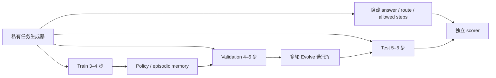

# Agent L2.1：隔离能力评测与自动进化

`toolroute-l2.1-v1`替代了容易饱和的早期 L2 工具路由任务。它同时回答两个问题：

1. Agent 在不知道答案和参考计划时，能否根据公开工具反馈完成未见任务；
2. memory、planner、tool policy、critic、policy、recovery、reflection、verifier 和
   context compression 应如何组合，才能在成功率与成本之间取得更好的 Pareto 解。

!!! success "接口层没有 oracle 或 guide"
    Policy 只收到 `CapabilityObservation` 和 `call_tool(name)`。公开对象不含 answer、
    route、allowed steps、reference plan 或扰动标签；环境也不存在 `guide`、`reveal`、
    `verify_answer` 等查询端点。调用未知的 `guide` 只会得到 `unknown_tool`。

## 评测隔离

| Split | 任务族 | 路径深度 | 用途 | 是否参与最终结论 |
|---|---|---:|---|---|
| Train | travel / finance / retail / support | 3–4 | 学习可复用技能或 memory | 否 |
| Validation | logistics / education / media / health | 4–5 | Evolve 晋级与选冠军 | 仅用于选择 |
| Test | science / legal / security / operations | 5–6 | 所有代际完成后评一次 | 是 |

三个 split 的任务族、task ID 和路径深度均隔离。Evolve 不能用 test 选候选；test 只比较
冻结初始基线和 validation 冠军。



## 难度轴

- `clean`：正常长工具链；
- `transient`：工具首次临时失败，重试消耗预算；
- `ambiguous`：反馈含正确 tag 和相似干扰 tag；
- `fallback`：主工具永久失败，必须读取反馈并切换只读 fallback；
- `irreversible`：候选中含公开标为不可逆的高风险工具；
- `combined`：歧义、临时失败和 fallback 同时出现。

工具预算只覆盖正确路径及任务规定的重试/fallback。盲目尝试干扰工具会挤占后续预算，
因此方法不能靠穷举获得满分。工具成本由公开元数据决定，不再把每次调用都视为相同成本。

## 六种方法不是别名

| 方法 | 本地执行机制 |
|---|---|
| Long-context | 只采用第一个候选，无显式探索、重试、验证或 memory |
| ReAct | 按 observation 循环执行，探索候选并处理 transient/fallback |
| Reflexion | ReAct 基础上记录失败反思，再尝试后续候选 |
| Agent-G² | generator 给出候选，public-evidence verifier 按可靠性、可逆性和成本排序 |
| AHEAD | 优先只读候选，并压缩多候选上下文后继续执行 |
| AUSO | 在 AHEAD 基础上把成功 tag 决策写入 episodic skill memory，并跨 episode 复用 |

聚合产物还包含五个消融：`react-no-retry`、`reflexion-no-reflection`、
`agent-g2-no-verifier`、`ahead-no-compression`、`auso-no-memory`。消融与主方法使用相同
split、seed 和工具预算。

## 正式指标

- answer accuracy、plan exact match、plan step F1、joint success；
- recovery success rate；
- invalid-tool rate、irreversible-error rate；
- average tool calls、按工具元数据累计的 average cost；
- 三 seed 均值、标准差和 95% CI；
- reflection、verification、compression、memory write/reuse telemetry。

固定设置为 train 36、validation 60、test 60 episodes/seed，seeds 42/43/44。以下均为
隔离 test 三 seed 均值：

| 方法 | Joint success | Plan F1 | Recovery | Invalid-tool rate | Average cost |
|---|---:|---:|---:|---:|---:|
| Long-context | 0.3500 | 0.5212 | 0.0000 | 0.0532 | 2.8571 |
| ReAct | 0.6833 | 0.7683 | 0.6667 | 0.0455 | 4.7984 |
| Reflexion | 0.7278 | 0.7786 | 0.6667 | 0.0376 | 4.7920 |
| Agent-G² | **0.7778** | **0.8276** | 0.6667 | 0.0394 | 5.0662 |
| AHEAD | 0.7556 | 0.7887 | 0.6667 | **0.0334** | 4.5571 |
| AUSO | 0.7556 | 0.7887 | 0.6667 | **0.0334** | **4.5192** |

这里没有把成本最低的 Long-context 误写成能力最好，也没有把 Agent-G² 的最高成功率忽略
其额外验证成本。消融显示：去掉 ReAct retry 后 joint success 降至 0.5167；去掉
Reflexion 反思后从 0.7278 降至 0.6833；去掉 Agent-G² verifier 后从 0.7778 降至
0.6833。AHEAD compression 与 AUSO memory 在本版本主要改变成本/telemetry，不虚构成功率提升。

重新生成的固定结果以
[`agent-toolroute-l2-seeds42-44.json`](../experiments/agent-toolroute-l2-seeds42-44.json)
为准。任何结果只适用于 `toolroute-l2.1-v1`，不能外推成通用 Agent 能力。

## 静态公平比较

```bash
python -m pip install -e ".[dev]"

auto-research agent-capability \
  --methods long-context,react,reflexion,agent-g2,ahead,auso \
  --train-episodes 36 \
  --episodes 60 \
  --seeds 42,43,44 \
  --output-dir runs/agent-capability
```

## 多轮自动进化

```bash
auto-research evolve \
  --model agent \
  --dataset toolroute-l2.1 \
  --direction "组合 memory、planner、tool、critic、policy、recovery、reflection、verifier 与 context compression" \
  --generations 3 \
  --population 9 \
  --workers 3 \
  --agent-episodes 60 \
  --seeds 42,43,44
```

第一代执行单组件公平消融；后续代围绕 validation 冠军组合多个论文算子。报告逐项记录
候选来源、父代、变异理由、validation 观察、负结果和最终隔离 test。候选只来自仓库已实现
论文算子或这些算子的白名单组合；实时检索但没有实现的论文不会被伪装成可执行结构。

固定三代、population 9、三 seed 示例共执行基线与全部候选。validation 选出的 `g2-t2`
在隔离 test 上将 joint success 从 **0.3500** 提升到 **0.8000**，plan F1 从
**0.5212** 提升到 **0.8327**；平均成本从 **2.8571** 增至 **4.9662**。完整 genome、
父子关系、论文来源、白名单组合和逐轮负结果见
[`toolroute-l21-evolve-seeds42-44.json`](metrics/toolroute-l21-evolve-seeds42-44.json)。

## 重新生成公开证据

```bash
PYTHONPATH=src python scripts/generate_agent_l2_evidence.py
PYTHONPATH=src python scripts/generate_public_experiment_dashboard.py
```

## 当前边界与 L3

- L2.1 仍是本地合成工具环境，但不再含 answer/plan/guide 泄漏；
- episodic memory 可在同一 split 内根据公开反馈更新，这属于被测能力，不读取标签；
- 成本是固定工具元数据，不是真实 API token、网络延迟或美元费用；
- 官方 SWE-bench Lite、ToolHop 和真实浏览器仍属于 L3，并按用户要求保持延后；
- 后续真实 LLM policy、后训练和多模态实验可使用 GPU；本 benchmark 本身无需占用 A100。
