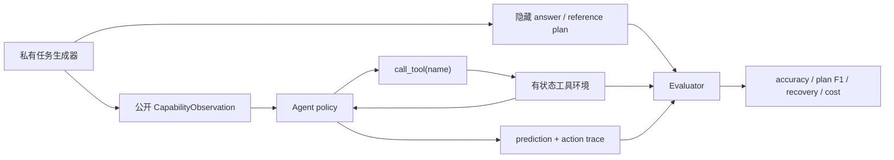

# Agent L2 无 Oracle 能力评测

`toolroute-l2-v1`用于回答一个与 L1 机制验证不同的问题：Agent 在不知道标准答案和
参考计划时，能否通过工具反馈完成任务，并在故障、歧义和有限预算下恢复。

!!! success "Labels 在接口层隔离"
    Policy 只收到 `CapabilityObservation` 和 `call_tool()`；其中没有 `answer`、
    `plan` 或 `route` 字段。reference answer/plan 只存在于 evaluator 私有任务对象中，
    工具只有执行到最终节点后才返回答案。

## L1 与 L2 的职责

| 层级 | 用途 | Agent 能看到什么 | 是否参与效果比较 |
|---|---|---|---|
| L1 机制诊断 | 防止论文机制分支、状态和 telemetry 回归 | 确定性合成任务，可含 oracle | 否 |
| L2 能力评测 | 比较无 oracle 条件下的规划、恢复与成本 | observation、工具描述、调用反馈 | 是，同版本内比较 |



## 公平任务与扰动

每个 seed 使用相同的六类任务族与工具预算，覆盖四个轴：

- `clean`：正常多步工具链；
- `transient`：中间工具首次调用失败，考察重试；
- `ambiguous`：返回两个候选 evidence tag，考察验证或探索；
- `combined`：同时包含歧义与临时故障，在固定预算下考察恢复策略。

工具顺序、答案和扰动由 seed 决定。方法不能读取生成器私有对象，只能根据公开 tag、
工具描述与调用反馈行动。错误调用和重试计入成本与 plan step F1。

## 三 Seed 结果

统一设置：60 episodes/seed，seeds 42、43、44，共 180 episodes/方法。

| 方法 | Joint success | Plan step F1 | Recovery success | Invalid-tool rate | Average cost |
|---|---:|---:|---:|---:|---:|
| Long-context | 0.4000 | 0.7500 | 0.0000 | 0.0937 | 2.6056 |
| ReAct | 0.8556 | 0.9094 | 0.7111 | 0.0576 | 4.2444 |
| Agent-G² | 0.8556 | 0.9094 | 0.7111 | 0.0576 | 4.2444 |
| Reflexion | **1.0000** | **0.9367** | **1.0000** | 0.0000 | 4.7500 |
| AHEAD | **1.0000** | **0.9367** | **1.0000** | 0.0000 | 4.7500 |
| AUSO | **1.0000** | **0.9367** | **1.0000** | 0.0000 | **4.0833** |

这里的满分来自该方法在**这个固定 L2 工具路由任务**上解决了全部 episode，不外推为
通用 Agent 100% 准确率。横向结论仅在 `toolroute-l2-v1`、相同预算和相同 seeds 内成立。
三 seed 均值、标准差和 95% CI 见
[`agent-toolroute-l2-seeds42-44.json`](../experiments/agent-toolroute-l2-seeds42-44.json)。

## 运行

```bash
python -m pip install -e ".[dev]"

auto-research agent-capability \
  --methods long-context,react,reflexion,agent-g2,ahead,auso \
  --seeds 42,43,44 \
  --episodes 60 \
  --output-dir runs/agent-capability
```

重新生成仓库中提交的证据与公开看板：

```bash
PYTHONPATH=src python scripts/generate_agent_l2_evidence.py
PYTHONPATH=src python scripts/generate_public_experiment_dashboard.py
```

## 当前边界

- 这是无 oracle、可重复的本地能力 benchmark，但仍是合成工具环境；
- 成本是统一工具调用成本，不是真实 API token/延迟/费用；
- 不冒充官方 SWE-bench Lite、ToolHop、AppWorld 或真实浏览器环境；
- 后续真实 executor 可以沿用同一 observation/hidden-label/evaluator 边界晋级到 L3。
