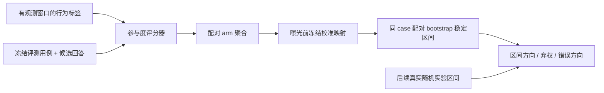

# Meta 分层参与度评测：可复用审计协议

> **状态：协议实现，不是论文实验复现。** 论文使用 Meta 私有助手会话、分类器、冻结系数和真实 A/B 对照；这些数据与权重并未公开。本仓库实现可复用的配对 bootstrap、曝光前冻结校验与区间决策审计，不声称重现论文的 81.1% F1。

## 论文信息

| 字段 | 内容 |
|---|---|
| 论文链接 | [arXiv v1](https://arxiv.org/abs/2609.25408) |
| 公司/机构 | Meta Platforms（第一作者 Xuanyi Li 所属机构） |
| 首次公开日期 | 2026-09-21（arXiv v1） |
| 原文开源代码 | 否：截至 2026-09-26 未找到原作者发布的评测代码或配对数据 |
| Adapter | 无；本项是审计协议，不进入论文复现 registry |
| 本地代码 | [`src/auto_research/evaluation/layered_engagement.py`](https://github.com/daiwk/auto-research/blob/main/src/auto_research/evaluation/layered_engagement.py) |

论文把离线指标能否预判线上实验拆成三层：**行为标签与产品目标**、**分类器与候选行为**、**固定评测集/聚合/校准与实验效果**的对齐。最终不能只看相关系数，需用上线后的随机实验置信区间检验冻结代理的决策方向；离线评分稳定区间跨零则弃权。原文冻结后八项实验、113 个对照的 contrast-micro F1 为 81.1%，但其专有特征及系数未给出。

本地 `Contrast` 要求带时区的 `frozen_at ≤ offline_scored_at < exposure_started_at`。`paired_scoring_interval` 用相同索引重采样 control/treatment case，再经过调用方给定的**冻结**线性比例；它不是未来线上效果的预测区间。`audit` 按论文式定义报告 contrast-micro F1、逐实验等权 macro F1、错误方向、弃权和 power-aware precision。没有真实配对 A/B 时，单元测试仅验证公式与数据门禁，不生成“论文效果”。

要用于真实项目，必须先固定 case 集、模型和校准规格，记录其版本及曝光前时间；上线后再接入逐实验区间与对照 ID。禁止用线上结果反调校准后仍声称前瞻验证。论文 Figure 1 与 §3.2、§3.5 的完整论述见[官方正文](https://arxiv.org/html/2609.25408v1)。
