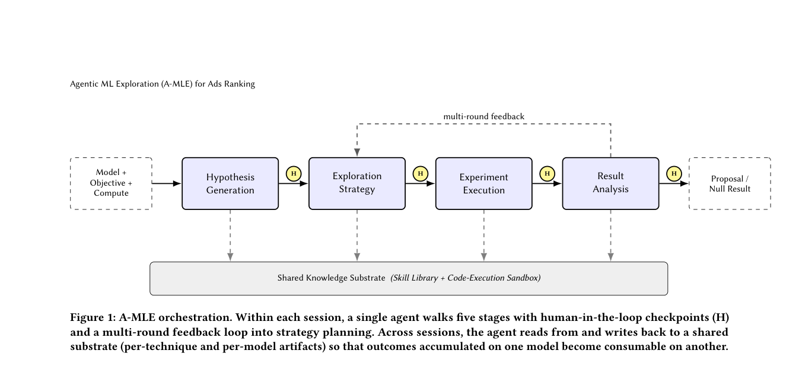

# A-MLE：面向广告排序的 Agentic ML 探索

> **复现级别：公开控制器机制实现。** 本地实现阶段状态、独立研究 idea、审计事件和执行经验；不复现 Meta 内部 sandbox、训练平台或模型资产。

## 论文信息

| 字段 | 内容 |
|---|---|
| 论文链接 | [arXiv 2609.08248](https://arxiv.org/abs/2609.08248) |
| 公司/机构 | Meta Platforms, Inc. |
| 首次公开日期 | 2026-09-08（arXiv v1） |
| 原文开源代码 | 未找到 / 未发布 |
| Adapter / 方法 | `research-portfolio-amle` |
| 本地复现代码 | [`src/auto_research/research_loop/portfolio.py`](https://github.com/daiwk/auto-research/blob/main/src/auto_research/research_loop/portfolio.py) |

## 原始论文总结

### 背景与主要改动

A-MLE 把工业 ML 迭代拆成假设生成、探索策略、实验执行、结果分析和共享知识五个阶段，
由 Agent 调用领域技能并在阶段边界保留人工检查点。优化对象不只是单个模型指标，也包括
跨模型迁移技术时的研究吞吐和执行可靠性。

<!-- paper-figure:start -->
### 原论文关键图

> **原论文 Figure 1（关键图）**：展示原论文方法的总体设计和关键组成。图片来自[原论文](https://arxiv.org/abs/2609.08248)，版权归原作者所有；点击图片可查看来源。
<!-- paper-figure:end -->

## 本地复现与边界

`ResearchPortfolio` 提供可审计状态转换、每个 idea 的独立持久状态、独占 worker claim、
append-only 事件轨迹和固定 baseline。现有领域 adapter、trainer 与 evaluator 才负责产生
和测量候选；控制器不执行论文标题或未实现的自然语言建议。

本实现由 `tests/test_research_portfolio.py` 验证状态隔离、冲突 claim、非法跳转、失败恢复、
重启恢复和执行 / 结果双记忆。论文没有发布可对齐的公共系统与工业数据，因此不报告伪造
的数值复现。
