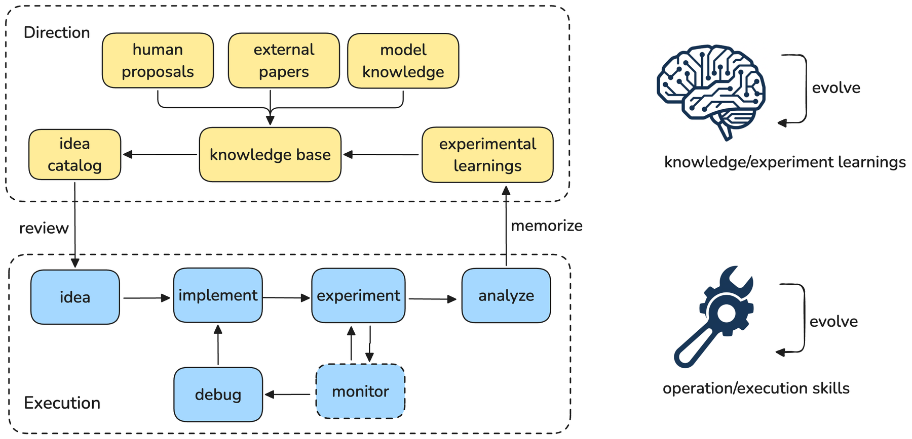

# Auto-RecSys：工业级推荐系统的自治研究 Agent

> **复现级别：公开控制器机制实现。** 本地实现 per-idea 状态隔离、持久恢复与双层记忆；不声称复现 Meta 内部跨服务器存储、调度平台或多日 GPU 任务。

## 论文信息

| 字段 | 内容 |
|---|---|
| 论文链接 | [arXiv 2609.10922](https://arxiv.org/abs/2609.10922) |
| 公司/机构 | Meta |
| 首次公开日期 | 2026-09-10（arXiv v1） |
| 原文开源代码 | 未找到 / 未发布 |
| Adapter / 方法 | `research-portfolio-auto-recsys` |
| 本地复现代码 | [`src/auto_research/research_loop/portfolio.py`](https://github.com/daiwk/auto-research/blob/main/src/auto_research/research_loop/portfolio.py) |

## 原始论文总结

### 背景与主要改动

Auto-RecSys 面向训练周期长、配置脆弱的工业推荐研究，让多个 idea 在不同阶段异步推进。
论文的三项 harness 设计是分布式异步执行、集中持久记忆和认知—过程分离；执行循环把成功
流程与失败原因沉淀为 playbook，idea 循环再用历史实验结果指导下一批假设。

<!-- paper-figure:start -->
### 原论文关键图

> **原论文 Figure 1（关键图）**：展示原论文的整体流程、关键阶段及其数据流向。图片来自[原论文](https://arxiv.org/abs/2609.10922)，版权归原作者所有；点击图片可查看来源。
<!-- paper-figure:end -->

## 本地复现与边界

`ResearchPortfolio` 用独立 JSON 保存每个 idea，并用原子替换和独占 claim 隔离并行 worker；
失败会进入 `debugging`，修复后恢复到原阶段。`playbooks.json` 保存执行经验，终态结果写入
append-only `outcomes.jsonl`，可按假设相关性检索，构成两个明确分开的记忆循环。

当前持久层是本地或共享文件系统，而不是论文内部中央服务；远程执行仍由项目已有 SSH / 
Slurm executor 负责。论文没有公开官方代码，所以本实现只对可公开验证的控制器语义负责。
