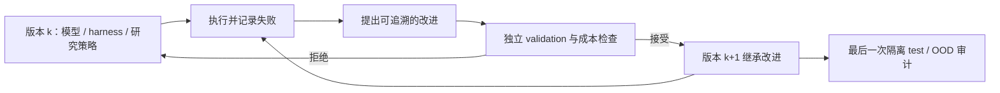

# 递归自我改进（RSI）

RSI 在本站是**跨领域研究专题**，不是第七套论文代码目录：它研究一个系统能否把上一轮的失败与验证结果，用来改进下一轮的模型、Agent harness、训练数据或研究策略。原论文和 adapter 仍分别归入[基础模型](../foundation-models/README.md)、[LLM 后训练](../post-training/README.md)或[Agent](../agent-research/README.md)；此页串起它们如何形成可审计的多轮闭环。

## 什么才算 RSI

判定关键不是“模型自己写了一段反思”，而是：**改动对象持久化**、下一轮**继承**该改动、用固定预算的外部反馈**验收**，并保留被拒绝的提案和失败轨迹。单题内的自我修正是有用组件，但单独不构成研究层面的递归自改进；论文搜到后未经实现就执行生成代码也不是本仓库的 RSI 路径。

| 改进对象 | 当前可用的本地入口 | 不能据此宣称的能力 |
|---|---|---|
| 模型结构、参数和训练配方 | [定向 Evolve](../model-evolution.md)、[可执行算子约束](../evolution-operators.md) | 自动实现任意实时检索论文 |
| LLM 权重与后训练数据 | [后训练 Evolve](../auto-research.md)、[Recursive OPSD 机制诊断](../reproductions/2609.30652-recursive-opsd/README.md) | 原论文规模的递归学习收益或模型自发改写训练算法 |
| Agent harness、记忆与工具策略 | [Agent Evolve](../agent-research/capability-benchmark.md)、[长周期研究控制器](research-portfolio.md) | 已在未知真实任务上稳定自我提升 |
| 研究流程本身 | [实验提案与负结果记忆](../research-platform-p1.md) | 无人工监督地修改执行器、评测器或安全边界 |

## 论文与评测线索

以下按“已实现的局部机制”和“待复核候选”区分，不把外部论文直接标为本地复现。

- [Self-Refine](../agent-research/2303.17651-self-refine/README.md) 与 [Reflexion](../agent-research/2303.11366-reflexion/README.md)：单任务修正与跨 episode 语言记忆，是反馈循环的组件；是否改善后继版本要看隔离评测。
- [Recursive Self-Improvement via On-Policy Distillation](../reproductions/2609.30652-recursive-opsd/README.md)：动态教师与学生共用更新后的权重，本地已有小预算 Qwen 诊断；三种子对照未测出收益，尚未完成原论文训练与评测协议。
- [Video-RSI](../agent-research/2609.37950-video-rsi/README.md)：用主动视频调查诊断失败，再按准确率—视觉成本 Pareto 门槛接纳可继承 harness 修订；本地已实现接纳协议，完整视频环境仍未复现。
- [RRSI](https://arxiv.org/abs/2609.24972)：针对 Agent harness 的提案和选择加正则，强调分布外能力与 token 成本；**待审候选，尚无本地 adapter**。
- [RSIBench-Data](https://arxiv.org/abs/2607.25886)：固定后训练栈，测 Agent 能否根据训练反馈改进数据策略；**待审评测候选，尚未接入本地统一评测**。

## 验收协议

一次 RSI 实验至少记录初始版本、每轮改动及其来源、训练和推理预算、validation 决策、失败候选、最终隔离 test、分布外/回归集和成本。保留 **best-so-far** 与最后一轮两条曲线：末轮变差不能被中间峰值掩盖，反之亦然。比较不同方法时锁定数据修订、模型起点、种子及工具预算；不能让被评测 Agent 读取标准答案或验证集反馈之外的 test 信息。

新论文先走[发现审计](../paper-discovery-audit.md)和对应领域的论文信息合同，再决定是 evidence-only、独立 adapter，还是已实现算子的可执行组合。RSI 入口只聚合与解释，不复制论文页、指标文件，也不绕开 CUDA 验证门槛。
