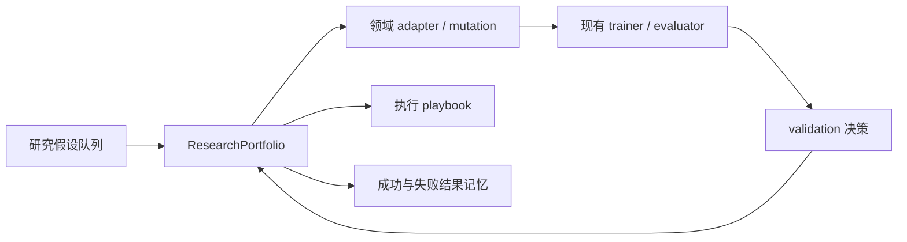

# 长周期研究组合控制器

`ResearchPortfolio` 是模型、后训练和 Agent evolve 之外的一层持久化编排器。它解决的
不是“用什么网络”，而是多个研究假设需要并行跑几小时或几天时，如何不丢状态、隔离
失败并复用经验。

## 它与 Evolve 的关系



- `ResearchPortfolio` 管 idea 的生命周期、worker claim、故障恢复和记忆；
- 现有领域 adapter 仍负责产生**已经实现且可执行**的结构、objective 或 policy；
- trainer / evaluator 仍负责真正训练和测量，控制器不会把论文标题或自然语言建议
  伪装成已实现算子；
- 每个 idea 使用独立状态文件，事件和终态结果使用 append-only JSONL；关键 JSON
  通过临时文件加 `fsync` 后原子替换。

## 状态机与恢复

```text
ideating -> implementing -> validating -> training -> analyzing -> complete
                    |             |           |
                    +-------------+-----------+-> debugging -> 原失败阶段
```

`rejected` 也可从非终态进入。非法跨阶段跳转会立即拒绝；claim 使用独占锁文件，两个
worker 不会同时取得同一个 idea。组合目录固定包含：

```text
portfolio/
├── portfolio.json    # schema 与固定 baseline
├── ideas/*.json      # 每个 idea 独立持久状态
├── claims/*.lock     # worker 独占 claim
├── events.jsonl      # append-only 操作轨迹
├── playbooks.json    # 执行经验
└── outcomes.jsonl    # 成功与拒绝的研究结果
```

## 最小用法

```python
from pathlib import Path

from auto_research.research_loop import IdeaStage, ResearchPortfolio

portfolio = ResearchPortfolio(Path("runs/portfolio/demo"), baseline_id="main@abc123")
portfolio.create_idea("longer", "把长序列压缩加入当前模型", payload={"budget": 300})
portfolio.transition("longer", IdeaStage.IMPLEMENTING)
portfolio.claim("longer", "worker-0")

try:
    # 在这里调用现有 adapter、训练器和 evaluator。
    portfolio.transition("longer", IdeaStage.VALIDATING)
finally:
    portfolio.release("longer", "worker-0")
```

失败时调用 `fail(idea_id, error)`，修复后调用 `recover(idea_id)`，控制器会回到失败前的
阶段。`remember_playbook` 保存执行经验；`related_outcomes` 按研究假设的关键词重合和
已测 score 检索历史结果，供下一轮 ideation 使用。

## 论文依据与本地实现边界

### A-MLE

[查看独立论文实现页 →](2609.08248-amle/README.md)

> **论文信息**
>
> - 论文：[Agentic ML Exploration (A-MLE) for Ads Ranking（arXiv v1）](https://arxiv.org/abs/2609.08248)
> - 公司 / 机构：Meta Platforms, Inc.
> - 原文首次公开日期：2026-09-08
> - 原作者开源代码：未找到 / 未发布
> - 本地 adapter key：`research-portfolio-amle`
> - 本地实现：`src/auto_research/research_loop/portfolio.py`

A-MLE 把 ML 探索拆成假设、策略、实验执行、结果分析和共享知识五段，并在阶段边界
保留人工检查点。本地实现吸收其分阶段审计思想，但不会声称复现 Meta 内部工具、
sandbox 或广告训练基础设施。

### Auto-RecSys

[查看独立论文实现页 →](2609.10922-auto-recsys/README.md)

> **论文信息**
>
> - 论文：[Auto-RecSys: Harnessing Autonomous Research Agents for Industry-Scale Recommender Systems（arXiv v1）](https://arxiv.org/abs/2609.10922)
> - 公司 / 机构：Meta
> - 原文首次公开日期：2026-09-10
> - 原作者开源代码：未找到 / 未发布
> - 本地 adapter key：`research-portfolio-auto-recsys`
> - 本地实现：`src/auto_research/research_loop/portfolio.py`

Auto-RecSys 的关键是每个 idea 独立状态、异步并行、跨会话恢复，以及执行经验和实验
结果两个演化循环。本地实现复现这些可公开验证的控制器语义；当前持久层是共享文件
系统，不等同于论文内部的跨服务器存储和作业平台。

## 当前边界

- 本组件不是新的远程 scheduler；SSH / Slurm 仍使用项目已有 executor；
- `baseline_id` 在一个组合生命周期内不可改变，避免跨 baseline 混合结论；
- playbook 更新已经持久化，但是否采纳仍应经过 validation，不自动改写模型代码；
- 这两篇论文没有可用的公开官方实现，因此本页属于公开机制复现，不声称数值复现。
