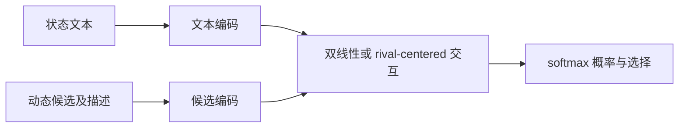
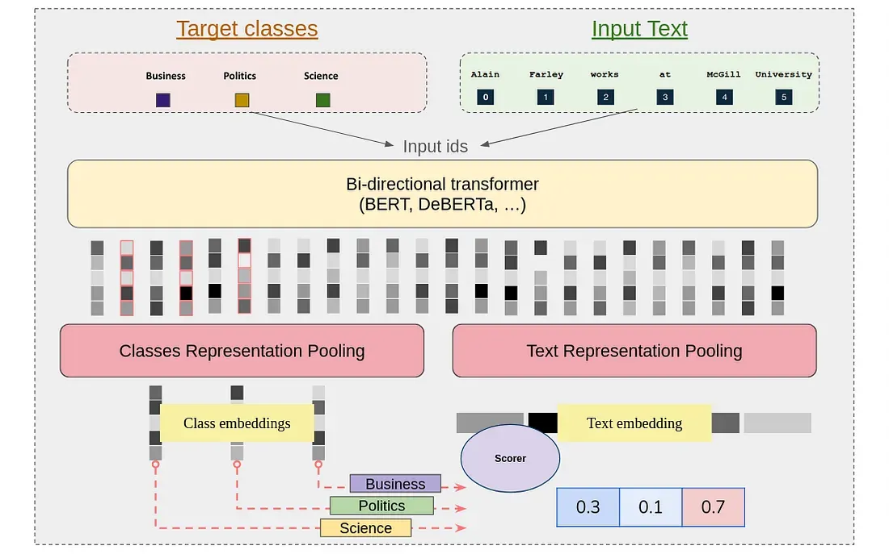

# GLiClass：动态候选轻量分类

## 论文信息

| 字段 | 内容 |
|---|---|
| 论文链接 | [arXiv 2508.07662](https://arxiv.org/abs/2508.07662) |
| 公司/机构 | Knowledgator（按第一作者署名单位） |
| 首次公开日期 | 2025-08-11（arXiv v1） |
| 原文开源代码 | 有：[Knowledgator/GLiClass](https://github.com/Knowledgator/GLiClass) |
| Adapter / 方法 | `system-one:bilinear-ce`、`system-one:rival-ce` |
| 本地复现代码 | `src/auto_research/system_one/` |

## 原始论文总结

### 背景与主要改动

GLiClass 把文本和运行时给定的候选标签放进同一个分类接口，避免生成式 LLM 的解析不稳定，也避免 cross-encoder 对每个文本—标签对逐次推理。本仓库保留“候选内容参与打分”和“一次归一化得到全候选分布”这两个定义性机制。

本地实现是 NumPy 机制基线，不加载 GLiClass 权重，不宣称复现论文的完整 Transformer、PPO 多标签训练或论文数值。它用于 System One 的 Banking77 统一协议和 Evolve operator。

<!-- paper-figure:start -->
### 原论文关键图

> **原论文 Figure 1（关键图）**：展示原论文提出的核心架构、主要模块及其连接关系。图片来自[原论文](https://arxiv.org/abs/2508.07662)，版权归原作者所有；点击图片可查看来源。
<!-- paper-figure:end -->

### 核心公式

本地 scorer 计算 `softmax(h_state W h_candidate)`；rival 版本先把同一问题中的候选表示中心化再打分。

### 论文离线与线上效果

论文报告多任务 zero/few-shot 分类结果。本仓库不横比不同模型规模和硬件下的论文数字，只在统一 Banking77 协议中报告本地实现。

## 复现边界

只复现动态候选交互与一次归一化机制，不复现 GLiClass 完整权重、训练语料或 PPO 流程。
