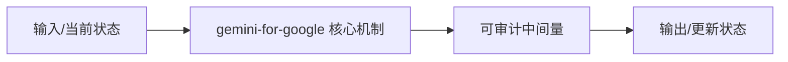
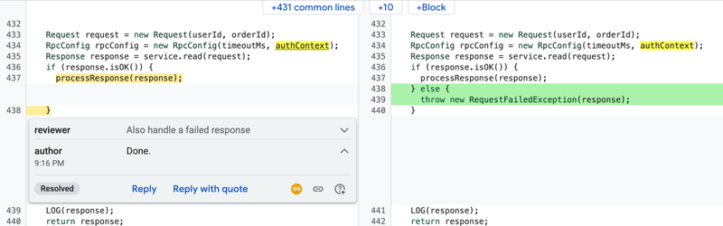

# Customizing an LLM for Enterprise Software Engineering

> **复现级别：L1 核心机制诊断。** 只执行中训练 replay 目标与不变量；没有 Google 私有万亿 token 数据、Gemini 权重或内部开发环境，不把原文 A/B 当作本地成绩。

## 论文信息

| 字段 | 内容 |
|---|---|
| 论文链接 | [arXiv 2605.16517](https://arxiv.org/abs/2605.16517) |
| 公司/机构 | Google（按第一作者署名单位） |
| 首次公开日期 | 2026-05-15（arXiv v1） |
| 原文开源代码 | 否：截至 2026-10-02 未找到原作者公开实现 |
| Adapter | `gemini-for-google` |
| 本地复现代码 | [`src/auto_research/foundation_latest_20261002.py`](https://github.com/daiwk/auto-research/blob/main/src/auto_research/foundation_latest_20261002.py) |

## 原始论文总结

### 背景与主要改动

从企业开发历史中提取高价值代码与交互信号，经过去重、质量过滤和污染控制形成中训练数据；用通用数据回放抑制灾难性遗忘，再做面向内部工具的后训练和部署评测。

<!-- paper-figure:start -->
### 原论文关键图

> **原论文关键图**：展示论文核心架构、训练流程或系统协议。图片来自[原论文](https://arxiv.org/abs/2605.16517)，版权归原作者所有；点击图片可查看来源。
<!-- paper-figure:end -->

### 核心公式

$L=(1-\lambda)L_{enterprise}+\lambda L_{replay}$；本地算子显式暴露企业适配与通用能力保留之间的混合比例。

### 论文离线与线上效果

29,000 名开发者盲 A/B 中，平均每轮交互次数下降 23%，代码存活率提高 16.8%。

## 本地复现

> **本地对照口径**：基线为机制关闭或默认状态，实验组为开启对应核心算子。本批指标只验证不变量、梯度或状态转换，不表示论文规模效果。

- 三种子诊断：[`metrics/mechanism-seeds42-44.json`](metrics/mechanism-seeds42-44.json)
- `diagnostic_only=true`，不进入正式能力排名。

## 复现边界

只执行中训练 replay 目标与不变量；没有 Google 私有万亿 token 数据、Gemini 权重或内部开发环境，不把原文 A/B 当作本地成绩。
