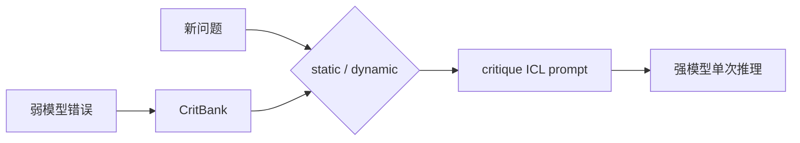
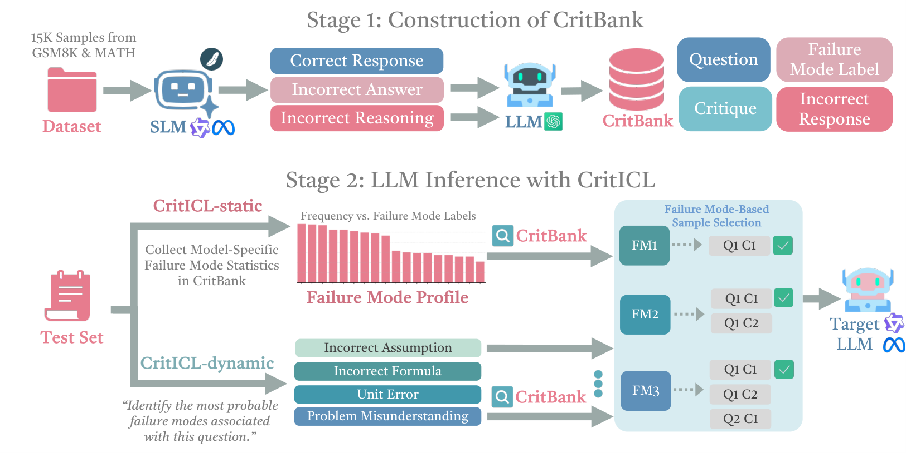

# CritICL：从弱模型失败模式做高效推理提示

> **复现级别：模型无关核心机制。** 实现 CritBank、静态/动态检索和单次推理提示构造，不伪造 checkpoint 指标。

## 论文信息

| 字段 | 内容 |
|---|---|
| 论文链接 | [arXiv 2608.27455](https://arxiv.org/abs/2608.27455) |
| 公司 / 机构 | 俄亥俄州立大学（第一作者第一署名单位） |
| 首次公开日期 | 2026-08-27（arXiv v1；COLM 2026） |
| 原作者代码 | [论文给出 CRITICL 仓库](https://github.com/umwyf/CRITICL)，但核查时仓库为空（2026-08-31），按尚未实际发布处理 |
| 本地 adapter / 方法 | `criticl` |
| 本地复现代码 | [`src/auto_research/foundation_methods.py`](https://github.com/daiwk/auto-research/blob/main/src/auto_research/foundation_methods.py) |

## 原始论文总结

### 背景与主要改动

弱模型错误不是随机噪声，而会聚成可跨模型尺度迁移的失败模式。CritICL 离线归纳 CritBank；static 使用全局高频失败模式，dynamic 根据当前输入检索相关 critique，再让强模型只生成一次答案。



<!-- paper-figure:start -->
### 原论文关键图

[](https://arxiv.org/html/2608.27455v1/design.png)

> **原论文 Figure 1（关键图）**：展示原论文方法的总体设计和关键组成。图片来自[原论文](https://arxiv.org/abs/2608.27455)，版权归原作者所有；点击图片可查看来源。
<!-- paper-figure:end -->

### 核心公式

$$
C_q=\operatorname{TopK}_{c\in CritBank}\operatorname{sim}(q,c),\qquad y\sim p_{strong}(\cdot\mid q,C_q).
$$

## 本地复现与边界

单元测试覆盖确定性 static/dynamic 检索、failure-mode 去重和零在线弱模型调用。当前没有下载大 checkpoint，因此不发布准确率；该机制也没有冒充 Micro-LLM 结构算子。

## 真实 checkpoint 与 GSM8K 路径

`auto-research criticl-eval` 只用 GSM8K train 构造 CritBank，再在官方 test 子集等预算比较 zero-shot、CritICL-static 和 CritICL-dynamic；弱/强 checkpoint、revision、三种子和 95% CI 全部入指标文件。

```bash
auto-research criticl-eval --bank-examples 24 \
  --evaluation-examples 12 --seeds 42,43,44
```

单卡验收默认使用公开 SmolLM2 以验证端到端路径。启发式 failure label 替代论文中的 frontier-LLM critic，且小 checkpoint 在小子集上可能三种方法都为 0；这些边界均写入产物，不把流程可运行误写成效果复现。
脱敏验收记录见 [CritICL A100 receipt](../../gpu-validations/criticl-checkpoint-a100-20260901.json)。
