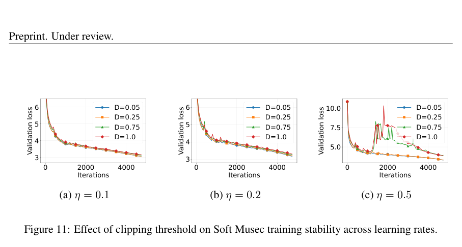

# Musec: MomentUm SpEctral Clipping for Stable Muon-type Training

> **复现级别：L1 核心机制诊断。** 本地执行完整 SVD soft clipping reference；未复刻大模型训练吞吐。

## 论文信息

| 字段 | 内容 |
|---|---|
| 论文链接 | [Musec: MomentUm SpEctral Clipping for Stable Muon-type Training](https://arxiv.org/abs/2609.11655) |
| 公司/机构 | National University of Singapore（按第一作者署名单位） |
| 首次公开日期 | 2026-09-10 |
| 原文开源代码 | 否：未找到作者公开仓库（核查日期：2026-09-14） |
| Adapter / 方法 | `musec` |
| 本地复现代码 | [`src/auto_research/foundation_latest_20260914.py`](https://github.com/daiwk/auto-research/blob/main/src/auto_research/foundation_latest_20260914.py) |

## 原始论文总结

### 背景与主要改动

对 Muon momentum 的奇异值做平滑谱裁剪，避免硬截断不连续，同时限制不稳定大方向。

<!-- paper-figure:start -->
### 原论文关键图

> **原论文 Figure 11（关键图）**：展示原论文的训练流程与关键优化环节。图片来自[原论文](https://arxiv.org/abs/2609.11655)，版权归原作者所有；点击图片可查看来源。
<!-- paper-figure:end -->

### 核心公式或操作

本地代码把论文决定性操作实现为确定性的 reference kernel，并显式输出门控、选择、投影、图边或状态更新统计；测试覆盖公式不变量和边界条件。

### 论文离线与线上效果

FineWeb、OpenWebText 和 C4 上跨学习率与模型规模提高稳定性。 这些数字来自原论文，不与本地缩小实验直接比较；论文未报告线上 A/B 时不推断线上收益。

## 本地复现

三种子指标见 [`metrics/mechanism-seeds42-44.json`](metrics/mechanism-seeds42-44.json)。所有候选使用相同公开 fixture、预算和 seed；本页结果只证明核心状态转换实际执行。

### 复现边界

本地执行完整 SVD soft clipping reference；未复刻大模型训练吞吐。
