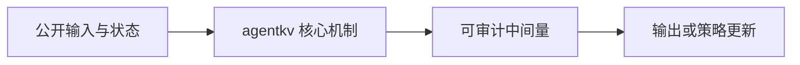
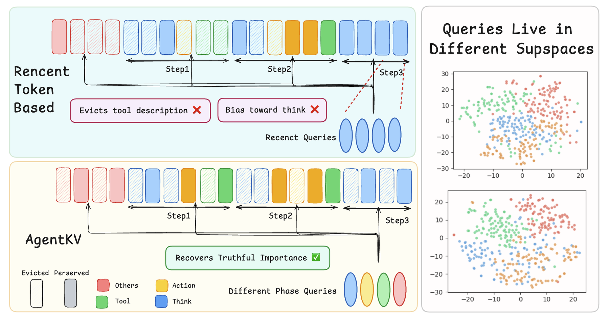

# AgentKV: Phase-Aware KV Eviction for Agentic LLMs

> **复现级别：L1 核心机制诊断。** 本地执行 phase-aware scoring；未修改 SGLang 或运行 CUDA kernel。

## 论文信息

| 字段 | 内容 |
|---|---|
| 论文链接 | [AgentKV: Phase-Aware KV Eviction for Agentic LLMs](https://arxiv.org/abs/2609.14872) |
| 公司/机构 | University of Cambridge（按第一作者署名单位） |
| 首次公开日期 | 2026-09-14（arXiv v1） |
| 原文开源代码 | 是：[https://github.com/LiuTaowen-Tony/agentkv](https://github.com/LiuTaowen-Tony/agentkv) |
| Adapter / 方法 | `agentkv` |
| 本地复现代码 | [`src/auto_research/foundation_latest_20260916.py`](https://github.com/daiwk/auto-research/blob/main/src/auto_research/foundation_latest_20260916.py) |

## 原始论文总结

### 背景与主要改动

按 Agent 阶段保留代表性 query buffer，以跨阶段查询相关性决定 KV 淘汰。

本地 reference kernel 保留决定性门控、权重或状态转换，并输出可审计中间量，以便与相邻方法在统一预算下比较。

<!-- paper-figure:start -->
### 原论文关键图

> **原论文 Figure 1（关键图）**：展示原论文方法的总体设计和关键组成。图片来自[原论文](https://arxiv.org/abs/2609.14872)，版权归原作者所有；点击图片可查看来源。
<!-- paper-figure:end -->

### 核心公式

实现保留论文的决定性状态转换，并输出权重、门控、深度、阶段或缓存统计；固定预算和三种子只用于检查机制不变量，不等同于论文规模训练。

### 论文离线与线上效果

论文报告的能力、速度或成本结论只作为原文事实记录；本地指标不与其直接横比，也不外推线上收益。

## 本地复现

三种子结果见 [`metrics/mechanism-seeds42-44.json`](metrics/mechanism-seeds42-44.json)。统一 receipt 标记 `diagnostic_only=true`，不会被公开看板当成完整能力提升。

### 复现边界

本地执行 phase-aware scoring；未修改 SGLang 或运行 CUDA kernel。
